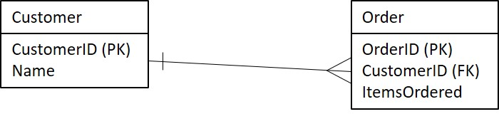

# Enrichments

Enrichments are managed from the Source screen. Enrichments provide the logic for identifying data quality issues or adding new columns to the data. 


Note: The supported syntax in the expression input is specific to PostgreSQL. Refer to PostgreSQL documentation: [https://www.postgresql.org/docs/10/functions.html](https://www.postgresql.org/docs/10/functions.html)


## Enrichments Tab

The Enrichments tab allows users to select, edit, remove, or add a Source's Enrichments. By default, only Active Enrichments are listed. The **Active Only** toggle changes this setting.

To edit an Enrichment, select the Enrichment directly. This opens the Edit Enrichment modal.

To create a new Enrichment, select **New Enrichment**. This opens the Enrichment modal.

## Enrichment Parameters

On the Enrichment modal, users can modify Enrichment parameters or apply an existing [Template ](../validation-and-enrichment-rule-templates.md)using the **Enrichment Rule Type** dropdown. Selecting **Enforce** ensures that a Template cannot be modified and is only configurable through the [Templates](../validation-and-enrichment-rule-templates.md) screen, while leaving **Enforce** unchecked copies the Template into a rule specific to the Source.

**Fields Available:**

| Parameter | Default Value | Description |
| :--- | :--- | :--- |
| **Type** | Enrichment | The type of the Enrichment. Validations mark records as pass/fail based on a boolean expression in the expression field. |
| **Enrichment Name\*** |  | The user-defined name of the Enrichment |
| **Attribute Name\*** |  | The name of the new column of the Enrichment |
| **Description\*** |  | The user-defined description of the Enrichment |
| **Expression Data Type** |  | The data type of the result of the Expression. |
| **Attribute Data Type** |  | The data type of the Enriched Attribute. RAP will attempt to convert the data type of the Expression Data Type to the Attribute Data Type. Leave as Default for no conversion. |
| **When expression is false, set to** | Warn | These are the flags that will be set on records that fail to be converted to another data type. Warn, Fail, or Ignore are the possible options. For Validations only. |
| **Expression** |  | Use SQL syntax to set the Enrichment Rule transformation logic. |
| **Unique Value** |  | Signifies that the Enriched Attribute will have unique values for every record. |
| **Active** | TRUE | Allows the user to set this Validation as Active or not. If Active, it affects the Source load. |

Click **Save** to save the Enrichment. Clicking **Save and Create Validation** will create an extra Validation column to mark whether the values from the Expression Data Type succeeded the conversion to the specified Attribute Data Type.

## Using Relations in Enrichment Rules

Through Relations, users can access attributes from another Source when configuring Enrichment rules.  

When configuring the Expression property on the Enrichment configuration screen, the user must use the expression syntax specified below to access the attributes.  

<table>
  <thead>
    <tr>
      <th style="text-align:left">Expression</th>
      <th style="text-align:left">Description</th>
      <th style="text-align:left">Examples</th>
    </tr>
  </thead>
  <tbody>
    <tr>
      <td style="text-align:left">[<em>Source Name</em>]</td>
      <td style="text-align:left">Source container</td>
      <td style="text-align:left">[Divvy Rides]</td>
    </tr>
    <tr>
      <td style="text-align:left">[This]</td>
      <td style="text-align:left">Current Source container. Equivalent to [<em>current source name</em>]</td>
      <td
      style="text-align:left">[This]</td>
    </tr>
    <tr>
      <td style="text-align:left">[<em>Relation Name</em>]</td>
      <td style="text-align:left">Non-primary Relation name, indicates path to the Source containers used
        in expression</td>
      <td style="text-align:left">[This]~{To Station Relation}~[Divvy Rides].attribute</td>
    </tr>
    <tr>
      <td style="text-align:left">.</td>
      <td style="text-align:left">Separator of Source containers and attribute names</td>
      <td style="text-align:left"></td>
    </tr>
    <tr>
      <td style="text-align:left">~</td>
      <td style="text-align:left">Path indicator, separates Source containers and Relations</td>
      <td style="text-align:left">[Divvy Rides]~{Relation Z}~[Weather].attribute</td>
    </tr>
    <tr>
      <td style="text-align:left">[<em>Relation</em>].<em>attribute_name</em>
      </td>
      <td style="text-align:left">Attribute in the container</td>
      <td style="text-align:left">
        
[Divvy Rides].trip_id

        
[Divvy Stations].latitude

        
[This]~{To Station Relation}~[Divvy Rides].longitude

      </td>
    </tr>
  </tbody>
</table>## Enrichment Expression Examples Using Relations

Consider this example Entity-Relationship Diagram \(ERD\) between two Sources in RAP:

Let's say that a user has already created a relation called `Student-Computer` which relates the Student and Computer Sources with the Relation Expression `[This].ComputerID = [Related].ComputerID`. This Relation has the Cardinality O \(one\) because each student may own only one computer at a time from the university. If the user is creating an Enrichment from the context of the Student Source and wanted to access the OperatingSystem attribute on the Major Source, they would type`[This]~{Student-Computer}~[Computer].OperatingSystem`.

Now, let's examine a different scenario:

This ERD depicts a Relation with the Cardinality M \(many\) since a customer can make multiple orders. Let's say that a user has already created a relation called `Customer-Order` which relates the Customer and Order Sources. Since the Relation has Cardinality M, the user must use an aggregate function because the Relation has the potential to return more than one record. If the user is creating an Enrichment from the context of the Customer Source and wanted to calculate the total number of items a customer ordered over multiple orders, they would type`SUM([This]~{Customer-Order}~[Course].ItemsOrdered)`.

See all of the supported aggregate functions below:

| Aggregate | Query |
| :--- | :--- |
| first\_value | SELECT first\_value\(expression, order\_by\) FROM L WHERE &lt;relationship expression&gt; |
| avg | SELECT avg\(x\) FROM L WHERE &lt;relationship expression&gt; |
| mean | SELECT mean\(x\) FROM L WHERE &lt;relationship expression&gt; |
| min | SELECT min\(x\) FROM L WHERE &lt;relationship expression&gt; |
| max | SELECT max\(x\) FROM L WHERE &lt;relationship expression&gt; |
| stddev | SELECT stddev\(x\) FROM L WHERE &lt;relationship expression&gt; |
| sum | SELECT sum\(x\) FROM L WHERE &lt;relationship expression&gt; |
| variance | SELECT variance\(x\) FROM L WHERE &lt;relationship expression&gt; |
| approx\_count\_distinct | SELECT approx\_count\_distinct\(x\) FROM L WHERE &lt;relationship expression&gt; |
| corr | SELECT corr\(x\) FROM L WHERE &lt;relationship expression&gt; |
| count | SELECT count\(x\) FROM L WHERE &lt;relationship expression&gt; |
| countDistinct | SELECT countDistinct\(x\) FROM L WHERE &lt;relationship expression&gt; |
| collect\_list | SELECT collect\_list\(x\) FROM L WHERE &lt;relationship expression&gt; |
| collect\_set | SELECT collect\_set\(x\) FROM L WHERE &lt;relationship expression&gt; |
| sumDistinct | SELECT sumdistinct\(x\) FROM L WHERE&lt;relationship expression&gt; |

## Chaining Relations

The user can traverse multiple Relations to access attributes from two or more Sources apart. Examine the example ERD below:

The Relation from User to Computer has a Cardinality of O because in this example a user owns only one computer, and the Relation from Computer to File has a Cardinality of M because a computer can store multiple files. If the user is creating an Enrichment from the context of the User Source and wanted to access the average file size a user has stored, they would type`AVG([This]~{User-Computer}~{Computer-File}~[File].Size)`.


When chaining Relations, only the final Relations may have a Cardinality of M.


## A Note About Primary Relations

Recall that only one Primary Relation may exist on each Source. When using a Primary Relation in an Enrichment, users may access attributes through that Relation using shorthand. For Example ERD 1, if `{Student-Computer}`was a Primary Relation, the user would only have to type `[Computer].OperatingSystem`. Because of this, Primary Relations are useful for the Relation that a user intends to use most frequently.

