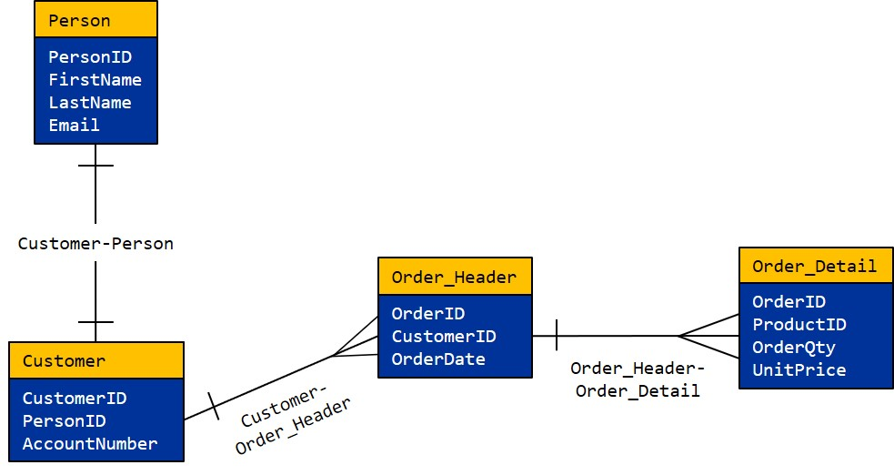
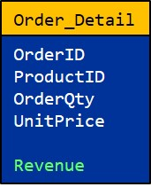
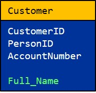
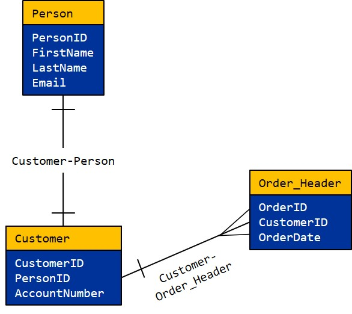
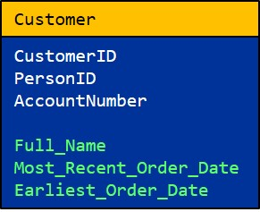

# !! Rules

Enrichments are managed from within a Source. Select the "Rules" tab to see the collection of Rules.

!! Source screen. Rules provide the logic for identifying data quality issues or adding new columns to the data. 


Note: The supported syntax in the expression input is specific to PostgreSQL. Refer to PostgreSQL documentation: [https://www.postgresql.org/docs/10/functions.html](https://www.postgresql.org/docs/10/functions.html)


## Rules Tab

The Rules tab allows users to select, edit, remove, or add a Source's Rules. By default, only Active Rules are listed. The **Active Only** toggle changes this setting.

\*Add screenshot highlighting active only toggle here\*

To create a new Rule, click the **New Rule** button. This opens the create/edit Rule modal.

\*Add Screenshot highlighting New Rule button here Here\*

\*add blurb and screenshot of editing existing rule here

## ! Rule Parameters

\*Add blurb and screenshot of create/edit Rule modal here\*

**Fields Available:**

| Parameter | Default Value | Description |
| :--- | :--- | :--- |
| **Type** | Enrichment | The type of the Rule. Validations mark records as pass/fail based on a boolean expression in the expression field. |
| **Enrichment Name\*** | No Default | The user-defined name of the Rule. This is what will appear in the  |
| **Attribute Name\*** | No Default | The name of the new column of the Rule. This what will appear in attribute dropdowns of expressions, and within expressions. |
| **Description** | No Default | The user-defined description of the Rule |
| **Expression Data Type** | Interpreted from expression | The data type of the result of the Expression. |
| **Attribute Data Type** | Expression Data Type | The data type of the Enriched Attribute. RAP will attempt to convert the data type of the Expression Data Type to the Attribute Data Type. Leave as Default for no conversion. |
| **When expression is false, set to** | Warn | These are the flags that will be set on records that fail to be converted to another data type. Warn, Fail, or Ignore are the possible options. For Validations only. |
| **Expression** | No Default | Use SQL syntax to set the Enrichment Rule transformation logic. |
| **Unique Value** | FALSE | Signifies that the Rule Attribute will have unique values for every record. |
| **Active** | TRUE | Allows the user to set this Validation as Active or not. If Active, it affects the Source load. |

Click **Save** to save the Rule. Clicking **Save and Create Validation** will create an extra Validation column to mark whether the values from the Expression Data Type succeeded the conversion to the specified Attribute Data Type.

## Rule Expressions

Through Relations, users can access attributes from another Source when configuring Enrichment rules.  

When configuring the Expression property on the Enrichment configuration screen, the user must use the expression syntax specified below to access the attributes.  

<table>
  <thead>
    <tr>
      <th style="text-align:left">Expression</th>
      <th style="text-align:left">Description</th>
      <th style="text-align:left">Examples</th>
    </tr>
  </thead>
  <tbody>
    <tr>
      <td style="text-align:left">[<em>Source Name</em>]</td>
      <td style="text-align:left">Source container</td>
      <td style="text-align:left">[Divvy Rides]</td>
    </tr>
    <tr>
      <td style="text-align:left">[This]</td>
      <td style="text-align:left">Current Source container. Equivalent to [<em>current source name</em>]</td>
      <td
      style="text-align:left">[This]</td>
    </tr>
    <tr>
      <td style="text-align:left">[<em>Relation Name</em>]</td>
      <td style="text-align:left">Non-primary Relation name, indicates path to the Source containers used
        in expression</td>
      <td style="text-align:left">[This]~{To Station Relation}~[Divvy Rides].attribute</td>
    </tr>
    <tr>
      <td style="text-align:left">.</td>
      <td style="text-align:left">Separator of Source containers and attribute names</td>
      <td style="text-align:left"></td>
    </tr>
    <tr>
      <td style="text-align:left">~</td>
      <td style="text-align:left">Path indicator, separates Source containers and Relations</td>
      <td style="text-align:left">[Divvy Rides]~{Relation Z}~[Weather].attribute</td>
    </tr>
    <tr>
      <td style="text-align:left">[<em>Relation</em>].<em>attribute_name</em>
      </td>
      <td style="text-align:left">Attribute in the container</td>
      <td style="text-align:left">
        
[Divvy Rides].trip_id

        
[Divvy Stations].latitude

        
[This]~{To Station Relation}~[Divvy Rides].longitude

      </td>
    </tr>
  </tbody>
</table>

## Relations and Rules Examples

To illustrate the proper use of Relations and Enrichments, let's examine the example Entity-Relationship Diagram of an arrangement of Sources in RAP below. We will use this ERD for both examples. The labels near the relationship lines are the names of the Relations that the user would have configured prior to creating any Enrichments. 

#### 

### Example 1: Revenue By Customer

For this example, we need to focus on a particular section of the ERD shown below.

One useful metric to track in these kinds of data models is _revenue by customer._ To do this, let's first create an enriched column _Revenue_ on the Order\_Detail Source_._ The Enrichment expression for this would be `[This].OrderQty * [This].UnitPrice`. All of the attributes needed for this enriched column already exist on the Order\_Detail Source, so we don't need any Relations for this metric.

The Order\_Detail Source should now look like this:

The last part of capturing this metric is to retrieve the full name of the customer. Breaking this last step into two parts makes this task slightly easier. Since the cardinality of the Customer-Person Relation is O \(one\), it should be simple to store the full name of the customer in the Customer Source. Let's create an enriched column on the Customer Source called _Full\_Name_ with the Enrichment expression `[This]~{Customer-Person}~[Person].FirstName + [This]~{Customer-Person}~[Person].LastName` . 

Note the special syntax when using Relations in the expression. Relations can make the Enrichment expression quite long, but marking a Relation as the Primary Relation makes referencing it much easier. If the Customer-Person Relation is Primary, the expression for Full\_Name can also be written as `[Person].FirstName + [Person].LastName` . 

The Customer Source should now look like this: 

Now all we need to do is capture the Full\_Name attribute in the Order\_Detail Source. Below is the section of the ERD we now need to examine.   

Finally, create an enriched column on the Order\_Detail Source called _Customer\_Full\_Name_ with the Enrichment expression `[This]~{Order_Header-Order_Detail}~[Order_Header]~{Customer-Order_Header}~[Customer].FullName`If both the Order\_Header-Order\_Detail and the Customer-Order\_Header Relations are Primary, the above expression can also be written as `[Customer].FullName`.

This time, we need to traverse two Sources to access attributes in Customer. This is allowed because in the direction we are traversing, both Relations have the cardinality O.

The Order\_Detail Source now has the attributes that make it possible to track revenue by customer.

### Example 2: Customer Tenure

 In the next example, we'll see how to use Relations of cardinality M \(many\). We will use the ERD we started with in Example 1.

Another useful metric to track in this kinda of data set is _customer tenure,_ or "customer loyalty". Below is the portion of the ERD we need to examine for this example.

We will be storing all of the enriched columns in the Customer Source. First, we want to know the name of each customer. Create an enriched column in the Customer Source called Full\_Name that combines the FirstName and LastName fields in the Person Source, just like in Example 1.

Customer tenure can be rephrased as "the amount of time that a customer has been making purchases at the store". In order to capture this, we need to take difference between the most recent date and the earliest date that a customer has made a purchase.

To capture the most recent purchase date, create a new enriched column on the Customer Source called _Most\_Recent\_Order\_Date_ with the Enrichment expression `MAX([This]~{Customer-Order_Header}~[Order_Header].OrderDate)` \(or `[Order_Header].OrderDate` if Customer-Order\_Header is Primary\).

Notice the `MAX()` function surrounding the expression. This is an example of an aggregate function. We need to use an aggregate function in this case because the cardinality of the Relation Customer-Order\_Header is M, and has the potential to return more than one record as indicated by the one-to-many relationship from Customer to Order\_Header. The Enrichment expression cannot return multiple values, so the aggregate function consolidates these into one returnable value. 


RAP uses Spark SQL for aggregate functions. Click [here](https://jaceklaskowski.gitbooks.io/mastering-spark-sql/spark-sql-aggregate-functions.html) for a complete list of Spark aggregate functions. 


For the earliest purchase date, create another enriched column called _Oldest\_Order\_Date_ with the same expression, but using the `MAX()` aggregate function instead. The Customer Source should now look like this:

Finally, in order to capture customer tenure, create an enriched column that takes the difference between the most recent order date and the earliest order date. These fields are in a date format, so we'll need to use a specific aggregate function. The Enrichment expression is `DATEDIFF([This].Earliest_Order_Date, [This].Most_Recent_Order_Date)` .

