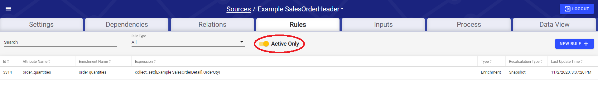

# !! Rules

Enrichments are managed from within a Source. Select the "Rules" tab to see the collection of Rules.

!! Source screen. Rules provide the logic for identifying data quality issues or adding new columns to the data. 


Note: The supported syntax in the expression input is specific to PostgreSQL. Refer to PostgreSQL documentation: [https://www.postgresql.org/docs/10/functions.html](https://www.postgresql.org/docs/10/functions.html)


## Rules Tab

The Rules tab allows users to select, edit, remove, or add a Source's Rules. By default, only Active Rules are listed. The **Active Only** toggle changes this setting.

To create a new Rule, click the **New Rule** button. This opens the create/edit Rule modal.

To edit an existing rule, click on any column of that rule's row in the table besides the expression column \(circled in the picture below\). If a rule references another rule in its expression, a link will appear in the expression column that, when clicked, will open the edit rule modal of the rule that is referenced by the link \(boxed in the picture below\).

## ! Rule Parameters

\*Add blurb and screenshot of create/edit Rule modal here\*

**Fields Available:**

| Parameter | Default Value | Description |
| :--- | :--- | :--- |
| **Type** | Enrichment | The type of the Rule. Validations mark records as pass/fail based on a boolean expression in the expression field. |
| **Rule Name\*** | No Default | The user-defined name of the Rule. This is what will appear in the  |
| **Attribute Name\*** | No Default | The name of the new column of the Rule. This what will appear in attribute dropdowns of expressions, and within expressions. When creating a new rule, this field will automatically be filled in with valid formatting based on what the user enters into the Rule Name field. |
| **Description** | No Default | The user-defined description of the Rule |
| **Expression Data Type** | Interpreted from expression | The data type of the result of the Expression. |
| **Attribute Data Type** | Expression Data Type | The data type of the Enriched Attribute. RAP will attempt to convert the data type of the Expression Data Type to the Attribute Data Type. Leave as Default for no conversion. |
| **Recalculation Mode** | Snapshot | Snapshot means that the field will never be recalculated even after attributes the rule depends on get updated. Keep current means that if an attribute value a record depends on gets updated, the dependent attribute will also be updated during processing. |
| **When expression is false, set to** | Warn | These are the flags that will be set on records that fail to be converted to another data type. Warn, Fail, or Ignore are the possible options. For Validations only. |
| **Expression** | No Default | Use[ Intellio QL](https://app.gitbook.com/@intellio/s/dataops/~/drafts/-MLwpeBgYEcGrh4eZftR/v/master/configuring-the-data-integration-process/expressions)/[Spark SQL](https://spark.apache.org/docs/latest/sql-programming-guide.html) syntax to set the Rule transformation logic. |
| **Active** | TRUE | Allows the user to set this Rule as Active or not. If active, it will be applied on new inputs and source resets. |

Click **Save** to save the Rule. Clicking **Save and Create Validation** will create an extra Validation column to mark whether the values from the Expression Data Type succeeded the conversion to the specified Attribute Data Type.

## Example Expressions

#### _Multiplying an attribute from a related source to an attribute of the current source through a primary relation_

> \[This\].ListPrice \* \[Related Source Name\].Quantity

#### _Aggregating a column from a primary related source with many cardinality_

> SUM\(\[Related Source Name\].SalesTotal\)

#### _Aggregating a column from a non-primary related source with many cardinality_

> SUM\(\[This\]~{Relation Name}~\[Related Source Name\].SalesTotal\)

#### _Rounding a column down to two decimal places_

> ROUND\(\[This\].AverageCost, 2\)

