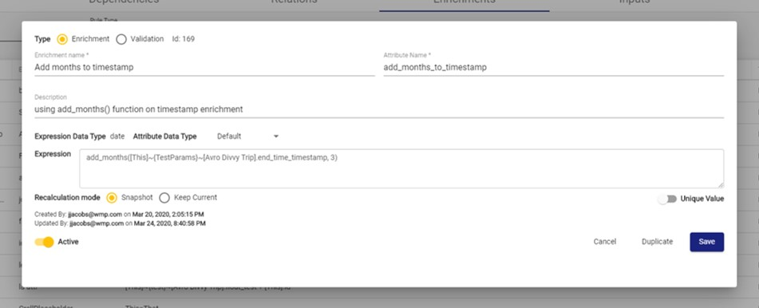
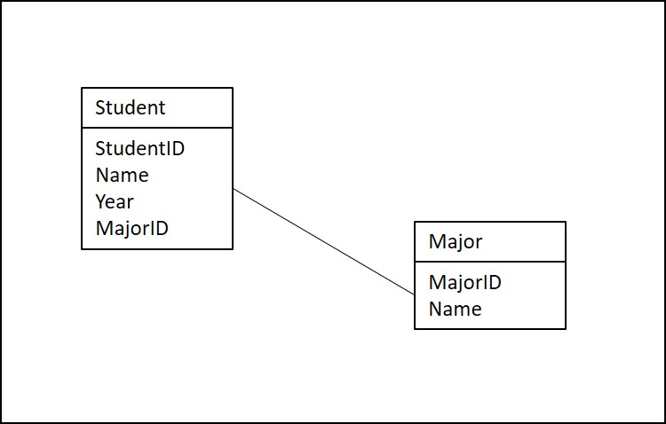

# Enrichments

Enrichments are managed from the Source screen. Enrichments provide the logic for identifying data quality issues or adding new columns to the data. 


Note: The supported syntax in the expression input is specific to PostgreSQL. Refer to PostgreSQL documentation: [https://www.postgresql.org/docs/10/functions.html](https://www.postgresql.org/docs/10/functions.html)


## Enrichments Tab

The Enrichments tab allows users to select, edit, remove, or add a Source's Enrichments. By default, only Active Enrichments are listed. The **Active Only** toggle changes this setting.

To edit an Enrichment, select the Enrichment directly. This opens the Edit Enrichment modal.

To create a new Enrichment, select **New Enrichment Rule**. This opens the Enrichment modal.

## Enrichment Parameters

On the Enrichment modal, users can modify Enrichment parameters or apply an existing [Template ](../validation-and-enrichment-rule-templates.md)using the **Enrichment Rule Type** dropdown. Selecting **Enforce** ensures that a Template cannot be modified and is only configurable through the [Templates](../validation-and-enrichment-rule-templates.md) screen, while leaving **Enforce** unchecked copies the Template into a rule specific to the Source.

Click **Save as Rule Type** to save the Enrichment as a Template for later use. For more details, see [Templates](../validation-and-enrichment-rule-templates.md). Otherwise, click **Save** to save the Enrichment.

**Fields Available:**

| Parameter | Default Value | Description |
| :--- | :--- | :--- |
| **Type** | Enrichment | The type of the Enrichment. Validations mark records as pass/fail based on a boolean expression in the expression field. |
| **Enrichment Name\*** |  | The user-defined name of the Enrichment |
| **Attribute Name\*** |  | The name of the new column of the Enrichment |
| **Description\*** |  | The user-defined description of the Enrichment |
| **Rule Type** |  | Configures this rule to be managed from an [Enrichment Template](../validation-and-enrichment-rule-templates.md). If chosen, all configuration is grayed out, and any modifications must be done in the parent template |
| **Enriched Column Data Type** | Text | This can be Text, Numeric, or Timestamp |
| **On conversion error set to** | Warn | These are the flags that will be set on records that fail to be converted to either Numeric or Timestamp. Warn, Fail, or Ignore are the possible options. |
| **Operation Type** | Formula | This can be either Formula or Lookup. For Lookups, see below. |
| **Return Expression** |  | Use SQL syntax to set the Enrichment Rule transformation logic. |
| **Active** | TRUE | Allows the user to set this Validation as Active or not. If Active, it affects the Source load. |

## Using Relations in Enrichment Rules

Through Relations, users can access attributes from another Source when configuring Enrichment rules.  

When configuring the Expression property on the Enrichment configuration screen, the user must use the expression syntax specified below to access the attributes.  

<table>
  <thead>
    <tr>
      <th style="text-align:left">Expression</th>
      <th style="text-align:left">Description</th>
      <th style="text-align:left">Examples</th>
    </tr>
  </thead>
  <tbody>
    <tr>
      <td style="text-align:left">[<em>Source Name</em>]</td>
      <td style="text-align:left">Source container</td>
      <td style="text-align:left">[Divvy Rides]</td>
    </tr>
    <tr>
      <td style="text-align:left">[This]</td>
      <td style="text-align:left">Current Source container. Equivalent to [<em>current source name</em>]</td>
      <td
      style="text-align:left">[This]</td>
    </tr>
    <tr>
      <td style="text-align:left">[Related]</td>
      <td style="text-align:left">Container for related Source. Only allowed in Relation expression</td>
      <td
      style="text-align:left">[Related]</td>
    </tr>
    <tr>
      <td style="text-align:left">[<em>Relation Name</em>]</td>
      <td style="text-align:left">Non-primary Relation name, indicates path to the Source containers used
        in expression</td>
      <td style="text-align:left">[This]~{To Station Relation}~[Divvy Rides].attribute</td>
    </tr>
    <tr>
      <td style="text-align:left">.</td>
      <td style="text-align:left">Separator of Source containers and attribute names</td>
      <td style="text-align:left"></td>
    </tr>
    <tr>
      <td style="text-align:left">~</td>
      <td style="text-align:left">Path indicator, separates Source containers and Relations</td>
      <td style="text-align:left">[Divvy Rides]~{Relation Z}~[Weather].attribute</td>
    </tr>
    <tr>
      <td style="text-align:left">[<em>Relation</em>].<em>attribute_name</em>
      </td>
      <td style="text-align:left">Attribute in the container</td>
      <td style="text-align:left">
        
[Divvy Rides].trip_id

        
[Divvy Stations].latitude

        
[This]~{To Station Relation}~[Divvy Rides].longitude

      </td>
    </tr>
  </tbody>
</table>## Enrichment Expression Examples Using Relations

Consider this example Entity-Relationship Diagram between 2 Sources in RAP:

Let's say that a user has already created a relation called `Student-Major` which relates the Student and Major Sources with the Relation Expression `[This].StudentID = [Related].MajorID`. If they were creating an Enrichment in the Student Source and needed to access the Name attribute on the Major Source, they would type .`[This]~{Student-Major}~[Major].Name`.

## A Note About Primary Relations

Recall that only 1 Primary Relation may exist on each Source. When using a Primary Relation in an Enrichment, users may access attributes through that Relation using shorthand. For Example ERD 1, if `{Student-Major}`was a Primary Relation, the user would only have to type `[Major].Name`. Because of this, Primary Relations are useful for the Relation that a user intends to use most frequently.

## Lookups \(OLD\)

Lookups can be used to add data to a Source from a different Source. They work similarly to the Excel VLOOKUP formula. Lookups can only return one record per row. If RAP detects when a lookup may return more than one record per row, it will prompt a user to specify an `ORDER BY` statement in the parameters to sort the results and select only the `TOP 1` result.

### Lookup-Specific Parameters

* **Lookup Source:** Separate Source that the Enrichment is pulling data from.
* **Lookup Expression:** The expression that specifies the `JOIN ON` condition between the Source and Lookup Source, such as `L.bike_id = T.bike_id`. The prefix L refers to the Lookup Source and the prefix T refers to the current Source. When possible, use RAP's `s_key` to join the Lookup Source: The `s_key` represents the Primary Key columns of the Source, pipe delimited. 
  * For example: `456|Chicago|15`
* **Automatic Reprocessing:** Specifies when the current Source records will be re-processed upon Lookup Source refresh.
  * **None**: The Enrichment is not automatically re-ran when the Lookup Source has updated data.
  * **New**: The Enrichment automatically re-runs only on the newly added rows that have been added to the Lookup Source.
  * **All**: The Enrichment automatically re-runs on all updated or new rows when the Lookup Source received a new Input of data.
* **Select Lookup Column\(s\) to Order Returned Results**: This specifies which columns the `ORDER BY` is run against. Comma-separated list of column names.

