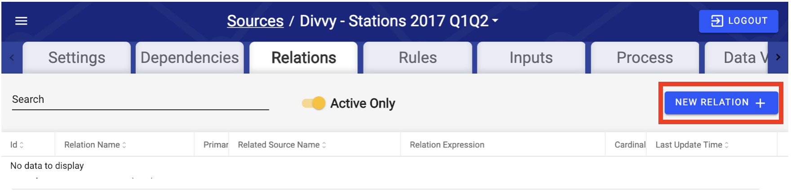
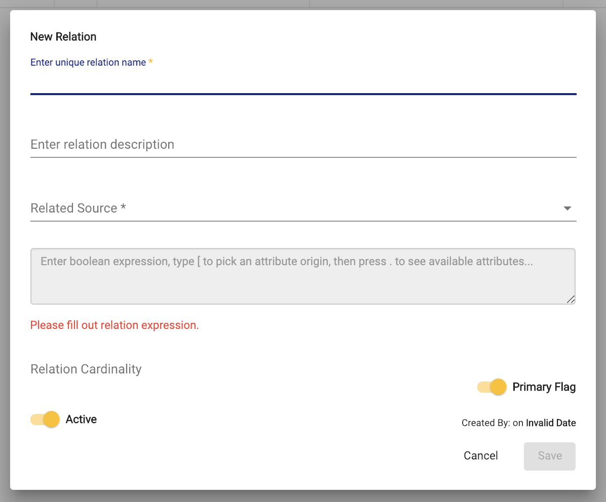

# !! Relations

## Creating Relations

To create a Relation, select a Source from the Sources screen, select the Relations tab, and click "New Relation" button in the top-right corner of the screen.

### Relation Properties

Once "New Relation" is clicked the setting screen appears with required properties.

* **Relation Name:** __The name of the Relation must be unique because a Relation is simply a relationship between any two Sources in the RAP environment, and a unique identifier is needed to distinguish one Relation from another.


 If no relation name is specified, the relation name will default to the following pattern:   
'_Current Source Name - Related Source Name'_


* **Related Source:** Specifies the related Source.
* **Relation Expression:**  This is a boolean expression written in SQL that "joins" the current Source \(denoted by "\[This\]"\) to the related Source \(denoted by "\[Related\]"\). The Relation will return 0, 1, or multiple records depending on the result of the expression. The relation expression will define how the resulting data will look, see the Relation Example below for further details. See the [Expressions](../expressions.md) page for more details on Expressions.
* **Primary Flag:** When set, sets one relation mapping between the Source and Related Source. Practically, a Primary Relation is much easier to reference in Enrichments. If the Related Source via the defined Relation will be referenced many times in an Enrichment it is recommended to make it a Primary Relation.
* **Active Flag**: Indicates if the Relation is live.

Click "Save" to finish creating the Relation.


Across the Intellio DataOps \(RAP\) platform, a grey \(un-clickable\) "Save" button indicates there is an error with the parameters. Typically this error is within an expression field. Double check errors and expressions if you are unable to "Save" your work.


## Relation Example

Consider the Source data below. The first image is the first 10 records of taxi cab ride data, where each record shows the data for separate trips. The second image is the first 10 records of location data, where each record represents a unique location. Let's say that the first image represents "This" Source, and the second image represents the "Related" Source.

If the Relation Expression is \[This\].DOLocationID = \[Related\].LocationID, the Relation would return only one record since LocationID in the related Source is a Key column with unique values.

However, if the Relation Expression is \[This\].fare\_amount &gt; 4, the Relation would return multiple rows since multiple records in the fare\_amount column match the expression.

Pay carful attention to the Relation Expression to ensure the resulting data is desired. As the above example described it is possible to obtain multiple records depending on how the Relation Expression is defined.

## Primary Relation Details

* Specifies whether the Relation is a primary Relation. This property is intended for the Relation that will be referenced the most when configuring Enrichments since they are much easier to reference. Read about [Enrichments](enrichment-rule-configuration.md) for examples of Primary Relations. From the context of a particular Source, that Source can have only one primary Relation. \(TODO - update description - Primary relation flag determines if a reference across that relation can be automatically resolved without defining the relation in an output mapping or enrichment.  It is set automatically by RAP by following **all** 1-M and 1-1 relation chains between the current source / related source to determine if multiple relation paths exist between the 2 sources.  If more than one chain of 1-1 / 1-M relations get us between those 2 sources, the relation is marked as non-primary.\)

