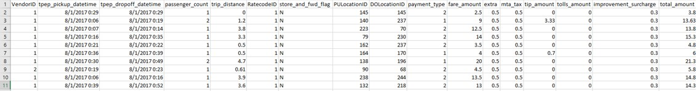
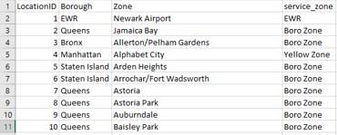
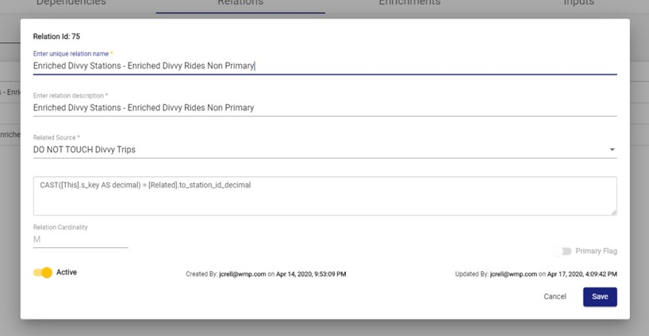

# !! Relations

A Relations is a global relationship between two Sources that the user is able to define. With Relations, the user can access attributes from other Sources to enrich the original Source's data through Enrichments.

## Creating Relations

To create a Relation, select a Source from the Sources screen, select the Relations tab, and click "New Relation" in the top-right corner of the screen.

Relations have a few crucial properties:

* **Relation Name:** __The name of the Relation must be unique because a Relation is simply a relationship between any 2 Sources in the RAP environment, and a unique identifier is needed to distinguish one Relation from another.
* **Related Source:** Specifies the related Source.
* **Relation Expression:**  This is a boolean expression written in SQL that "joins" the current Source \(denoted by "This"\) to the related Source \(denoted by "Related"\). The Relation will return 0, 1, or multiple records depending on the result of the expression.

Consider the Source data below. The first image is the first 10 records of taxi cab ride data, where each record shows the data for separate trips. The second image is the first 10 records of location data, where each record represents a unique location. Let's say that the first image represents "This" Source, and the second image represents the "Related" Source.

If the Relation expression is \[This\].DOLocationID = \[Related\].LocationID, the Relation would return only one record since LocationID in the related Source is a Key column with unique values.

However, if the Relation expression is \[This\].fare\_amount &gt; 4, the Relation would return multiple columns since multiple records in the fare\_amount column match the expression.

* **Primary Flag:** Specifies whether the Relation is a primary Relation. This property is intended for the Relation that will be referenced the most when configuring Enrichments since they are much easier to reference. Read about [Enrichments](enrichment-rule-configuration.md) for examples of Primary Relations. From the context of a particular Source, that Source can have only one primary Relation. \(TODO - update description - Primary relation flag determines if a reference across that relation can be automatically resolved without defining the relation in an output mapping or enrichment.  It is set automatically by RAP by following **all** 1-M and 1-1 relation chains between the current source / related source to determine if multiple relation paths exist between the 2 sources.  If more than one chain of 1-1 / 1-M relations get us between those 2 sources, the relation is marked as non-primary.\)

Click "Save" to finish creating the Relation.

