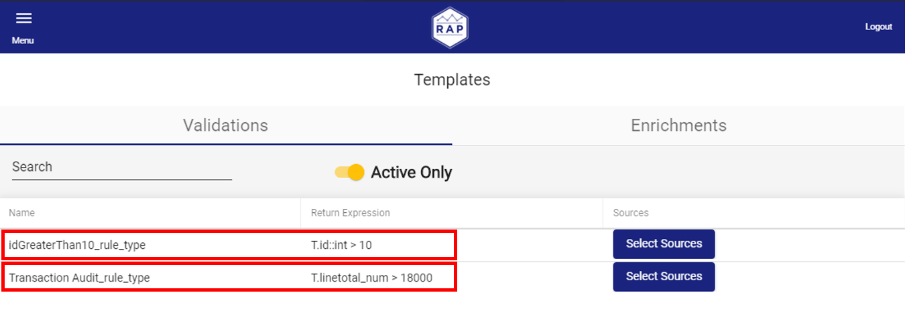
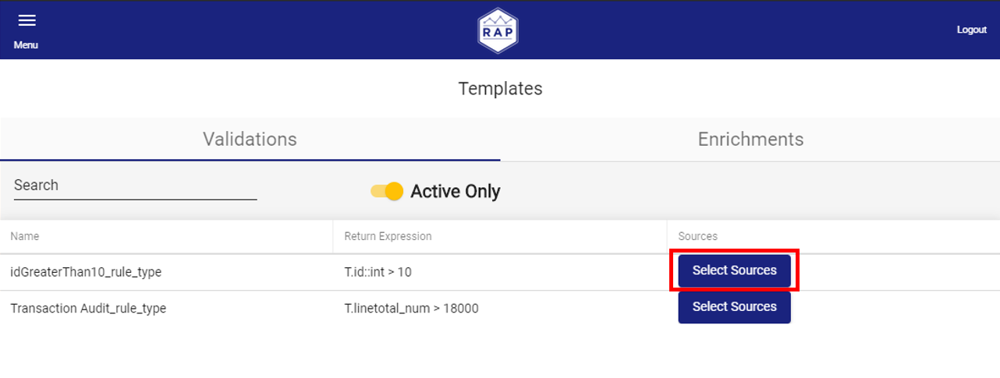

# Templates and Tokens

## Introduction and Terms

#### Token

Global variable that enables customization of Templates. Token values in free text format are defined for each source that has tokenized templates applied. 

#### Rule Template

Template that has structure of a Rule. Name, Attribute Name and Expression attributes can be tokenized. When template is linked to the Source, all tokenized attributes of the template are evaluated using token values defined for the Source, and single instance of Rule is saved. Rule Template cannot be linked to the same source multiple times. Whenever template is modified, Rules from all linked Sources are re-evaluated and updated. Rule template can be linked to each source

#### Relation Template

Template that shares structure with Relation. Name, Related Source Name Name and Expression attributes can be tokenized. When template is linked to the Source, all tokenized attributes of the template are evaluated using token values defined for the Source, and Relation is saved. Template cannot be linked to the same source multiple times. Linked Source becomes \[This\] source in the saved Relation. Whenever template is modified, Relations from all linked Sources are re-evaluated and updated.

####  

## Managing Templates

### Editing Templates

Users can edit Templates within the Templates screen. Select a Template to display the Edit Modal.

In the Edit Modal, users can modify the Template. Saving the Template immediately applies the new logic to all Sources attached to the Template.

### Applying Templates to Many Sources from the Templates Screen

Users may apply a Template on many Sources at once, eliminating the need to open up each Source separately. In the Templates screen, click the **Select Sources** button to display the Select Sources modal.

The Select Sources modal allows users to select multiple Sources and apply the Rule against it. Users can also search for specific Sources.


Note: A Source above is marked as **Has Dependents**, which prevents the Source from being deselected. This means that the Source not only already has the rule applied, but has additional Active rules configured that depend on the value output by the Template in question.


