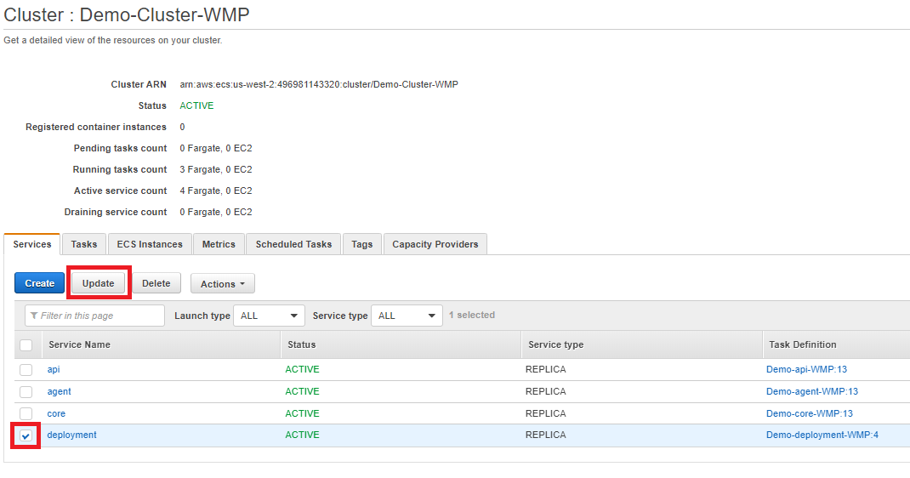

# New Version Upgrade Process \(Terraform\)

Upgrading to a new Intellio version in an AWS environment can be done in two ways

1. Terraform apply \(RECOMMENDED\)
2. Manual ECS cluster changes

The goal of this guide will be to walkthrough the Terraform apply upgrade.

Confirm that no Intellio DataOps processes are in progress before starting the deployment. Run the query below on the PostgreSQL metastore and ensure that it returns zero results before proceeding further.

```text
SELECT * FROM meta.process
```

In Terraform Cloud, navigate to the appropriate workspace and then click "Variables".


Update the "imageVersion" variable with the version number that is being upgraded to.


Queue the Terraform plan, providing a "Reason for queueing plan". 



The deployment process only allows incremental upgrades going forward. There is not support to revert to an earlier version at this time.


The plan should immediately launch, wait for the plan to finish. If the plan succeeds and the proposed resources changes align with expectations, confirm the plan to launch the Apply phase.

* If the Plan or Apply phases return error messages, please engage with the West Monroe team to troubleshoot.
* Generally the only resources that should be changed are the Container resources. You should see resources being changed or being destroyed and recreated. If resources are planned to be destroyed without an equivalent being created in the plan, please engage with the West Monroe team to troubleshoot. Most likely, there have been infrastructure changes made manually that Terraform is trying to revert back.


After the Apply phase runs successfully, navigate to the Deployment container logs in Cloudwatch and confirm that the Deployment ran successfully.

1. Navigate to the Cloudwatch service in AWS and select "Log groups" on the left hand side of the page.
2. Find the log group called "/ecs/&lt;environment&gt;-deployment-&lt;client&gt;"
3. Click the logs for the latest running deployment

The Deployment service will log all of the steps it is performing, and attempt to rollback the environment to the previous version if any errors occur. 

If the deployment hasn't ran, follow these steps to kick off the service manually.

Head back to the clusters page and click into the ECS Cluster that contains the containers that are being updated. When in the cluster, select the deployment Service Name and click "Update".



Change the Revision to the latest version \(just created in the previous steps\) and set the "Number of tasks" value from 0 to 1. Click "Skip to review" and then "Update Service"


The service is now updated to start the deployment container, and will now start a task shortly. The task will run, perform the deployment steps in the running container, and then set the service back to 0.


 

