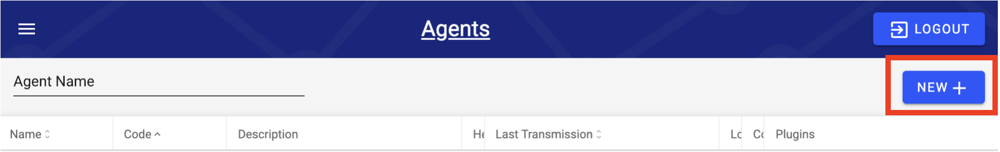
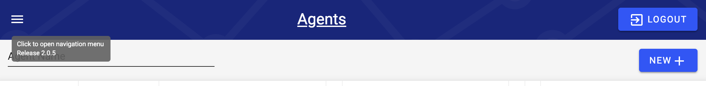
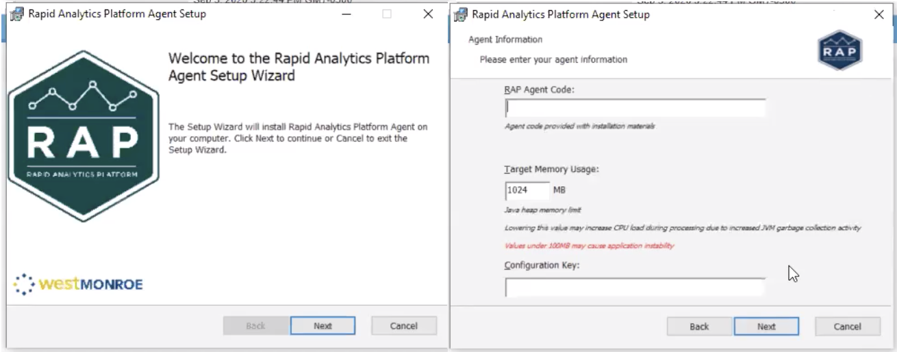
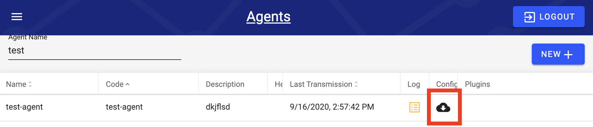
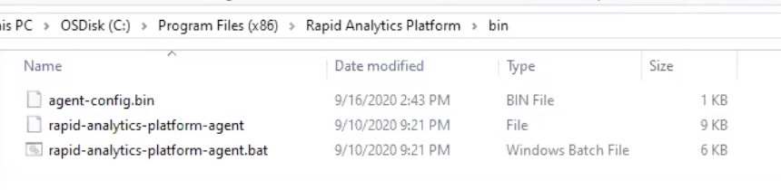

# Installing a New Agent

RAP Agents are a means of transporting data from a source data source to a location RAP can manage \(either in AWS or Microsoft Azure\). Agents are managed through the RAP interface once installed. This section walks through the process of installing a new RAP agent on premise \(on a client's machine\).

All data ingested into RAP flows through a RAP Agent, either one installed out of the box on AWS, on a client machine, or on another cloud environment.

## Prerequisites \(Requirements for Installation\)

Prior to installing the RAP Agent, the following requirements must be met.  Please ensure that the machine hosting the RAP Agent meets the requirements prior to installation.

* The machine or VM must be running one of the following 2 operating systems:
  * Windows 7 / Server 2008 R2 or later
  * Red Hat 6 or later \(or compatible distribution\) \(Current Linux distribution is deprecated.\)
* The latest version of the Amazon Corretto JDK 8 should preferably be installed on the destination machine.  Alternatively, if Oracle JDK 8 is already installed, that will be sufficient as well.  If neither is installed on the destination machine, navigate to the site linked [here](https://docs.aws.amazon.com/corretto/latest/corretto-8-ug/downloads-list.html) and download and install the Corretto JDK that is compatible with the target architecture and OS of the machine that the Agent will be installed on.
* Since the RAP Agent initiates all its own connections, outbound connections to various cloud resources on the public Internet are required.  If a firewall is limiting outbound internet access, the following resources should be allowed through the firewall \(exact domain names will vary by environment\).  Note that these are all secure endpoints, so if SSL inspection is enabled at the firewall, special consideration is needed to ensure that the certificate presented to the machine hosting the RAP Agent is trusted.
  * AWS S3 / Azure Data Lake Storage via HTTPS \(port 443\) for the following locations
    * Landing area
    * RAP Agent update area
  * RAP API endpoint via HTTPS \(port 443\)
  * Auth0 via HTTPS \(port 443\)
* File and database sources that will be accessed through the RAP Agent must be accessible from the machine the RAP Agent is being installed on.  In the case of database sources, many customers install the RAP Agent software directly on the database server.  However, network connectivity from the machine that the Agent software is being installed on is all that is required.  Note that the RAP Agent will be performing data pulls and uploading to AWS / Azure, so the recommendation is to not segment off the Agent machine from the sources being accessed in a way that traffic needs to cross a limited capacity network segment to reach those sources.
* The user account intended for RAP on source databases need to be set up with native database engine authentication.  In the case of SQL Server, Windows / Azure AD authentication is not supported for the RAP user and only SQL Server authentication can be used.
  * Mixed-mode authentication can still be enabled to allow for integrated authentication for non-RAP related loads.

## !! Setting up a New Agent Configuration

!! Note: this has the parameters "Region" and "s3LandingPath" is there something different for the Microsoft Azure agent?



In the RAP UI, from the left hand menu navigate to Agents, and click New. From this settings interface input the required inputs as seen below. Additional parameters exist for more detailed installations. Note that you will need information about the machine the agent will be hosted on.

| Agent Inputs | Detail |
| :--- | :--- |
| Name | Agent code on the backend, and name reference for sources and other RAP elements within the UI. |
| Description | Necessary clarification and detail. |
| Region | AWS region, or Microsoft Azure region that the RAP is stored and being processed in \(e.g. "us-west-2"\). |
| Machine Guid | A specific key to identify the machine the agent is running on, see below for the terminal command to obtain. |
| s3LandingPath | Environment name \(soon to be deprecated\). |

#### Machine Guid Command

To access the Machine Guid, run the following command in the terminal.

```text
reg query HKEY_LOCAL_MACHINE\SOFTWARE\Microsoft\Cryptography /v MachineGuid
```

## Installing the RAP Agent \(Windows\)

As a client, go to the AWS S3 console for the specific environment on which RAP will be operating. Look for the bucket &lt;environment&gt;-agentjar-&lt;client&gt;. Specifically looking for the "agentjar" bucket. Within this bucket there will be an msi-install. The deployment install drops the installer into this bucket location. Install the appropriate version based on the version of RAP your client is working with. Identification of the 

Identify the appropriate version of the .msi \(installer\) by hovering over the navigation menu in the upper left hand corner of the RAP UI.



Download the appropriate version of the msi installer. Once downloaded and opened, the computer will be prompted with typical installation commands, such as if the msi is allowed to make changes to the computer and the installation helper popup. Answer the appropriate prompts.



A specific **RAP Agent Code** will be required, and this is the **RAP Agent Name** from the RAP UI. Other inputs will be prompted and can be tailored.

The final step of the installation pertains to providing the appropriate security credentials to the RAP Agent and the RAP UI. On the client computer, navigate to the RAP UI and in the RAP IU navigate to the Agents screen and click on the cloud icon under the Config column \(and for the appropriate Agent row\). Clicking on this icon will download the configuration document.



Locate the file which is binary encrypted and contains the Auth0 credentials. The downloaded file should be named "agent-congic.bin". Move this file to the bin folder within the RAP Agent: C:/Program Files \(x86\)/Rapid Analytics Platform/bin



This should complete the setup of the RAP Agent on the client machine. All further configuration should be able to be completed via the RAP UI, such as locating file paths or database/data warehouse credentials.


If the RAP Agent is not heart beating with the RAP UI, you man need to go to "Services" on the Windows machine, locate the "RAPAgentBat", right click and click restart. 


## Obtaining the DataOps Agent Installer

The DataOps Agent installation build contains authorization to connect to only the specific environment it is configured for. Therefore, the correct build must be generated by the DataOps development team. Please reach out for a link to the correct installation build.


Security credentials.

Download icon. Binary encryption.

TODO - copy/paste from existing [Word doc](https://westmonroepartners1.sharepoint.com/sites/DDPA/0063900000stpZHAAY/Docs/Forms/AllItems.aspx?FolderCTID=0x0120001A877AC2A8D0754C894745F7F2227E37&id=%2Fsites%2FDDPA%2F0063900000stpZHAAY%2FDocs%2FImplementation%2FTechnical%20Documentation%2F3%20-%20RAP%2FRAP%20Agent%20Installation%2FRAP%20Agent%20Install%20Guide%20for%20Windows%2Epdf&parent=%2Fsites%2FDDPA%2F0063900000stpZHAAY%2FDocs%2FImplementation%2FTechnical%20Documentation%2F3%20-%20RAP%2FRAP%20Agent%20Installation)? 

System Requirements

Installation

!! Include video recording steps as well.


## Installing the RAP Agent \(Linux\)


Historically there has existed a RAP Agent for Linux, however, due to lack of demand the Linux RAP Agent has been deprecated. Historical Linux RAP Installation can be found [here](https://westmonroepartners1.sharepoint.com/sites/DDPA/0063900000stpZHAAY/Docs/Forms/AllItems.aspx?FolderCTID=0x0120001A877AC2A8D0754C894745F7F2227E37&id=%2Fsites%2FDDPA%2F0063900000stpZHAAY%2FDocs%2FImplementation%2FTechnical%20Documentation%2F3%20-%20RAP%2FRAP%20Agent%20Installation%2FRAP%20Agent%20Install%20Guide%20for%20Red%20Hat%206%2E10%2Epdf&parent=%2Fsites%2FDDPA%2F0063900000stpZHAAY%2FDocs%2FImplementation%2FTechnical%20Documentation%2F3%20-%20RAP%2FRAP%20Agent%20Installation), but speak with your RAP contact before selling or promising a Linux RAP Agent.


