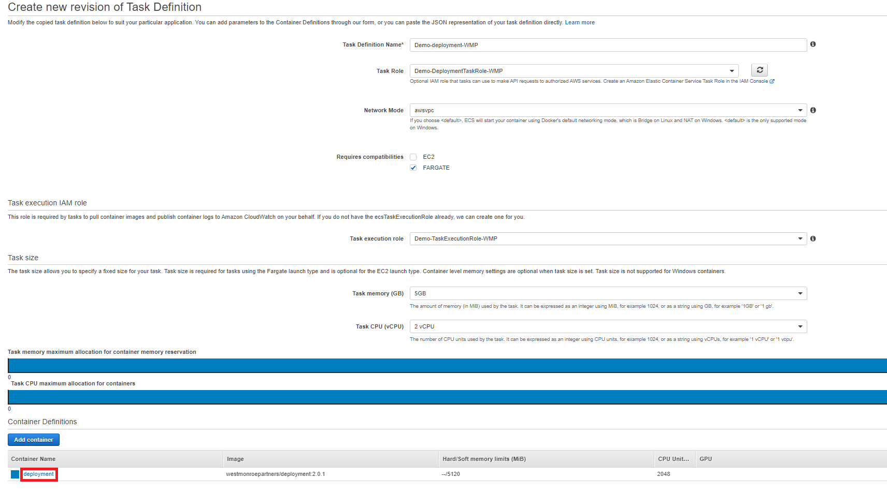
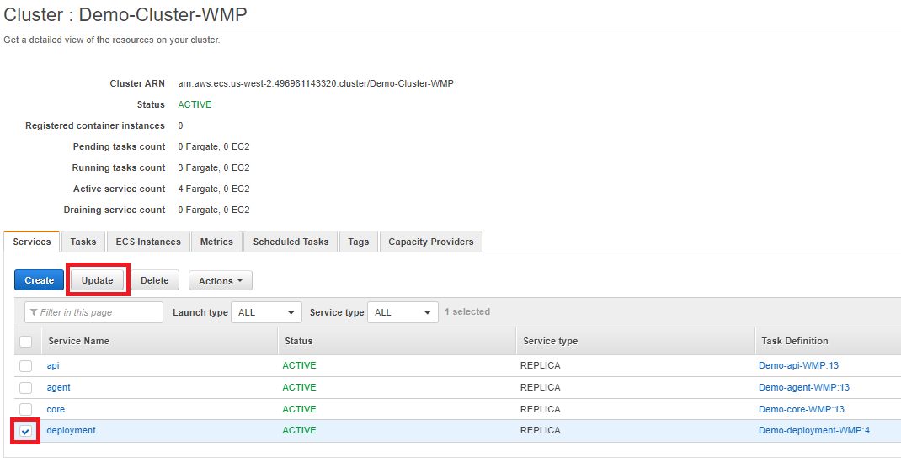

# Using the Deployment Service in AWS

## Prerequisites

* AWS Console Access
* Read and write access to RAP ECS Clusters and Task Definitions
* Read access to deployment cloudwatch logs
* RDS Query Editor access or PgAdmin access

## Running the Service

1. Make sure there are no currently running processes in RAP. Check the UI or check the meta.process table - if processes exist, then wait for them to finish or work with the Configuration team to clear them out of the process queue.
2. Navigate to the Amazon ECS Service in the AWS Management Console
3. Click the "Task Definitions" link on the left side of the page

4. Select the deployment task definition for the deployment environment. The task definition is named &lt;environment&gt;-deployment-&lt;client&gt;. Click "Create new revision"

5. Click on the deployment Container Definition to open the configuration window for the deployment container.

6. Once the configuration window opens, change the docker image name in the Image value to the targeted version - in the form of westmonroepartners/deployment:&lt;version-number&gt;

7. Scroll down and update the Environment variable named "version" to the targeted version number. Click Update on the bottom of the window.

8. Click Create on the bottom of the new revision page. A new revision of the Task Definition is created.

9. Head back to the clusters page and click into the ECS Cluster that contains the containers that are being updated. When in the cluster, select the deployment Service Name and click "Update".

10. Change the Revision to the latest version \(just created in the previous steps\) and set the "Number of tasks" value from 0 to 1. Click "Skip to review" and then "Update Service"

11. The service is now updated to start the deployment container, and will now start a task shortly. The task will run, perform the deployment steps in the running container, and then set the service back to 0.

## Updating External Agents 

### On-Premise Agent

1. Deployment service will update the agent jar file in S3 and trigger the auto update process- make sure Agent has autoUpdate set to true in the Agent parameters

### ECS Agent

1. Navigate to the Task Definition for the External Agent service and create a new revision. Update the image to the target version, similar to how the Deployment service was updated in the previous section steps.
2. Navigate to the Service for the External Image and update the Task Definition to the new revision \(latest\), then save the update to the service. 
3. A new task should start up with the new Task Definition and the old task should stop.
4. Confirm that the Agent is running on the target version by checking the Task Definition in the currently running external agent task.

## Monitor/Troubleshoot Deployment

1. Navigate to the Cloudwatch service in AWS and select "Log groups" on the left hand side of the page.
2. Find the log group called "/ecs/&lt;environment&gt;-deployment-&lt;client&gt;"
3. Click the logs for the latest running deployment

The Deployment service will log all of the steps it is performing, and attempt to rollback the environment to the previous version if any errors occur. 

