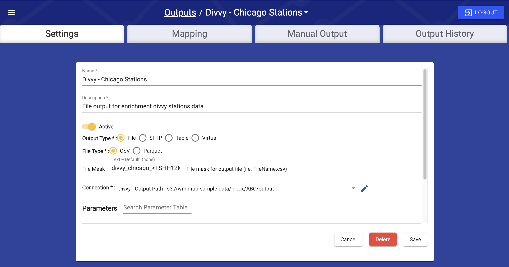
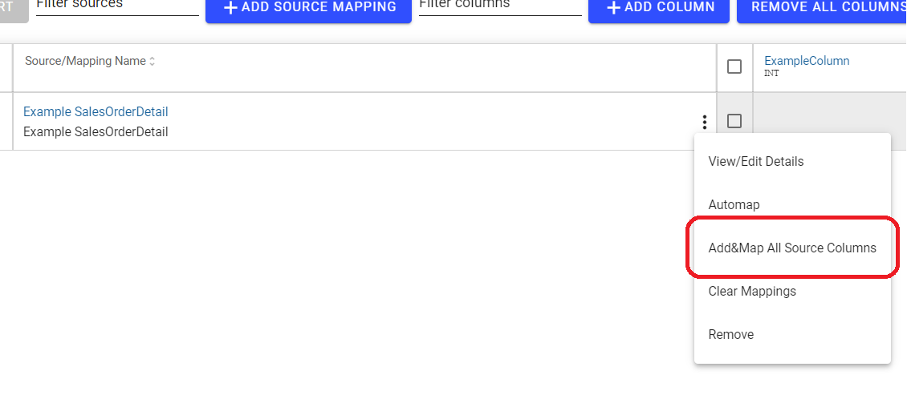
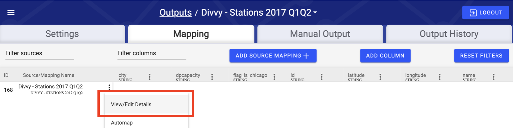
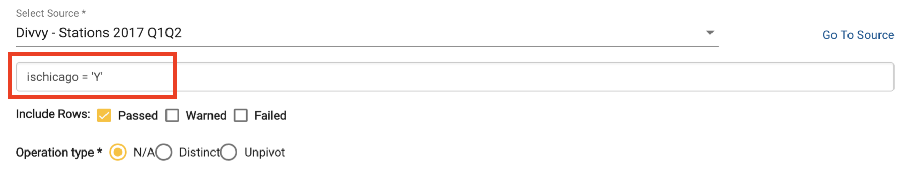
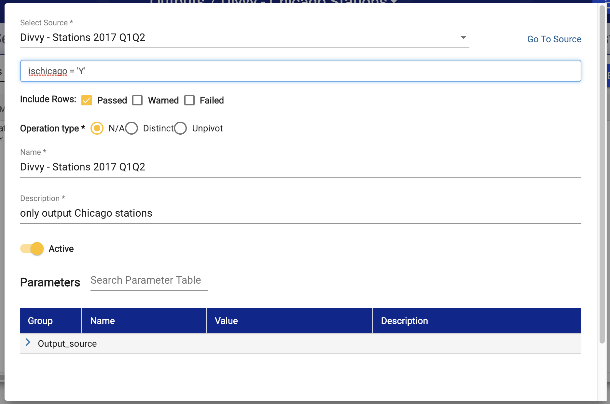
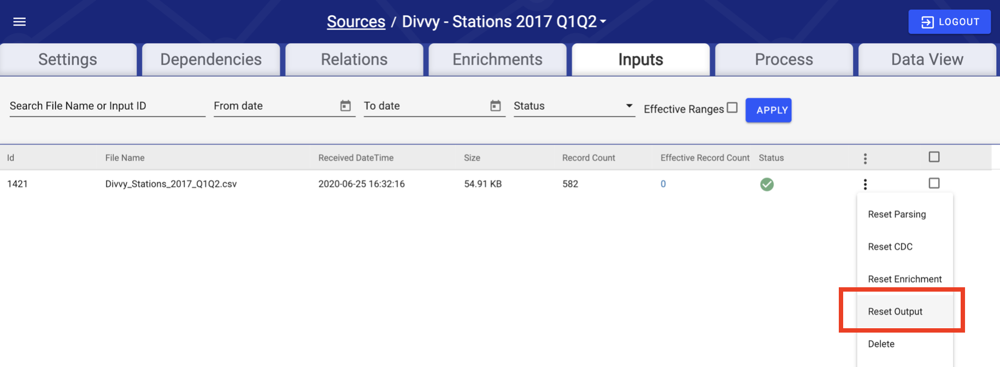

# Output

## Logical Data Flow


Output processes and maps transformed data from the Data Hub to a Data Warehouse or 3rd party. Output typically consists of very limited transformation logic, instead focusing on simple mappings of data fields from the Data Hub to the final location. In this example we map the output back to an S3 location.

## Step 1: Create Output Connection

An output connection is necessary in order to complete this phase. If this was not created during the [Connection](connection.md) section earlier, complete this first.

## Step 2: Create Output

### Output Creation

Before configuring any mappings, RAP requires general information about the desired Output, including a name and where within the connection the output should push data. To begin creating an Output, select Outputs in the Navigation Menu, and then select **Create New Output** on the Outputs screen. Following the [Naming Conventions](output.md), use the following values for Output Details configuration:

* **Name:** `Divvy - Chicago Stations`
* **Description:** File output for enriched divvy stations data

### Output Configurations



#### Output Type

RAP offers four output types. For this example we will use `File`.



RAP can output to a **File**, which can be a CSV or Parquet format and optionally compressed with gzip.



RAP can output to, manage, and ensure accurate refresh of a database **Table**.



RAP can send files via **SFTP** connection in a CSV format.



RAP can create a Postgres database view to expose data for polling by outside systems, otherwise known as a **Virtual** table.



#### File Type

Because `File` was selected, this option displays. Select `CSV` to output a simple `.csv` file. For more information on Output File Types, see below:



A plain-text comma-separated file. Common and easy to import, but not suitable for large files or semi-structured data.



Parquet is column-oriented data storage format, useful when direct to file queries are needed, such as use in Apache Hadoop, Apache Spark, or AWS Athena.



### Output Parameters

**connection\_name:** Select the Output Connection configured earlier: `Divvy - Output Path`. For help configuring the Output Connection, see [Connection Configuration](connection.md).

**file\_mask:** Enter `divvy_chicago_only_<TSHH12MISS>.csv`. This is a mask that describes the name of the output, where `<TSHH12MISS>` is replaced by the time the file was generated.

**key\_history, partition,** and **limit\_by\_effective\_range** can be safely left as-is for now. For more detailed information, see the [Output Configuration]() section in the [Configuration Guide](output.md).

## Step 3: Map Output

With the output details configured, and a location within the connection to push the data established, the next task is to map the individual columns from the RAP data hub to the output file.

### Adding a Source

To enable mappings between an output and a source, the first step is to add the source to the Output Mapping screen, thus generating a link between this Source and Output. Click **Add Source Mapping** at the top of the mapping table and underneath the "Mapping" tab, as seen below.


This should bring up the Output Source configuration modal. To select the source to map, click on the 'Select Source' search bar/drop down menu circled below, begin typing the name of the source that needs to be mapped, and once the desired source appears in the dropdown menu, it can be selected.


#### Options: 

* **Operation Type:** Default is "N/A". Allows the user to mark an output source mapping as an aggregate. More information on aggregate source mappings can be found below.
* **Name:** The name of the Source Mapping defaults to name of the source itself. The user may want to set their own name for the source mapping, for instance to help distinguish between two Source Mappings that come from the same source.
* **Description:** Allows the user to briefly describe to other users the use case of the Source Mapping.
* **Auto Add Columns:** Default is ".\*". Regex pattern, all matching column headers will be automatically added to the output. A different pattern can be set 
* **Key History:** Default is false. Output key history for Key Output Sources - ignore for Time Series sources.
* **Post Processing Command:** Default is true. SQL Command to run after output is complete WARNING: This will run live against your destination DB
* **Allow Output Regeneration:** Default is true. If set to false, the output will not be generated if triggered by an output reset or validation reset

#### Aggregate Output Sources

Aggregate outputs allow users to output data at a grain higher than their actual data. All columns in the output fall into one of two categories:

* **GROUPS:** Static fields by which rows with matching values will be grouped together. Akin to columns in a SQL "GROUP BY" clause.
* **MEASURES:** Usually numeric fields that we will perform aggregate operations on.

### Adding Columns


First, to add a single column, click on **Add Column** in the top middle of the screen, seen next to the **Remove All Columns** button in the image above.

Then, when the create column modal opens \(seen in the image below\), a column name must be added. The column name should start with a letter and may contain only letters, numbers, and underscores.


Optionally, the user can add a description to the column, or explicitly set the datatype of the column. If no datatype is set, the datatype of the column will be automatically inferred based on what source attributes are mapped to the column.

Furthermore, to add all of the source data columns at once, instead of one by one, click on the Output Source menu button \(the vertical stack of three dots on the far right of the "Source/Mapping Name" column\) and press the "Add&Map All Source Columns" button \(circled in the image below\)




Note: It is best practice to manually add all Output Columns when configuring an enterprise grade system to adhere to destination naming convention and semantics.


### Filtering Data

Add a filter that ensures the only records in the output have a flag of `ischicago = 'Y'`. This uses the Expression created earlier to filter the Output for only Divvy Stations in Chicago.

Click on the Source header above the Source column names to open up the filter menu, as in the image below.





Enter the following code for the Filter Expression, which makes use of the `ischicago` flag.

```sql
ischicago = 'Y'
```

#### Parameters:

**Include Rows:** `Passed` only. This checks flags created during [Validation](validation-and-enrichment.md#step-1-configure-validation) to determine which data to include in the output. Here, if rows failed validation then RAP would be unable to correctly filter them.

**Operation Type:** `N/A`, this guide does not transform the data in any other way.

**Name:** `Divvy - Chicago Stations 2017 Q1Q2`

**Description:** `only output Chicago stations`



When the configured filter resembles the above image, select **Close** and then **Save** to complete Output Configuration.

## Next Steps

Now that a Source and Output have been fully configured, the final step is to run our file all the way through to our destination output.

### Creating Output File

The output file should appear in the appropriate folder specified during the creation of the output [Connection](connection.md#step-1-create-a-connection).

To ensure the output file is generated, navigate to the Source's Input tab. There, click on the the kebab button \(**⋮**\) on the Stations input and select **Reset Output**, as seen below.




For all future data files related to this Source, no manual reset steps are required for the data to flow fully through Validation and Enrichment and generate a new file in the Output folder.


### Confirming Successful Output

If configuration was done correctly, the output file should be found in your designated output container in S3, and it should contain 518 entries \(519 including the headers\).


