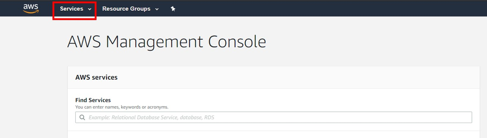
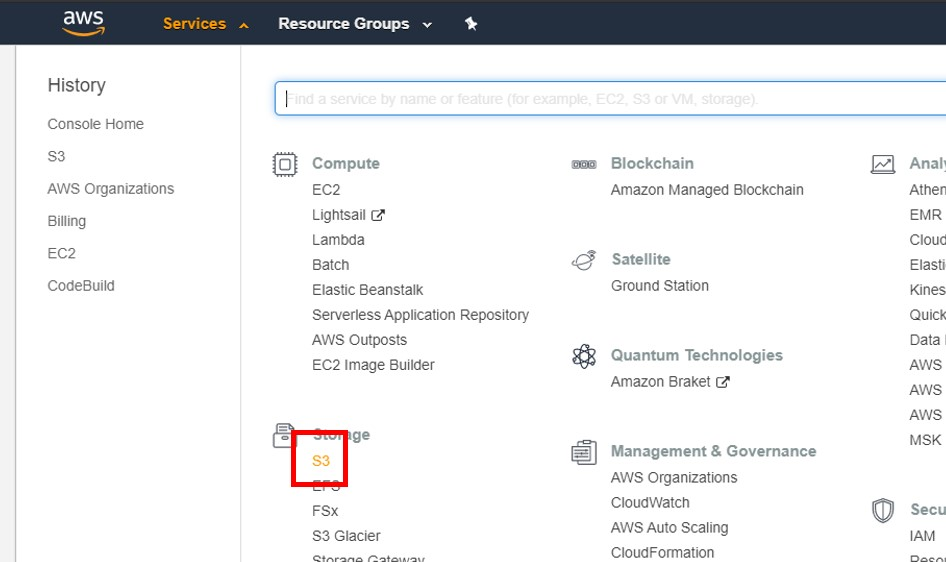
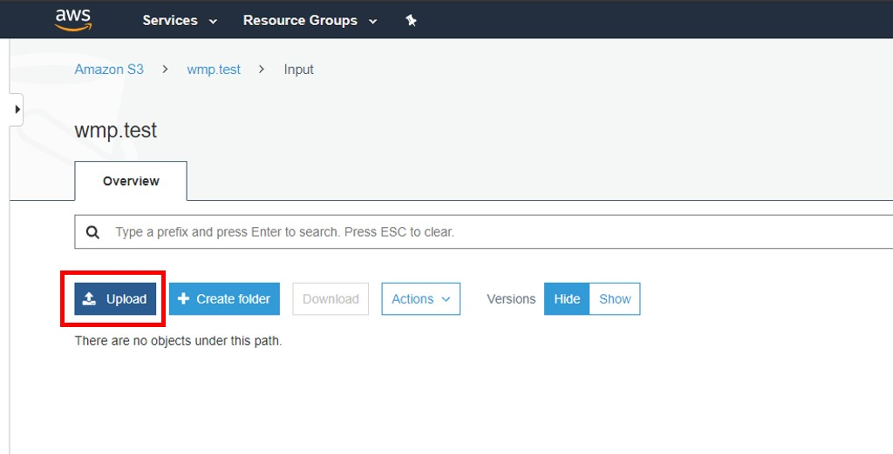
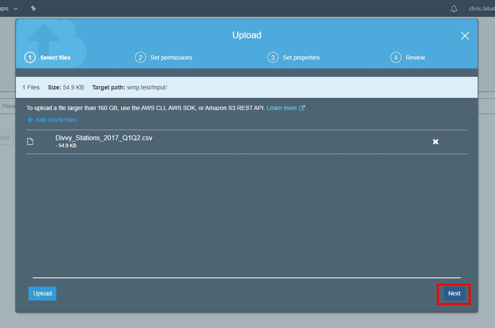

# Setting up

## Step 0: Logical Data Flow

The steps outlined in this Setting Up section correspond to creating a raw data location. The AWS environment created here is the raw data source that then needs to be appropriately ingested into RAP in the subsequent steps of Connection and Source.

## Step 1: Download the Divvy Data

The Data Integration Example uses Divvy Bike data hosted on Amazon Web Services' S3 buckets. Click to download the file [Divvy\_Stations\_2017\_Q1Q2.csv](https://wmp-rap-sample-data.s3.us-east-2.amazonaws.com/source-files/Divvy_Stations_2017_Q1Q2.csv). Save it locally.

## Step 2: Connect to AWS

RAP uses Amazon Web Services \(AWS\) to host and process the data. In order to setup this example, you will need to use the AWS interface to manually stage data in a location for RAP to pick up and process.

Your RAP account team will provide you with credentials to an AWS account. Once you have logged in, navigate to the S3 service from the Services dropdown menu in the top-left corner of the AWS Management Console.

## Step 3: Explore the S3 Environment

S3 is a storage service in AWS that allows you to store files in a structured hierarchy as you would in a conventional file system such as Windows File Explorer.

The S3 environment should already be provisioned as part of the automated deployment of RAP for your particular project. Typically, each RAP project will have an _input_ container to hold files that will be ingested into RAP, and an _output_ container which will be the destination of files exported from RAP. 

The S3 environment may have other containers that may be integral to the project workflow. Your RAP account team will let you know how all of the containers in your S3 environment are to be used. 

## Step 4: Upload the Divvy Data

Before ingesting data from S3 container into RAP, The data must first be uploaded to the input container. Navigate to the designated input container for your project and click the Upload button.  

Once the upload modal window appears, drag and drop the example file that was downloaded in Step 1 into the window. Click Next on any following prompts until the upload is complete. 


Remember that the name and path of your input container will be unique to your project.


