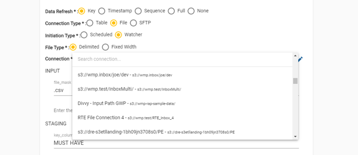
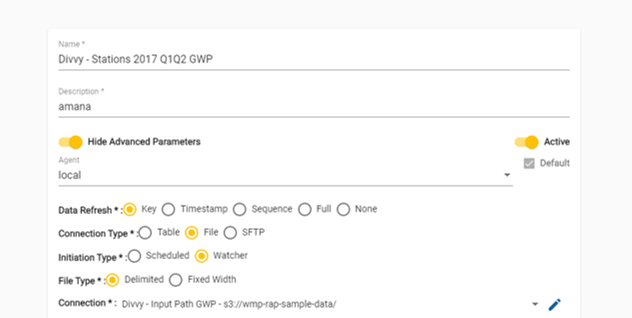
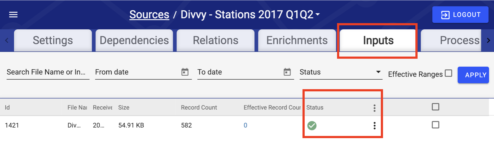

# Source

## Logical Data Flow

Sources  managing the entire logical data flow. Through setting parameters within the setting or through the different sub-tabs within the Source UI the flow from ingestion through output is managed. This means the four steps discussed in the How It Works section are managed from the Sources UI. What is covered in this step is how Input and Staging are set up. 

## Step 1: Create a Source

Navigate to the Sources screen through the Menu, then create and name a new Source in the same fashion as [Input and Output Connections](connection.md). Be sure to again follow [Naming Conventions](source.md). In this case, it is recommended to use `Divvy - Stations 2017 Q1Q2`.


The below image shows some available controls that we will not use in this basic example. Because these are more advanced features, this section only provides a brief description of each.




**Hide Advanced Parameters** reveals advanced source parameters when turned off.



**Active** is used to deactivate or reactivate a source. By default, all sources are active when created. Deactivating a source removes it from the active sources list, and stops any schedules, file watches, and processes from running on the source. Once this source is reactivated, it can begin processing again.



The RAP **Agent** establishes a secure connection between data sources and the RAP instance. It uploads them securely and quickly into RAP.



**Default** sets the current Agent to be the default Agent when configuring future Sources. It is common to create many Sources that all use the same Agent.



## Step 2: Configure Source Details

There are three main configuration categories that define how the system should Input and Stage data:

### Data Refresh Type

_The Data Refresh Type specifies how RAP tracks changes in data._

Select `Key`. The Divvy Stations file is suitable for the Key refresh type. Each record represents a station.



Sources with the **Key** refresh type contain a unique identifier or _key_ tied to a logical entity. These can be used as lookups from other sources. Sources with a refresh type other than Key cannot be used as lookups. In the terminology of traditional star schema models, Key Sources are analogous to Dimensions.



**Timestamp** sources identify changes in data using a column that contains the date and/or time for each record. Collectively, these values represent the time range of the entire data set. Data with newer time ranges replace data with older time ranges.



**Sequence** sources identify changes in data using a column containing integer numbers that follow a sequence. Data with higher value sequences replace data with lower value sequences.



**Full** sources replace the data completely whenever RAP ingests new data into the source.  



**None** sources do not track changes in data. Instead, RAP appends any new data to the existing data.




Be sure to use `Divvy_Stations_2017_Q1Q2.csv -`the other files packaged in the original zip file are intended for other Data Refresh Types.


### Connection Type

_The Connection Type specifies the format of the target source data._

Select `File`, and then select `Delimited`from the File Type option that will appear directly below. Divvy Stations is a CSV file that uses commas to separate data fields.



RAP supports two common **File** types: **Delimited** files designate a single character of text to separate data fields such as a comma. **Fixed Width** files are plain text files that use spaces to separate data. Data is spaced differently for each file, so RAP requires additional information before it can ingest Fixed Width files.



A **Table** is a collection of data that exists in a database in an arrangement of rows and columns. Data from tables can be obtained using a query language such as SQL.



A database table to be ingested at a scheduled time and cadence.




When selecting an Connection Type, the screen fields will dynamically update in the Schedule and Input Parameters sections of the Source configuration. Reference the [Configuration Guide](../../configuring-the-data-integration-process/) for more details on Connection Type attributes.


After selecting a Connection Type, select the connection that you configured on the previous page from the connection drop-down list. The list of connections available depends on your Connection Type.

### **Initiation Type**

_The Initiation Type specifies how RAP ingests data._

Select `Watcher`.



RAP continuously monitors a data path \(a local/network folder path or database connection\) and ingests data as soon as it becomes available.



RAP ingests data from a data path at a scheduled time and cadence.




When selecting an Initiation Type, the screen fields will dynamically update in the Schedule and Input Parameters sections of the Source configuration. Reference the [Configuration Guide](../../configuring-the-data-integration-process/) for more details on Initiation Type attributes.


## **Step 3: Specify Input Parameters**

Input parameters specify where within the connection the data exists, and how to retrieve it.

**file\_mask:** Enter `Divvy_Stations*.csv`. The **file\_mask** represents the _name_ of the file. Using a mask allows the selection of multiple files that fit a specific pattern.


In RAP, a mask uses \* for representing a variable block of text. For example, `TestData*.csv` matches both `TestData04.09.2018.csv` and `TestData04.10.2018.csv`, as well as just `TestData.csv`.



File masks typically help with automated daily loads from external exported data. In this scenario, the exporting system typically post-pends the file name with the timestamp of extract. By using the file mask, RAP can identify these files as generated from the same system, and process them within one source.


**connection\_name:** Select the input connection configured earlier: `Divvy - Input Path` . For help configuring the connection, see [Connection Configuration](connection.md).

## **Step 4: Specify Staging Parameters**

_The Staging Phase details how RAP reads and stores the Source._

**key\_columns:** Enter `id` . These are the primary keys for the input CSV: Divvy Stations uses `id` as its primary key.

## Step 5: Save

Click the **Save** button to save the Source; all parameters should be configured. Upon saving the Source, users will be redirected to the Source details view.

_RAP now has all the information it needs to complete the Input & Staging phases, allowing the source data to be ingested, read, and written into the RAP internal storage database._ 

## Step 6: Validate File Input

Check the Inputs tab at the top of the page to verify that the file has been successfully pushed to the system.


RAP will automatically begin the Input phase when the input files appear in the Connection specified earlier. These files will disappear once RAP ingests them.


