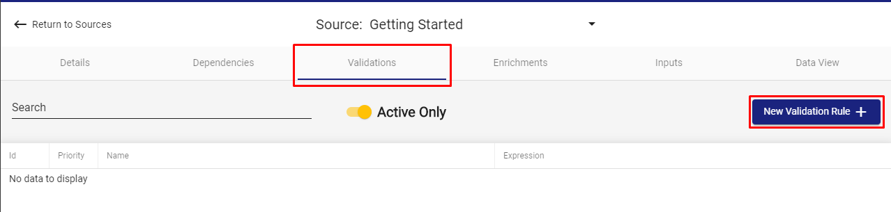

# Validation and Enrichment

## Step **1: Configure Validation**

A Validation Rule consists of validation logic, in the form of a SQL WHERE statement. After checking each statement individually, RAP tags each record with a pass, failure, or warning flag, as well as which rule\(s\) triggered the warnings or failures. This section makes a simple validation rule that ensures the city field has a value.

Navigate to the previously configured \(`Divvy - Stations 2017 Q1Q2` \) Source's Validation tab, and click New Validation Rule.



Configure the following parameters. While there are no [Naming Conventions]() for Validation rules, use the following values.

* **Name:** `City is Null`
* **Description:** `Warn when city is null`
* **When expression is true, set to:** `Warn`

For the Validation Expression, input:

```sql
T.city IS NULL
```

Click **Save** to finish.



When entering an expression, type ````` to reveal all of the Source fields available.



When field names are prepended with a T, such as `T.city`, it indicates that the field exists in the current Source.



RAP supports Rule Types, whereby commonly used Validation Rules can be saved as preset templates. This is a more advanced feature discussed in the [Configuration Guide's]() [Validation and Enrichment Rule Templates]() section.


## **Step 2: Configure Enrichment**

An Enrichment Rule creates a new column, based on either a formula or a lookup match and return value from a separate source. This section creates a simple column that is "Y" when the city is Chicago and "N" otherwise.


This example portrays a business requirement to filter the location of the station based on whether it exists in Chicago or not. The BI reporting tool requires a flag that indicates this property in a simple way \(as opposed to the `city` column, which contains unpredictable values\). Creating this Enrichment Rule simplifies downstream reporting needs and allows greater flexibility when filtering data later on.


Navigate to the Enrichments tab within the Source, and click **New Enrichment Rule**. To ensure parameter names are valid and follow [naming conventions](), it is recommend to use the following values:

* **Name:** `Flag : Is Chicago`
* **Description:** `Flag if city is Chicago`
* **Enriched Column Name:** `ischicago`

#### Enriched Column Data Type:

This is a `text` datatype, because it is a conversion of the `city` field to either a "N" or a "Y".

#### Operation Type:

`Formula`. For more information on Operation Types, see below:



Create a calculated column, based on prescribed logic.



Create a new column retrieved from another source by matching to data within this source. Similar to an Excel VLOOKUP formula.




Specifying the Operation Type determines which additional parameters need to be specified, if any. If the form requires additional input, ensure that `Formula` is selected.


#### Return Expression:

Enter the following SQL code to create an expression with our desired logic.

```sql
CASE WHEN T.city = 'Chicago' THEN 'Y' ELSE 'N' END
```


Note: The supported syntax in the expression input is specific to PostgreSQL. Refer to PostgreSQL documentation: [https://www.postgresql.org/docs/](https://www.postgresql.org/docs/)



Click **Save** when Enrichment Configuration resembles the above image**.**

Enrichment Configuration is now complete.

## Step 3: Execute Validation and Enrichment Rules

Recall that the `File Push` Input Type configuration creates a Source that automatically ingests data when it appears. Thus, although Validation and Enrichment configuration shows as complete, the data we pulled in as part of our Source configuration lacks the logic we just configured.

To remedy this, navigate to Inputs page, and for the most recent line item, click on the ellipsis on the far right and select **Reset All Validation & Enrichment**. See below.


## Step 4: Ensure Validation and Enrichment Completion

Navigate to the **Data View** to double-check that the Validation and Enrichment steps were successful**.** The image below ****shows the view that should display.


For every enrichment, a green column should be created in the Data View. Additionally, every entry that is flagged as `Warn` should appear yellow. In this case, no records should be flagged.

This concludes Validation and Enrichments configuration. RAP is now ready to **Output** data, and will be configured in the final part of this guide.


At this point, the content of the Data Viewer can be downloaded into a CSV file by hitting the **Download** button located underneath the Data Viewer tab on the right of the screen.


