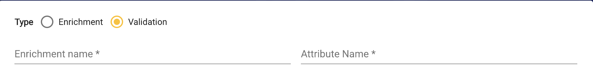
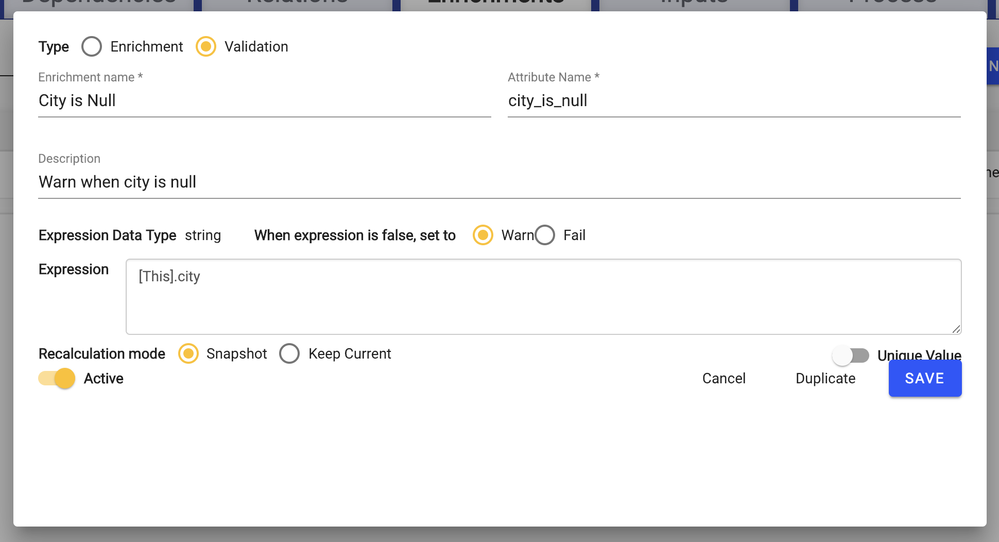
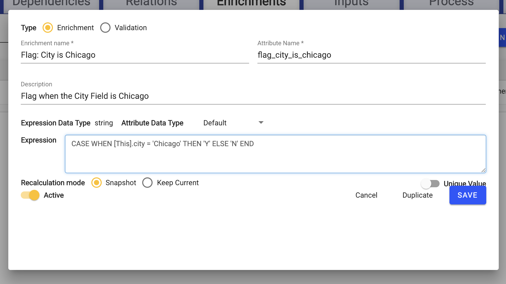
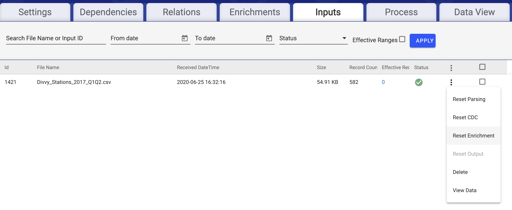
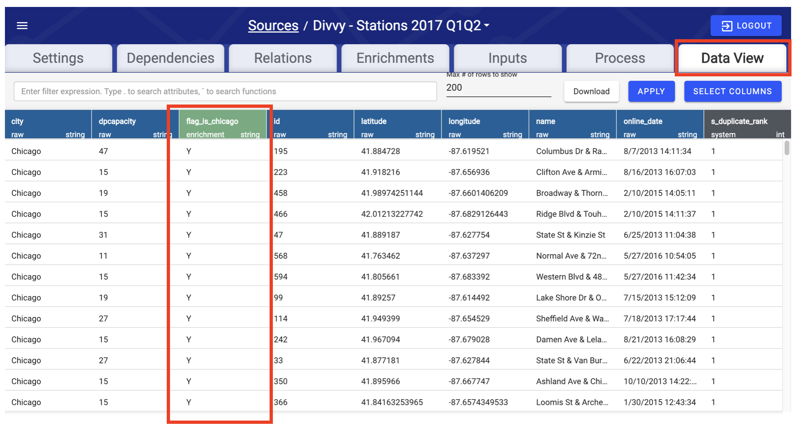

# Validation and Enrichment

## Logical Data Flow


Validation and Enrichment applies data quality checks and executes business logic. This happens within the Data Hub, where user-specified configuration rules drive transformations and processing in several automated steps. The Validation and Enrichment rules represent the majority of the logic and structure of data processing within DataOps, and provide a flexible, yet guided framework for data management.

## Step **1: Configure Validation** 

A Validation Rule consists of validation logic, in the form of a SQL WHERE statement. After checking each statement individually, DataOps tags each record with a pass, failure, or warning flag, as well as which rule\(s\) triggered the warnings or failures. This section makes a simple validation rule that ensures the city field has a value.

Navigate to the previously configured \(`Divvy - Stations 2017 Q1Q2` \) Source's Validation tab, and click New Enrichment.


In the screen that opens, select Type **Validation**.



Configure the following parameters. While there are no [Naming Conventions](validation-and-enrichment.md) for Validation rules, use the following values.

* **Name:** `City is Null`
* **Description:** `Warn when city is null`
* **When expression is true, set to:** `Warn`

For the Validation Expression input the following. Note that \[This\] represents to look within the currently selected data source.

```sql
[This].city IS NULL
```

Click **Save** to finish.




When entering an expression, type \`\`\`\`\` to reveal all of the Source fields available.



When field names are prepended with a \[This\] such as `[This].city`, it indicates that the field exists in the current Source.



DataOps supports Rule Types, whereby commonly used Validation Rules can be saved as preset templates. This is a more advanced feature discussed in the [Configuration Guide's](validation-and-enrichment.md) [Validation and Enrichment Rule Templates](../../configuring-the-data-integration-process/validation-and-enrichment-rule-templates/) section.


## **Step 2: Configure Enrichment**

An Enrichment Rule creates a new column, based on either a formula or a lookup match and return value from a separate source. This section creates a simple column that is "Y" when the city is Chicago and "N" otherwise.


This example portrays a business requirement to filter the location of the station based on whether it exists in Chicago or not. The BI reporting tool requires a flag that indicates this property in a simple way \(as opposed to the `city` column, which contains unpredictable values\). Creating this Enrichment Rule simplifies downstream reporting needs and allows greater flexibility when filtering data later on.


Navigate to the Enrichments tab within the Source, and click **New Enrichment Rule**. To ensure parameter names are valid and follow [naming conventions](validation-and-enrichment.md), it is recommend to use the following values:

* **Name:** `Flag : Is Chicago`
* **Description:** `Flag if city is Chicago`
* **Enriched Column Name:** `ischicago`
* **Recalculation Mode:** `Snapshot`

### Enriched Column Data Type:

This is a `text` datatype, because it is a conversion of the `city` field to either a "N" or a "Y". ****Select "string" from the dropdown menu.

### Return Expression:

Enter the following SQL code to create an expression with our desired logic.

```sql
CASE WHEN [This].city = 'Chicago' THEN 'Y' ELSE 'N' END
```

**Recalculation mode**

Recalculation mode indicates if this field needs to be refreshed. For the purpose of this example we keep the choice as Snapshot, which indicates the data source will not be updated once inputed into the system.



Snapshot performs the operation at time of data ingest only – and only on the incoming dataset contained within that Input. These formula are performed in the Enrich step on the incoming data only.



Keep current forces that formula to be shifted to the Recalculate step, which operates on the post-refresh Hub table that contains all current data for that specific source. Recalculate operates on all rows within that hub table every time a new input is loaded either to \[this\] source \(window functions\) or a dependent related source \(formula that use related source elements\).




Note: The supported syntax in the expression input is specific to PostgreSQL. Refer to PostgreSQL documentation: [https://www.postgresql.org/docs/10/functions.html](https://www.postgresql.org/docs/10/functions.html)




Click **Save** when Enrichment Configuration resembles the above image**.**

Enrichment Configuration is now complete.

## Step 3: Execute Validation and Enrichment Rules

Recall that the `File Push` Input Type configuration creates a Source that automatically ingests data when it appears. Thus, although Validation and Enrichment configuration shows as complete, the data we pulled in as part of our Source configuration lacks the logic we just configured.

To remedy this, navigate to Inputs page, and for the most recent line item, click on the ellipsis on the far right and select **Reset All Validation & Enrichment**. See below.



## Step 4: Ensure Validation and Enrichment Completion

Navigate to the **Data View** to double-check that the Validation and Enrichment steps were successful**.** The image below shows the view that should display. Note that naming in image if off due to test environment.



For every enrichment, a green column should be created in the Data View. Additionally, every entry that is flagged as `Warn` should appear yellow. In this case, no records should be flagged.


Notice that a few \(41\) Chicago-located Stations are given an `ischicago = 'N'`. This is due to additional whitespace in some input data. Messy data is common — thankfully, DataOps has ways to deal with this problem.


This concludes Validation and Enrichments configuration. DataOps is now ready to **Output** data, and will be configured in the final part of this guide.


At this point, the content of the Data Viewer can be downloaded into a CSV file by hitting the **Download** button located underneath the Data Viewer tab on the right of the screen.


## Note: Relations

Though not included in this example, Relations are another way to modify the data in a Source. Relations can be thought of as a join/merge between multiple data sources, joining the current source with another reference source.

