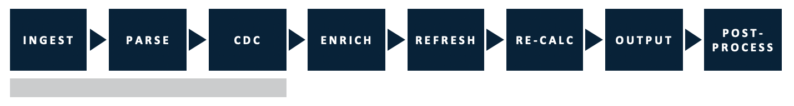
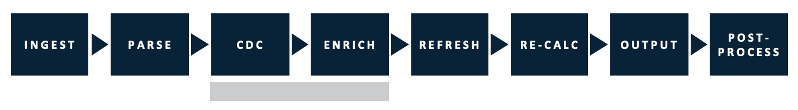
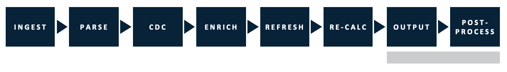
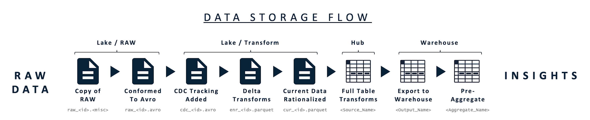

# !! How it Works \(new version\)

## The Logical Data Flow

As seen in the above data flow diagram, RAP intakes raw data and outputs an organized data warehouse. The Logical Data Flow consists of eight steps: Ingest, Parse, CDC, Enrich, Refresh, Re-Calculate, Output, and Post-Process. The Data Storage Flow consists of four main structures: Raw Data, Data Lake, Data Hub, and Data Warehouse. Though not shown in the diagram, each step in each flow consists of generated and configuration meta data to aid the user in process management and configurations respectively. 

To illustrate this introductory overview of the logical data flow we will focus in on the four data structures \(Lake/Raw, Lake/Transform, Data Hub, Data Warehouse\) and a selection of key steps.

### Lake / Raw External Data Source

RAP does not generate data. RAP relies on external **raw data** sources, and RAP supports many types of data sources such as flat CSV Files, databases or data warehouses. This raw data exists somewhere and the first step of the logical data flow \(ingest\) relies on appropriately copying and transforming this raw data.


#### External Data Sources - ERP, CRM, HR, FIN, etc.

RAP does not generate or store business data, rather it collects this information from various **External Data Sources**. The nature of these sources can vary, and RAP has existing modules built for the most common data stores used by enterprise organizations.


### Ingest

Ingest is the first step of the logical data flow and is the process by which data enters RAP. The ingest and parse steps appropriately copy raw data and convert this raw data into workable formats. The ingest process is facilitated by the Connections and Sources screens in the RAP interface. 

### RAP Data Lake

RAP imports the appropriately transformed raw data from source systems into an indexed **Data Lake**, which utilizes Amazon's S3 or Microsoft Azure's file storage technology. As RAP imports the data into the Data Lake, it identifies and stores information such as source database, original file location, and location in the Data Lake within the metadata structure, resulting in a self-managing Data Lake, useful for data scientists to access the raw information gathered on a scheduled basis.

### RAP Data Hub

!! MC - Data hub no longer resides in Postgres - now is exposed as a Hive table

The **Data Hub** consists of a Hive table optimized to process and store data for RAP. As data moves through processing steps, RAP automatically and continuously modifies the underlying table structures to ensure optimal performance.

### Enrichment

**Enrichment \(Enrich\)** is the step of the logical data flow that applies data quality checks and executes business logic. This happens within the Data Hub, where user-specified configuration rules drive transformations and processing in several automated steps. The Enrichment rules represent the majority of the logic and structure of data processing within RAP, and provide a flexible, yet guided framework for data management. 

The Enrichment step is facilitated by the Enrichment tab within the Source screen in the RAP interface. 


**Enrichments Execution**

RAP supports many types of enrichments, and not all types of business logic can be executed at the same time. Based on the type of enrichment, calculation or aggregation the enrichment will execute at a different, appropriate time in the logical data flow or data processing actions. RAP's interface keeps the details of these executions behind the scenes and user friendly.


### Output

The **Output** step of the logical data flow and maps transformed data from the Data Hub to a Data Warehouse or 3rd party. Output typically consists of very limited transformation logic, instead focusing on simple mappings of data fields from the Data Hub to the final location.

The Output step is facilitated by the connections and source screens in the RAP interface.

### RAP- Managed Data Warehouse

The **Data Warehouse** data structure is the final of the data structures in the RAP data processes. The Data Warehouse focuses on optimized access for BI tools and analytics. RAP supports most column-oriented storage technologies, such as SQL Server, Snowflake, Parquet, etc. and can fully manage the table structures, data models, and maintenance operations within the Warehouse. RAP can also output data into a manually managed, existing data warehouse if needed.

### RAP Metadata Structure

RAP uses a **Metadata Structure** to manage information about configuration, process tracking, and data tracking throughout the entire platform. RAP utilizes a proprietary table structure to relate all these data points, and stores this information in a Postgres database for easy access.

## Historical Framework \(RAP 1.X\)

!! MC - Good idea to refer to the old framework, but doesn't seem the paragraph really adds more than just referring to historical content.  I'd probably just keep this section short to say "RAP 1.x did things differently, here's roughly how things map from 1.x to 2.0, old content link is here if you wanted to look at it".

RAP's 1.x framework was viewed as four storage structures and four data processing steps. The four storage structures map one to one between the two frameworks, but the eight steps of the logical data flow only roughly map into the four data processing steps. For reference the [historical framework](../../historical-reference/components-and-concepts.md) section is provided.

!! Cut this: The advantages of of the historical framework is the relationship between the data storage structures and metadata, analytics, and BI. The historical framework diagram is provided below and further reading can be found in the [historical framework section](../../historical-reference/components-and-concepts.md).

!! MC - The diagram is high-level enough that it still feels like it would apply in the RAP 2.0 world, seems like something we should put up top to say "here's how RAP flows things through at a high-level, now we're going to show how the 8 main steps / 4 data structures map to this".

* * * * * * * * * * * * * * * 

!! MC - For sections below, the Input / Staging / Validation and Enrichment / Output paradigm is something that relates to RAP 1.x, but the terms changed for RAP 2.0.  The job statuses in the UI for 2.0 don't make mention of these concepts, so this may be a bit confusing for someone to reconcile with what they see in RAP.  I'm thinking this should probably line up more with the 4 data structures \(Lake / Raw, Lake / Transform, Data Hub, Data Warehouse\).

### Input

!! MC - CDC step isn't really part of Input historically, it mapped more to Staging

The **Input** step moves data into RAP's Data Lake from source databases or file systems. This process collects information about the file or database table as it exists at the time of extract and stores this data in the Metadata Repository, ultimately generating the indexed RAP Data Lake.

### Staging

!! MC - CDC is not "Change Data Capture" any more in 2.0.  CDC is referred to as "Capture Data Changes".

!! MC - We should probably make mention of Data Profiling somewhere.  It's its own step that forks off from the Enrich step, but isn't really part of the main processing lineage.  Take a peek at the Miro board here to see where it fits:  [https://miro.com/app/board/o9J\_ktWj0Yk=/](https://miro.com/app/board/o9J_ktWj0Yk=/)

**Staging** reads data from the Data Lake writes data into RAP’s internal Data Hub. This process automatically converts the files in the data lake to the performance-optimized tables within the data hub. Additionally, Staging compares the individual files read from the data lake to what already exists in the Data Hub to track how data has changed since the last file was staged in a sub-process called Change Data Capture.

### Validation and Enrichment

**Validation** & **Enrichment** applies data quality checks and executes business logic. This happens within the Data Hub, where user-specified configuration rules drive transformations and processing in several automated steps. The Validation and Enrichment rules represent the majority of the logic and structure of data processing within RAP, and provide a flexible, yet guided framework for data management.

### **Output**

**Output** processes and maps transformed data from the Data Hub to a Data Warehouse or 3rd party. Output typically consists of very limited transformation logic, instead focusing on simple mappings of data fields from the Data Hub to the final location.

## The Four Data Structures and Metadata Structure

### Lake / Raw External Data Source

RAP does not generate data. RAP relies on external raw data sources, and RAP supports many types of data sources such as flat CSV Files, databases or data warehouses.


#### External Data Sources - ERP, CRM, HR, FIN, etc.

RAP does not generate or store business data, rather it collects this information from various **External Data Sources**. The nature of these sources can vary, and RAP has existing modules built for the most common data stores used by enterprise organizations.


### RAP Data Lake

!! MC - not solely on S3, can reside on Azure Data Lake Storage if RAP is deployed to Azure

RAP imports raw data from source systems into an indexed **Data Lake**, which utilizes Amazon's S3 or Microsoft Azure's file storage technology. As RAP imports the data into the Data Lake, it identifies and stores information such as source database, original file location, and location in the Data Lake within the metadata structure, resulting in a self-managing Data Lake, useful for data scientists to access the raw information gathered on a scheduled basis.

### RAP Data Hub

!! MC - Data hub no longer resides in Postgres - now is exposed as a Hive table

The **Data Hub** consists of a Hive table database structure optimized to process and store data for RAP. As data moves through processing steps, RAP automatically and continuously modifies the underlying table structures to ensure optimal performance.

### RAP- Managed Data Warehouse

The Data Warehouse layer focuses on optimized access for BI tools and analytics. RAP supports most column-oriented storage technologies, such as SQL Server, Snowflake, Parquet, etc. and can fully manage the table structures, data models, and maintenance operations within the Warehouse. RAP can also output data into a manually managed, existing data warehouse if needed.

