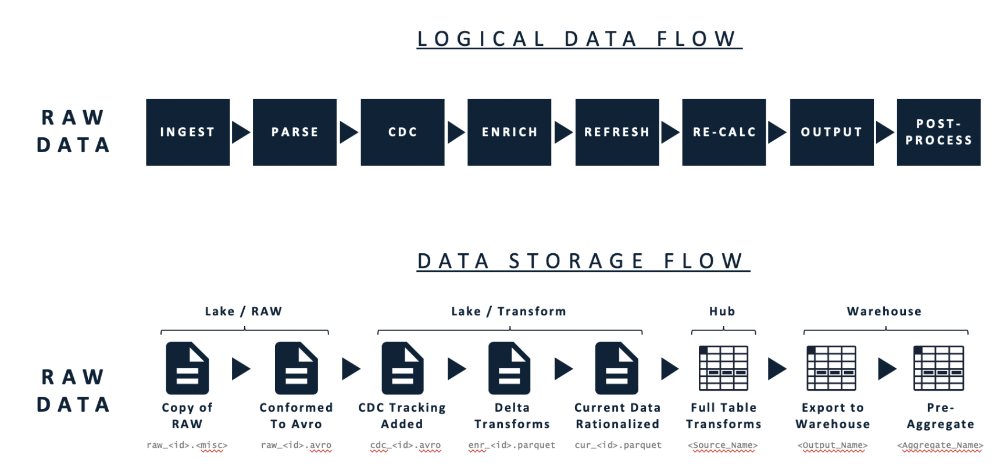
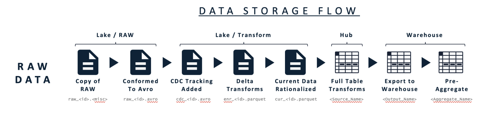

# !! How it Works \(new version\)

## The Data Flow

As seen in the above data flow diagram, RAP intakes raw data and outputs an organized data warehouse. The Logical Data Flow consists of eight steps: Ingest, Parse, CDC, Enrich, Refresh, Re-Calculate, Output, and Post-Process. The Data Storage Flow consists of four main structures: Raw Data, Data Lake, Data Hub, and Data Warehouse. Though not shown in the diagram, each step in each flow consists of generated and configuration meta data to aid the user in process management and configurations respectively. Though there are eight steps in the Logical Data Flow, we will focus on the four data processing steps that summarize the flow.

### Input

The **Input** step moves data into RAP's Data Lake from source databases or file systems. This process collects information about the file or database table as it exists at the time of extract and stores this data in the Metadata Repository, ultimately generating the indexed RAP Data Lake.

### Staging

**Staging** reads data from the Data Lake writes data into RAP’s internal Data Hub. This process automatically converts the files in the data lake to the performance-optimized tables within the data hub. Additionally, Staging compares the individual files read from the data lake to what already exists in the Data Hub to track how data has changed since the last file was staged in a sub-process called Change Data Capture.

### Validation and Enrichment

**Validation** & **Enrichment** applies data quality checks and executes business logic. This happens within the Data Hub, where user-specified configuration rules drive transformations and processing in several automated steps. The Validation and Enrichment rules represent the majority of the logic and structure of data processing within RAP, and provide a flexible, yet guided framework for data management.

### **Output**

**Output** processes and maps transformed data from the Data Hub to a Data Warehouse or 3rd party. Output typically consists of very limited transformation logic, instead focusing on simple mappings of data fields from the Data Hub to the final location.

## The Four Data Structures and Metadata Structure

### Lake / Raw External Data Source

RAP does not generate data. RAP relies on external raw data sources, and RAP supports many types of data sources such as flat CSV Files, databases or data warehouses.


#### External Data Sources - ERP, CRM, HR, FIN, etc.

RAP does not generate or store business data, rather it collects this information from various **External Data Sources**. The nature of these sources can vary, and RAP has existing modules built for the most common data stores used by enterprise organizations.


### RAP Data Lake

RAP imports raw data from source systems into an indexed **Data Lake**, which utilizes Amazon's S3 file storage technology. As RAP imports the data into the Data Lake, it identifies and stores information such as source database, original file location, and location in the Data Lake within the metadata structure, resulting in a self-managing Data Lake, useful for data scientists to access the raw information gathered on a scheduled basis.

### RAP Data Hub

The **Data Hub** consists of a customized Postgres database structure optimized to process and store data for RAP. As data moves through processing steps, RAP automatically and continuously modifies the underlying table structures to ensure optimal performance.

### RAP- Managed Data Warehouse

The Data Warehouse layer focuses on optimized access for BI tools and analytics. RAP supports most column-oriented storage technologies, such as SQL Server, Snowflake, Parquet, etc. and can fully manage the table structures, data models, and maintenance operations within the Warehouse. RAP can also output data into a manually managed, existing data warehouse if needed.

### RAP Metadata Structure

RAP uses a **Metadata Structure** to manage information about configuration, process tracking, and data tracking throughout the entire platform. RAP utilizes a proprietary table structure to relate all these data points, and stores this information in a Postgres database for easy access.

## Historical Framework

Historically RAP's framework was viewed as four storage structures and four data processing steps. The four storage structures map one to one between the two frameworks, but the eight steps of the logical data flow only roughly map into the four data processing steps. The advantages of of the historical framework is the relationship between the data storage structures and metadata, analytics, and BI. The historical framework diagram is provided below and further reading can be found in the historical framework section \(!! add link\)

