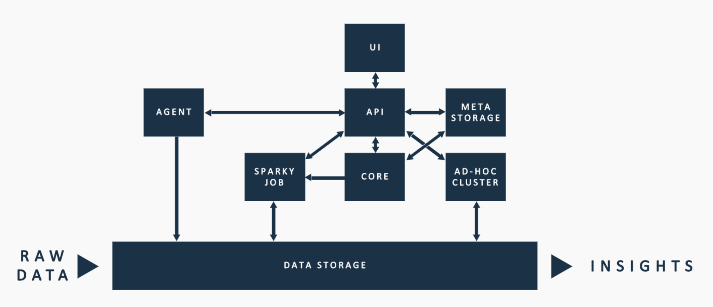

# !! Infrastructure Components

## The Components

RAP leverages various cloud components in AWS or Azure \(depending on the platform selected\). Regardless of the platform, the actions of the components remain the same. This section provides an overview of these different components and how these components interact with one another. Subsequent sections explore the details as they pertain to what specific services are leveraged in the AWS or Azure platform.

### UI \(User Interface\)

The UI represents what you see when you log into the RAP platform. The UI is the front end view of RAP. The [UI](../../logical-architecture-overview/user-interface.md#overview) is characteristic of the left-hand menu and consists of screens including Sources, Connections, Agents, and Outputs. The UI is agnostic to the platform \(AWS or Azure\) as it is interacted with through the browser.

### API

RAP's API is a lightweight communicator between all of the components of the infrastructure. The API strictly communicates between the components and does not execute any business logic.

### Meta Storage

Meta Storage is the component that executes the vast majority of business logic and transformation. Meta Storage encompasses the databases and functions \(in Postgres SQL\) to execute the required business logic. 

### Core

Core is the component of orchestration. Core manages executions of beginnings, hand offs, restarts, queues, and makes sure whatever must occur next does in fact occur. Core works closely with the Meta Storage to execute the appropriate business logic in the appropriate order. Core also works with Sparky Job to reference when to start up and when to shut down Spark infrastructure.

### Agent

The [RAP Agent](../../logical-architecture-overview/rap-agent.md#overview) works to move data from the client infrastructure into the RAP Cloud infrastructure.

### Ad Hoc Cluster

The Ad Hoc Cluster enables the UI. The primary purpose of the Ad Hoc Cluster is to execute the UI and ensure nothing breaks in the configuration of RAP. The most common usage of the Ad Hoc Cluster is the Data Viewer, such as viewing the first 200 rows of data.

To illustrate how the Ad Hoc Cluster works 

!! Add image of the physical architecture, what software used, etc.

RAP leverages various cloud components in AWS or Azure \(depending on the platform selected\).  This section provides an overview of the components leveraged by RAP, how they are leverages as part of the RAP processing engine, and how sizing affects processing performance.

This section covers the following components of the RAP infrastructure stack, as well as how sizing affects performance when applicable:

* On-Premise Agent
* Data Lake Storage
* Virtual Machines
* Database Layer

