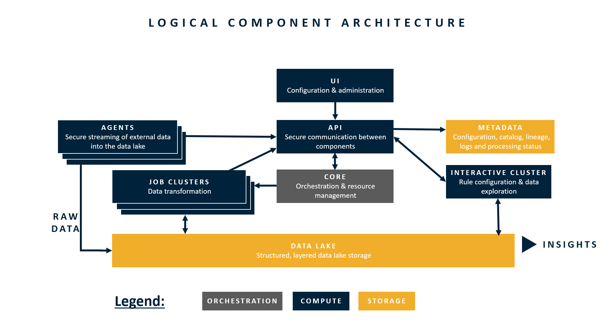

# Infrastructure Components

## The Components

DataOps leverages various cloud components in AWS or Azure \(depending on the platform selected\). Regardless of the platform, the actions of the components remain the same. This section provides an overview of these different components and how these components interact with one another. Subsequent sections explore the details as they pertain to what specific services are leveraged in the AWS or Azure platform.

### UI \(User Interface\)

The UI represents what you see when you log into the RAP platform. The UI is the front end view of RAP. The [UI](../../logical-architecture-overview/user-interface.md#overview) is characteristic of the left-hand menu and consists of screens including Sources, Connections, Agents, and Outputs.

### API

RAP's API is a lightweight communicator between all of the components of the infrastructure. The API strictly communicates between the components and does not execute any business logic.

### Meta Storage

Meta Storage is the component that stores the vast majority of business logic and transformation. Meta Storage encompasses the databases and functions \(in Postgres SQL\) to execute the required business logic. 

### Core

Core is the component of orchestration. Core manages executions of beginnings, hand offs, restarts, queues, and workflow engine. Core works closely with the Meta Storage to execute the appropriate business logic in the appropriate order. Core also works with Sparky Job to reference when to start up and when to shut down Spark infrastructure.

### Agent

The [RAP Agent](../../logical-architecture-overview/rap-agent.md#overview) works to move data from the client infrastructure into the RAP Cloud infrastructure. The RAP Agent is only utilized during the Ingest stage of the Logical Data Flow.

### Interactive Cluster

The Interactive Cluster enables the UI. The primary purpose of the Interactive Cluster is to perform lightweight SQL operations against the Data Lake for specific UI features such as Data Viewer and Query Validation during Rule creation.

To illustrate how the Interactive Cluster enables works, when you click "save" on a rule, DataOps will generate the query within the meta storage layer, then run that query with zero records against the data and return the results. The results are either a successful run \(Query Validation succeeded\) or a SQL error \(Query Validation failed\) with the details for that error displayed to the user. 

### Sparky Job

When a job is ready for execution, Core creates a new Sparky Job \(inclusive of a new cluster\). Business logic that has been validated in the meta storage layer is passed into this Job as a set of parameters/variables and then run. Sparky is written is Spark Scala, and focuses only on data processing. Sparky Job relies on the Core to indicate when to begin, run, or shut down based on appropriate orchestration.

### Data Storage

The data storage is the location of where the data is stored, and is dependent on the services used: AWS \(S3\) or Azure \(Azure Data Lake Gen 2\).

## Infrastructure Application

DataOps supports both AWS and Microsoft Azure cloud providers.

### Amazon Web Services Implementation

### Microsoft Azure Services Implementation

### Services Summary

| Component | AWS | Azure |
| :--- | :--- | :--- |
| Data Lake |  |  |
|  |  |  |
|  |  |  |
|  |  |  |


!! Resource Costs. Add here some links to pricing for the different resources.


!! Add image of the physical architecture, what software used, etc.

RAP leverages various cloud components in AWS or Azure \(depending on the platform selected\).  This section provides an overview of the components leveraged by RAP, how they are leverages as part of the RAP processing engine, and how sizing affects processing performance.

This section covers the following components of the RAP infrastructure stack, as well as how sizing affects performance when applicable:

* On-Premise Agent
* Data Lake Storage
* Virtual Machines
* Database Layer

