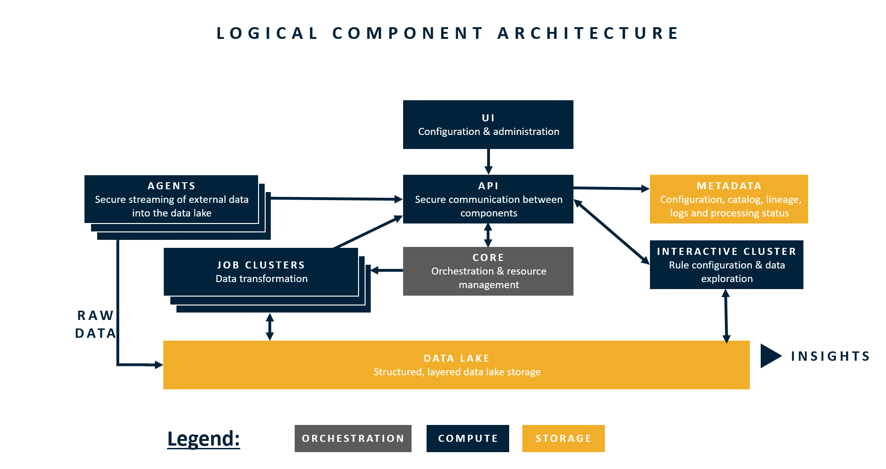

# Logical Architecture

As Intellio DataOps operates differently than traditional ETL tools, this section provides a deeper dive of how DataOps processes data, how data flows through DataOps, and how DataOps is logically organized.  The information presented in this section is helpful to know when architecting a new implementation leveraging DataOps as the data processing tool of choice.

It is helpful to think of Intellio DataOps is a modifications of SQL clauses. In some ways DataOps can be thought of as a front end wrapper for SQL, as each change in the interface modifies the ultimate SQL that is executed. Each step in the logical architecture modifies a different portion of the overall SQL code that executes from ingest through output.

### The Logical Data Flow

### The Logical Component Architecture

### Audience

The intended audiences for this section are the following:

* Data architects who have experience with traditional ETL tools and solutions and are seeking to understand how DataOps works in anticipation of needing to lead a new DataOps implementation.
* Cloud and application architects who are looking to understand how data moves through DataOps.
* Experienced DataOps configurators who are looking to understand more deeply how DataOps works \(the how and why behind the configuration\).
* Developers looking to gain a deeper understanding of what DataOps does in anticipation of needing to work on DataOps core processing code.

