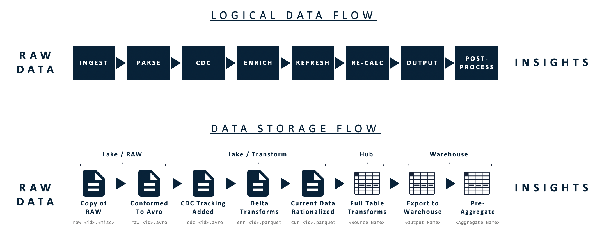

# Data Processing Engine

## The Logical Data Flow

Intellio DataOps processes data from left to right through the logical data flow. It is helpful to think of Intellio DataOps as modifying an SQL statement. Ultimately each configuration of within the UI modifies different sections of a SQL query executed on the ingested data.

Intellio DataOps does not create data, it only modifies, transforms, and processes data. Across the processing steps data is ingested, transformed, synthesized and ultimately outputted, with the resources to conduct each step gradually increasing. 

The Data Processing Steps section is a deep dive into each of the data processing steps. An understanding of the Logical Data Flow and the UI is necessary to implement Intellio DataOps.

