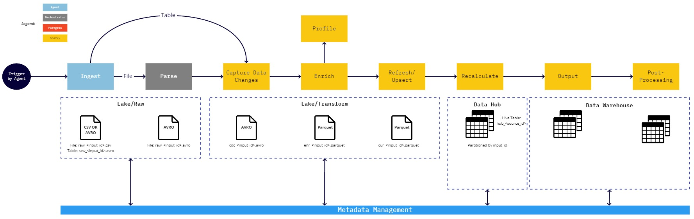

# Data Storage

### Data Lake

The data lake consists of a Raw data landing area and Transformation area used for RAP's processing steps.

### Data Hub

The data hub consists of Hive tables that contain the final processed data for each source.  Each table is one-to-one with a data source that is automatically generated and maintained by RAP.  This layer can be accessed via SQL syntax and is ideal to be used as an exposure point for data exploration purposes and sharing data with other systems.

### Data Warehouse

The Data Warehouse layer is the exposure layer for curated and cleansed data.  This layer is more tightly maintained, This is the layer intended to be exposed for enterprise reporting and analytics purposes.

