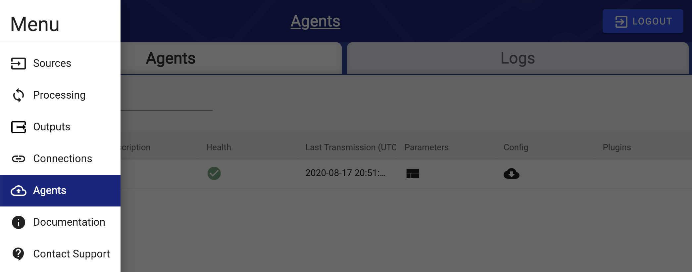

# DataOps Agent

## Overview

The purpose of the DataOps Agent is to acquire files from local file storage or an Amazon S3 bucket / Azure Storage account \(depending on the platform where DataOps is deployed\) and ingest them into the DataOps application. The Agent is installed on local Windows or Linux machines at client sites for the security of the client. Since the Agent handles all file ingestion operations at the client site, West Monroe does not need to access the client's machine directly.

The DataOps Agent was created to solve the common problems related to data ingestion and data connection from source data locations.

## Process

The DataOps Agent is a small piece of software that requires read only access to the source data and a 443 outbound internet connection. The setup allows for the data upload to bypass client intake firewalls and establishes a secure, encrypted connection between the uploaded source and the upload location.


At the beginning of a project an installation guide will be provided as well as documentation as how to download, install, and set up the specifics of the DataOps Agent. Read the overview [here](../deployment/installing-a-new-rap-agent/).


The DataOps Agent works as a light weight service. On the client side the DataOps Agent turns on when the service is active and shuts down when not active. The service runs the appropriate queries against the source database and passes this to the upload location.

The DataOps Agent is an input to the Ingest phase of the logical data flow. 

## Heartbeat and Monitoring

The DataOps Agent has a connection to DataOps every 30 seconds to check for if there is work required to be done with the service and to check the connection. The RAP Agent can be checked and modified in the "Agent" category of the left-hand menu. Here you can also monitor if the connection is live and if any errors have occurred.


The most common errors related to the DataOps Agent are connectivity issues such as outbound firewalls. Other errors often include other processes crashing the service that the DataOps Agent runs on.


## Plugin Configuration

Due to client specific requirements, legal obligations, or licenses there may be a need to create a custom DataOps Agent plugin. Though this is not ideal, our developers have a methodology to run a service on a service as a way to maintain the necessary requirements for the source data and the DataOps Agent service. Contact your DataOps Lead for specifics.


Additional details about the DataOps Agent can be found in the Environment Management sections, including [installation protocol](../deployment/installing-a-new-rap-agent/).


