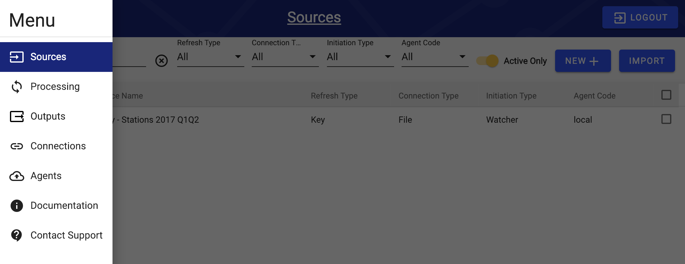
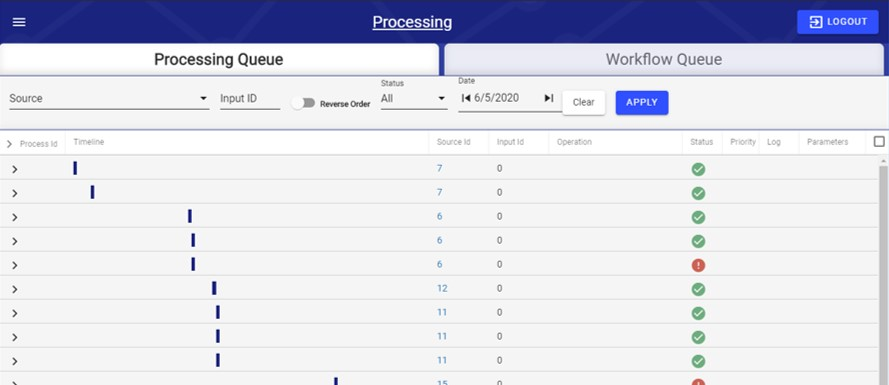

# !! User Interface

## Overview

The user interface is the front end to Intellio DataOps \(RAP\) that developers will interact with the most.

Users must login to the RAP user interface with a RAP account. Authentication is handled with Auth0, so clients need to be provided with an account in order to login to and use the user interface RAP configurators may sign up with their e-mail address.

Within the RAP user interface, the user is able to set up data sources and outputs, enrich existing data, and even perform troubleshooting. Everything can be reached from the hamburger menu in the top-left corner of the screen.


Provided in this section is a brief overview of the Intellio DataOps \(RAP\) UI, if you are looking for a more in depth explanation of the parameters within each section see the [Configuration Guide](../configuring-the-data-integration-process/).


## Sources and Processing

Sources are the main containers of the Intellio DataOps \(RAP\) interface. There is one logical data flow per source. Connections, Outputs, and Agents are parts of Sources, and these other aspects of RAP enable Sources to work through the Logical Architecture. 

Within a Source the tab structure along the top provides a framework of organizing a monitoring different aspects of the logical data flow. Enumerated below are the general summary of what each tab represents.

### Sources Tabs

| Tab | Summary |
| :--- | :--- |
| Settings | The main interface for set up and configuration of a Source. Set the Connection and Agent.  |
| Dependencies | Sources may be dependent upon other Sources. This tab displays additional data flows the Source may be dependent upon. |
| Relations | Additional data may be joined to a source and this tab displays the details of these joins. |
| Enrichments | Documentation of row level manipulations of the data, inclusive of both enrichments and validation rules. |
| Inputs | View of the associated raw data that is ingested through the Connection settings. |
| Process | Overview of the logical data flow and the calculations enacted. This view checks the status of the logical data flow. |
| Data View | Provide a view of the first so many rows in the Source Hub Table. |

### Processing

Within the Process Tab, logs are kept on how data flows through the logical data flow. As seen in the above image, Process IDs 2143-2150 at the bottom of the image report on this particular source going through Ingestion, Capture Data Change \(CDC\), Enrich, Refresh, Attribution Recalculation \(Recalculate\), and Output. When errors occur the Process Tab will held identify at which stage the error occurs.

## Outputs and Connections

## Other Screens

### Agents

The Agents UI manages parameters related to how an Agent will ingest appropriate data. Additional data on the Intellio DataOps \(RAP\) agent can be found in the [Agent Installation Guide](../deployment/installing-a-new-rap-agent/) and its subsequent [Source Connection Guide](../deployment/installing-a-new-rap-agent/connecting-a-rap-agent-to-a-source.md).

### Documentation

The Documentation link in the main left-hand menu brings you to the document you are currently reading. This Gitbook will be updated as additional information and future releases occur.

### Contact Support

If you require assistance with Intellio DataOps, the Contact Support option exists to assist with troubleshooting and errors. Do note that depending on your relationship and contractural agreements with West Monroe Partners the level of assistance the Intellio DataOps team can provide may be limited.

###  Sources, Outputs, and Connections

Sources, Outputs, and Connections can be viewed and filtered from their respective pages. Users will be using these pages the most when configuring data in RAP since Sources, Outputs, and Connections are all required components of RAP's data ingestion and output processes.

For example, clicking on a specific Source on the Sources page will show all of the details and options related to that Source. The same is true for the Outputs and Connections pages.

### Processing and Source Dashboard

If errors occur during configuration, the RAP user interface has some troubleshooting functionality that allows both clients and configurators to report and handle issues effectively.

The Processing page and Source Dashboard allows users to monitor Sources and Processes at a global level. From the Processing page, users can view and search all current and upcoming RAP processes as well as any process dependencies.

TODO - discuss what each thing means on Processing Queue, overview of Workflow Queue.

TODO - Cost, c formula on Processing Queue = \(ec2 spot hourly price + databricks DBU cost\)\*\(\# of nodes +1\), where first multiplier is configured in meta.system\_configuration table as spark-node-cost

The Source Dashboard shows the current status of all Sources as well as the status of the individual phases of the Source processes. The user can also view the status history of Sources and keep track of activity trends

\(Source Dashboard Photo\)  

TODO - what can you do in UI?

## Sign Up and Log In

&lt;screenshot&gt;

Obtain the appropriate URL from your RAP Lead. Create and Account. You will receive an email for verification.

Create a user name and password.

