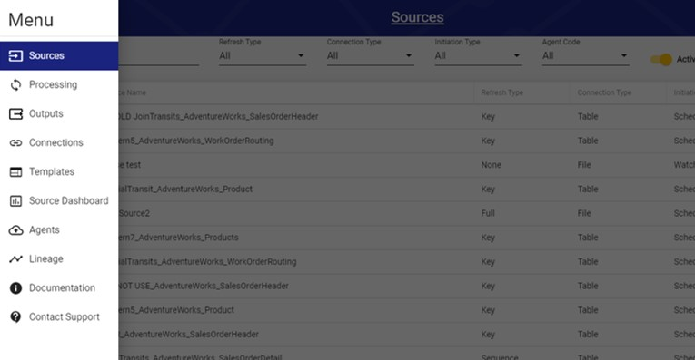
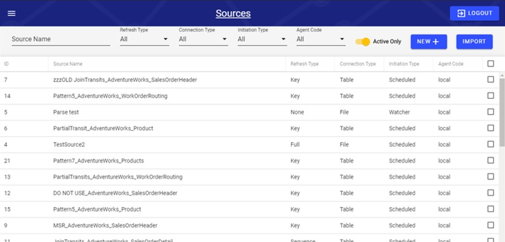
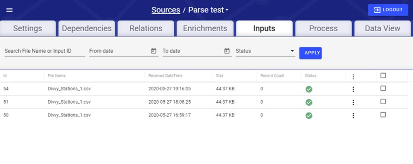

# User Interface

The user interface is the front end to RAP that developers will interact with the most.

Users must login to the RAP user interface with a RAP account. Authentication is handled with Auth0, so both RAP configurators and clients need to be provided with an account in order to login to and use the user interface.

Within the RAP user interface, the user is able to set up data sources and outputs, enrich existing data, and even perform troubleshooting. Everything can be reached from the hamburger menu in the top-left corner of the screen.

###  Sources, Outputs, and Connections

Sources, Outputs, and Connections can be viewed and filtered from their respective pages. Users will be using these pages the most when configuring data in RAP since Sources, Outputs, and Connections are all required components of RAP's data ingestion and output processes.

For example, clicking on a specific Source on the Sources page will show all of the details and options related to that Source. The same is true for the Outputs and Connections pages.

### Processing and Source Dashboard

TODO - what can you do in UI?

TODO - login experience / Auth0

