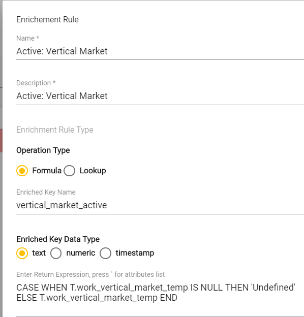
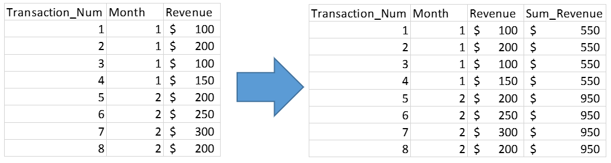
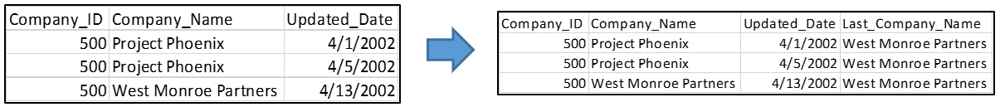
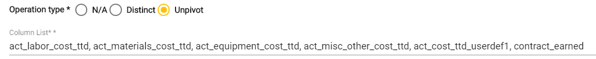
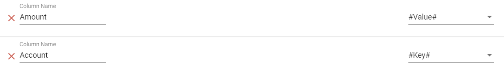

# Design Manifesto

## 1. Introduction

The Rapid Analytics Platform \(RAP\) aims to simplify the data integration and management process via two channels: design standardization and automation.

Traditional ETL tools focus on providing a large set of features, functionality, and flexibility to enable data engineers to design a custom system that best fits their use case. Data Prep tools focus on optimizing and automating individual data transformations via AI and machine learning. Data Warehouse Automation tools work to automate the broader table and pipeline management processes, while maintaining the same feature set and flexibility as the Data Prep and Traditional toolsets.

RAP started life as a simple data architecture design pattern, created to reduce the design and development portions of the standard data development lifecycle. By standardizing on this pattern, West Monroe no longer had to reinvent the wheel on every new project.

Once this pattern was fully flushed, vetted, and tested in the real world, using Traditional ETL tools as its core technology, RAP then migrated to a custom platform. It borrowed concepts from both the Data Prep and Data Warehouse Automation market segments to further streamline the development lifecycle, and reduce the time and cost of building and maintaining a BI solution.

Thus, while RAP has many technical similarities to both Data Prep and Data Warehouse Automation toolsets, the key time and cost savings stem from the application of the standard design pattern, which focuses on reducing architectural complexity and design effort required to develop an enterprise BI solution.

This document details the standard design pattern, and how to apply it to both common and complex use cases.

## 2. RAP Design Principles

There are four high level principles that act as the foundation of data integration with RAP

1. All data is processed via four standard steps
   * Input
   * Staging
   * Validation / Enrichment
   * Output
2. All data transformations can be broken down into a combination of two categories
   * Enrichments
   * Data Grain Changes
3. Complex Enrichments should be broken out into individual components
4. Grain Changes should be avoided to reduce complexity
   * When Grain Changes are needed, enrichments should be concentrated

At first glance, these principles may look more like constraints than “design principles”. By limiting the design space, the amount of time and effort it takes to build robust data pipelines diminishes substantially, as does the complexity of the solution. Within these constraints, \(almost\) every ETL task imaginable can be performed. All it takes is a short period of adjustment to thinking about ETL in terms of these constraints, but within hours, simple and maintainable ETL pipelines can be built.

### 2.1 Four Standardized Steps

RAP structures the ETL process into four standard steps: Input, Staging, Validation & Enrichment, and Output.

* **Input** brings data into RAP from its source system
* **Staging** writes data into RAP’s internal storage
* **Validation** & Enrichment applies data validation checks & executes business logic
* **Output** pushes data to final output, typically a Data Warehouse.

### 2.2 The only way to transform data is to add a column

All data transformations in RAP can and should be accomplished by simply adding a column in the Enrichment phase. By adding a column with the transformed value instead of old value, the raw source data is preserved and, more importantly, the logic implemented into the system becomes clear just by looking at the columns.

Let’s say a date field called “Start\_Date” comes in from the source system with a string data type. To convert to timestamp in RAP, simply add a new column entitled “Start\_Date\_timestamp”. Going forward, there should be no confusion around which field to use downstream, and by simply looking at the fields, the underlying logic of the data transformation can easily be inferred.

Each piece of intermediate logic should be broken out by creating a separate column. The ETL pipeline becomes more readable and easy to debug. If several pieces of logic are embedded within one enrichment rule and it breaks, trying to understand which part broke is a nightmare. To alleviate this issue, just add a column every time there’s a new piece of logic.

### 2.3 The only way to change grain is to create a new source

A _source_ represents the data that RAP ingests and processes. Once a source gets ingested, the grain cannot be changed. Changing grain is not taken lightly, and for good reason.

During the enrichment phase, when RAP implements business logic, grain is preserved by exclusively using LEFT JOINs to bring in data from lookups. If a lookup changes the grain of the Source \(as is often the case\), RAP does not permit the lookup to execute.

Obviously, at one point or another, ETL requires changes in grain to accomplish certain tasks. Unions, distincts, unpivots, aggregations are all necessary use cases for changing grain. While RAP does not support changing grain within a Source, RAP does support changing grain – it simply requires creating another source at the different grain.

For example, if a distinct list of Customers is needed to perform a lookup, but the Customers table is not at the desired grain, RAP design principles suggest keeping the Customers source at the current grain, pushing it to an Output file that represents distinct customers \(by selecting the “Distinct” flag in the Output phase\), and reprocessing that file as a separate source. The result is two sources, one at the original grain and one at the distinct. Examples of how to implement these grain changes in RAP are detailed in the Design Patterns section below.

By preserving grain at the source-level, RAP alleviates much of the pain of managing grain, while still supporting the use of grain changes.

#### **2.3.1: Try to not change grain**

Changing grain is not the preferred method of accomplishing tasks with RAP. If a task appears to require a grain change, think about alternate ways to solve that problem that don’t require changing grain. Obviously, there will be instances where it is inevitable, but RAP Design places an emphasis on contemplating these decisions with rigor.

## 3. Design Patterns

### 3.1 Data Transformations

#### **3.1.1: Data Type Conversion**

If a field isn’t represented with the correct data type, simply add an enriched column of the converted field. For example, if the field **crdtamnt** is stored in the database as text, instead of converting **crdtamnt** into a numeric, create a new field called **crdtamnt\_numeric.** The raw data is preserved, and the logic of the data transformation is made apparent by just looking at the field names.

#### **3.1.2 Null Handling**

If analysis requires null values to be filtered out or changed to a different value, add an enriched column that represents the desired value. The best approach to accomplish this is with a CASE statement. Within the CASE statement, prescribe the logic for how to handle null values in the newly created enriched column.

### 3.2 Grain Changes

As mentioned in the “Design Principles” section, it is recommended to truly contemplate a decision to change grain, and if an alternate option exists to accomplish the same goal that changing grain would do, RAP Design recommends taking the alternate option. However, there are several use cases in which changing grain is necessary. This section outlines how to implement those use cases with RAP.

#### **3.2.1 Loopback Pattern**

The “Loopback” is the foundational pattern used for changing grain in RAP. In short, a loopback takes one source, pushes it to an output, then re-ingests the output as a new source. Every time a change in grain becomes necessary, follow the loopback pattern.

To support a wider variety of grain change use cases, RAP has three types of operations it can support while creating outputs:

* **Distinct:** Creates an output with just distinct values of all fields.
* **Unpivot:** Transforms columns into rows; normalizes data.
* **N/A:** Creates an output in its current form. Using these three options, in conjunction with some other RAP features, almost all grain changes can be supported.

**3.2.2 Aggregation**

Aggregations are likely the most common type of grain change that is used in the data integration & analysis process. To implement an aggregation within the RAP framework, follow this basic pattern:

_SQL Aggregate Window Function + Distinct Output_

> Note: window functions are SQL statements that run over a subset of the table \(defined as the “window”\), and return a value for each record in the table. The real value for RAP’s purposes is that window functions allow operations to be performed without changing the grain of the table. A basic understanding of window functions is foundational for grain changes in RAP. For more information, check out the AWS window functions documentation [here.](https://docs.aws.amazon.com/redshift/latest/dg/c_Window_functions.html)

Let’s demonstrate this pattern with an example. Exhibit A is an account of the revenue earned over two months, and we’d like to get the SUM of revenue for each month, resulting in two records: one for Month 1 and one for Month 2. The first step to implementing this aggregation using RAP is to add a new column which represents the SUM of revenue for that month \(where the month is the “Window” of the Window function\).

The Sum\_Revenue field gives us the data we want, but not represented at the right grain. To change the grain into the aggregated form \(one record for each month\), create an Output, select the Distinct operation type, and include only the Month and Sum\_Revenue fields. The result of that Output will look like:

This Output can be re-ingested by RAP as a new source and used as desired.

#### **3.2.3 Type 1 Slowly Changing Dimension**

RAP natively supports Type 2 SCD’s, but there’s also mechanisms to create Type 1 SCD’s. The pattern is:

_LAST\_VALUE Window Function + Distinct Output_

The LAST\_VALUE window function is very similar to the aggregation ones: for a given “window”, identify the last value based on some ordering criteria. Mechanically, this looks very similar to the aggregation pattern. Here’s an example.

Let’s say there’s a Type 2 SCD that captures the historical updates of company names. For the integration process, we are not concerned with any historical data, only the most recent version of a company name. We’ll create a Last\_Company\_Name field, representing what the most recent Company\_Name is, based on the Updated\_Date field.

From there, simply create a Distinct output, using only the fields Company\_ID and Last\_Company\_Name, resulting in:

This Type 1 SCD can be re-ingested and used as desired.

#### **3.2.4 Union**

To union several data sets together in RAP, simply create an Output, and feed two or more “Output Sources” into that Output. An Output Source is a logical construct representing the mapping of source data into an output. Pushing two or more Output Sources into one Output effectively emulates a Union.

#### **3.2.5 Unpivot**

An unpivot transposes a data set, turning select fields into rows, therefore normalizing the data set closer to the third normal form. Unpivot is natively supported in RAP as an Output operation type. The first step is to select Unpivot as the operation type and list out the columns that are to be “unpivoted”.

The columns specified in the Column List are going to be turned into rows, while the rest of the columns will stay as columns. The second step is to assign how the field name and data values of the selected columns are to be represented in the unpivoted table.

In this example, all of the columns selected represent financial metrics, and we’d like the values of those field to go into an “Amount” field, while the names of the fields go into an “Account” field, so we can identify which account the record belongs to. To accomplish this in RAP, create two new fields in the Output, and assign the mapping to be “\#Value\#” for the data values field, and “\#Key\#” for the field names field.

