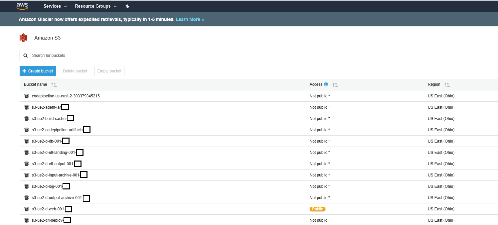
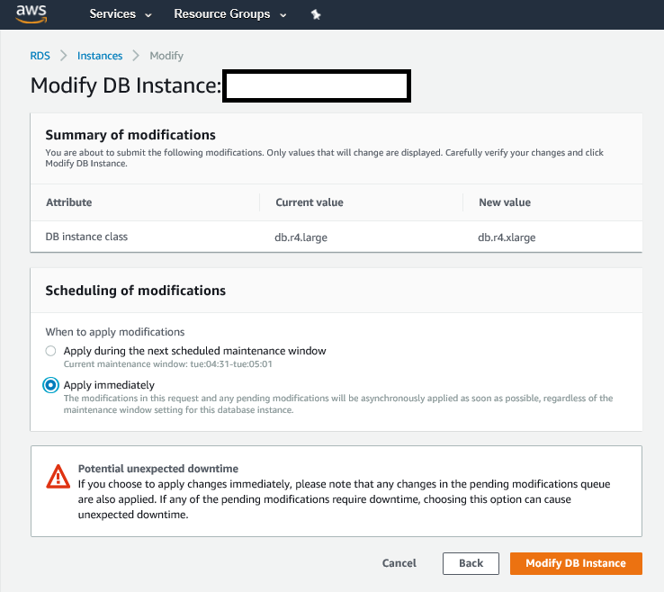
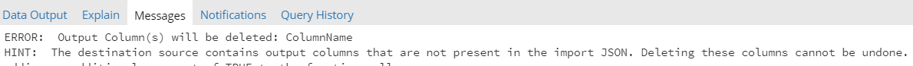

# Run Book and Troubleshooting Guide

## 1. Introduction

### 1.1 Purpose

This guide will explain how to monitor, maintain, and troubleshoot RAP. **Monitoring** will deal with day-to-day operations, and will be focused on daily support and check-ins. **Maintaining** will focus on the actual infrastructure of the platform, and will be focused on checking up and managing the overall health of the platform. The end of the guide includes information about dealing with common failures and issues and resolve them in a quick and effective way.

### 1.2 Audience

This audience of this guide is Level 1 support as well as RAP developers looking to troubleshoot while developing sources for the platform. Level 1 support team members see value in this guide from the daily monitoring and logging sections, as well as the troubleshooting section and platform management sections. RAP developers gain value from the guide by having quick references to common errors during their development, as well as tips and tricks to build a stronger knowledge base with the platform.

## 2. Daily Monitoring Tasks

### 2.1 Overview

Day-to-day monitoring consists of checking the built-in operational dashboard, user created dashboards, statuses of daily production sources, and investigating issues that have happened during the nightly or morning load. It is always best to start at the highest level and go from there. The highest level would be the operational dashboard, followed by the platform UI, and if necessary, going into AWS, Postgres and/or the application log files.

### 2.2 Operational Dashboard

RAP has a built in Operational Dashboard, viewable by clicking the Source Dashboard link in the left-side menu, as shown in Figure 2.2a. The dashboard URL is http://&lt;environment-rap-url&gt;/source-dashboard.

Figure 2.2b breaks down the main elements of the Source Dashboard screen.

1. The input that arrived on 10/17 for the “MC – CTA Bus Ridership” source is still processing. The “In Progress” status code hyperlinks the user to the inputs page for the “MC – CTA Bus Ridership source.
2. The input that arrived on 10/17 for the “MC – CTA Bus Route List” has successfully processed. The “Passed” status code hyperlinks the user to the inputs page for the “MC – CTA Bus Route List” source.
3. The input that arrived on 10/16 for the “a\*TestComplexLookupStations2” source has failed processing. The “Failed” status code hyperlinks the user to the inputs page for the “a\*TestComplexLookupStations2” source.
4. The pagination options are located here, with the default set to five sources per page. To the right, the left and right arrows let the user navigate through the sources.
5. This dropdown shows different processing trends for the source.
   1. Staging – Tracks input record counts recorded during the Staging process
   2. Change Tracking – New, Old, Changed, and Unchanged records are tracked in the Change Data Capture process
   3. Validation – Input record counts after Validation process. Tracks total, warned, and failed records.
   4. Throughput – Tracks rows processed per minute and process time for the source
6. The last 7 days of processing show on the dashboard with the final date being the date in this box. Saturday and Sunday highlight grey and the current day highlights neon green.
7. The Status dropdown filters the dashboard based on input statuses, similar to how the status dropdown works in the Inputs page.
8. Expanding the source shows additional information regarding number of inputs that arrived for a given day.

RAP also supports creating a Power BI gateway to connect to the Postgres layer, which enables the Support team to use Power BI to create custom operational reporting. This guide does not cover connecting and configuring Power BI.

### 2.3 Checking statuses

In RAP, every input marks its progress with a status code for each phase. The symbol and meaning of each status code are below:

 Passed \(P\) – All processes in the phase have succeeded

 Failed \(F\) – A process in the phase has failed

 In Progress \(I\) – A process in the phase is in currently executing

 CDC \(C\) – Input is waiting on a previous input to pass the Validation and Enrichment phase

 Queued \(Q\) – Input is queued in the process table and receives a connection when one becomes available

 Ready \(null\) – Input is ready to be queued for processing

P, F, I, C, Q, Ready

Clicking any of these process status icons will display the processing logs for that input/phase. This is typically the most useful and accessible way to troubleshoot the platform.

If the status code is “F”, or “Failed”, then the processing will not continue on to the next process in the chain. However, the platform contains reset functionality to provide the user with the tool to make changes and reset the failed process. The reset buttons are located on the right hand side of the inputs page, and require the user to click on the three vertical dots for the input that they want to reset. The user then clicks the reset button that aligns to the process that needs reset.

In a general troubleshooting scenario, it is best to make changes to a source that would fix the error that caused failure before blindly running a reset. **Note:** Delete will permanently delete the input. Do not click delete unless you are certain that the input needs removing.

A common scenario, especially when doing large reloads or running many processes concurrently, is long waits for processes to turn from “In Process”, to “Passed” or “Failed”. In most situations, the process is waiting for connections to allocate internally. Figure 2.3b is an example of a Staging process waiting for connections to allocate.

If any proce~~s~~ses timeout, then they will fail and update their status to fail accordingly. If a process is still In Progress for an abnormally long time, a deeper investigation is necessary. Refer to [Section 2.4.2]() for information on checking the Orchestration logs. Refer to [Section 3.1.2]() for information and guidelines around managing the Orchestration application that runs on an Amazon EC2 instance.

### 2.4 Checking logs

If clicking the status icon and reading the logs does not help diagnose the failure, there are two main logs to check. One of the log locations is in the internal Postgres database, covered in [Section 3.4]().

1. The Actor Log- stored in Postgres table
2. The Orchestrator Log- stored in file on the ETL box

#### 2.4.1 Actor Log

The Actor Log holds an account of all activity that takes place with any of data processing activities, including source scheduling, input, staging, validation & enrichment, and output. The UI exposes most of the information in this log to the user via the “Processing Log” \(see Figure 2.4.1a\) seen when clicking on the status icons, but if the desired information is not available, this log is accessible through the log.actor\_log table query, e.g.

SELECT \* FROM log.actor\_log ORDER BY insert\_datetime DESC LIMIT 1000

Common use cases for using the Actor Log are:

* Checking Agent connectivity
* Cannot access desired log message from UI Processing Log.

#### 2.4.2 Orchestrator Log

The Orchestrator Log provides higher level of details, including information related to system initialization, queueing/wait logic, clean up, connection management, in addition to the processing activities available in the Actor log. The Orchestrator log is available in file format directly on the ETL server. In the instance that the database is unavailable, the Orchestrator log can still be accessed and used in diagnosing issues with the application.

To access the Orchestrator log, follow instructions in the [_EC2_ section](), 3.1.

Common use cases for using the Orchestrator log are:

* Ensuring system initialization worked as intended
* Seeing detail behind the background file cleanup processes
* Finding status on the connections available in the application
* Database has crashed and need to see an account of what activities happened prior to the crash

### 2.5 Example Daily Routine + Queries

In this section, we will detail a typical day’s activities for maintaining the application. Section 4.1 of this document contains information about frequently encountered errors during monitoring as well as steps to fix them.

#### 2.5.1 Alerts

The primary mechanism to stay informed on the activities of the platform is RAP Alerts. Alerts are configurable to inform users when any of their Sources succeeds or fails a processing phase. If the daily data load is set to run overnight, the first activity in the morning is to look over the alerts and address any failures. Each alert message contains the following details to assist the user in troubleshooting:

* Input Id
* Log Id
* Source Name
* Link to processing page
* Error Message

To add alerts, navigate to the Source Detail page and enter an email to the distribution list.

#### 2.5.2 Summary View of Nightly Load

After addressing all alerts, users check the general status of the previous night’s data loads. Do this by utilizing the Operational Reporting dashboard or the following query:

SELECT i.input\_id, i.source\_id, s.source\_name, s.staging\_table\_name, i.input\_status\_code, i.staging\_status\_code, i.validation\_status\_code, i.output\_status\_code, \*

FROM stage.input i

JOIN stage.source s ON i.source\_id = s.source\_id

WHERE received\_datetime::date = now\(\)::date

AND \(input\_status\_code IS DISTINCT FROM 'P' OR staging\_status\_code IS DISTINCT FROM 'P' OR validation\_status\_code IS DISTINCT FROM 'P'\)

ORDER BY s.source\_name

This exercise provides the opportunity to identify any issues with the application and act upon them quickly.

Examples:

* Not all sources pulling from one Agent succeeded Input last night. Find the error message and determine the cause of the issue \(network partition, credential issues, etc.\).
* A Keyed source succeeded Input and Staging, but is waiting to run Validation & Enrichment. After digging into the source, you discover that the input from the prior day has failed V&E, which causes last night’s input to wait before V&E.
  * If an issue like this goes unaddressed for a while, there may be days, weeks, or months’ worth of Keyed source data that is still waiting to complete processing. Pay close attention to Keyed sources every day.

#### 2.5.3 Logs

Check into the Actor and Orchestrator logs in the morning to see if anything unusual happened. Digging into the sources, as described in the last two steps, should expose an issue if one occurred, but it is a good practice to check both the Actor and Orchestrator logs on a daily basis to identify any issues.

#### 2.5.4 Instance Health

It is a best practice to ensure that all AWS components are healthy. The next section has more detail on this, but as part of the daily routine, it is a good habit to confirm that the relevant AWS instances are active and healthy. The EC2 instances \(ETL & API boxes\) should have an Instance State of “running” and have passed their Status Checks.

The RDS Postgres instance should have a Status of “available” and should have CPU levels and Current Activity below the red line. If these levels are above the normal amount, check the logs and RDS Performance Insights to see what the cause may be.

## 3. Managing the Platform – Amazon Web Services Components

RAP deploys on an AWS cloud stack and utilizes a number of AWS components as detailed below:

1. **EC2**
   * Orchestrator
   * API
   * Local Agent
2. **RDS**
   *  Postgres Aurora - Database Backend
3. **Cloudfront**
   * UI
4. **S3**
   * General Object Storage \(Source files, output files, etc.\)
5. **CodeBuild & CodeDeploy**
   * DevOps
   * Path and Release deployment

Recommended tools needed to access the platform backend:

* SSH Client \(MobaXTerm is shown in this guide\)
* Internet Browser \(to connect to AWS services\)
* OpenVPN
* PgAdmin/Datagrip
* Remote Desktop

### 3.1 EC2

The AWS EC2 service contains the virtual machine instances and the secure parameter store used to configure the Orchestrator, API, and UI to run on multiple environments. Users should use this component to monitor the health of each instance, find necessary connection info to SSH into the virtual machines, and resize instances in case of scaling concerns.

#### 3.1.1 AWS EC2 Instances Page

Figure 3.1a below shows the main instances page of the AWS EC2 component. Access this page from the AWS dashboard by navigating to Services and searching “EC2” If this screen does not appear after clicking “EC2”, click the “instances” link on the left side of the page.

Each of these instances correspond to a virtual machine. The naming convention for each instance is ec2-&lt;region&gt;-&lt;availability\_zone&gt;-&lt;environment&gt;-&lt;rap\_type&gt;-&lt;number&gt;. For example, the name of the API instance that runs in the Dev environment in us-east-2, availability zone A is: ec2-ue2-a-d-api-001. The rap types are “api”, “etl”, “pbgwy” \(Instance that runs the Power BI gateway\), “vpn”, “rs” \(Report server\), and “sql” \(Instance that runs Microsoft SQL Server.

To start, stop, or reboot an instance, right click on the instance status and then expand “Instance State”. Stop will completely stop the instance. Reboot will stop and start the instance. Terminate WILL DELETE the instance completely. There should never be any reason to select terminate.

Changing the instance type is simple in the event that the platforms needs a scale up or scale down. Follow the steps below

* Stop the instance
* Go to Instance Settings
* Change Instance Type, selecting the Instance Type sized to fit the situation. \(The AWS documentation describes all the different types of instances [here](https://aws.amazon.com/ec2/instance-types/).\)

  

#### 3.1.2 Accessing the EC2 Instances via SSH

To find the application log files of the Orchestrator and API, users must SSH into their respective. Using an SSH client \(MobaXTerm is shown here\), setup a session by entering the IP of the EC2 instance, found on the AWS EC@ instances page, the username “centos”, and then provide the private key file provided by a RAP administrator. The user needs a VPN connection to access these instances. Figure 3.1e shows a screenshot establishing connection to an instance.

There are two important directories on the ETL instance. /logs/ and /input/ are directories on the instance that are important for troubleshooting. /logs/ will contain the Orchestrator logs and the Local Agent logs. These logs write in real time from the applications, and contain messages that show in the UI, as well as more backend logs, such as uncaught exceptions, connection statistics, and logging around the individual Akka actors in the application. Logs save daily, and the log for the current day’s processing save without the date appended. See figure 3.1f for an example. The Orchestrator, API, and Agent’s respective log files are orchestrator.log, agent.log, and api.log. Refer to the Checking logs/Troubleshooting sections for information detailing how to interpret and find common errors in these logs.

In the event that the platform writes files into an EC2 location rather than the default S3 bucket, the files write to the /input/ folder. The staging\_path parameter on the Source details tab configures where the files stage. Each input file in this folder corresponds to an input id, with the naming convention &lt;input\_id&gt;.csv or &lt;input\_id&gt;.csv.gz.

The EC2 instances are also important if there is a need to restart, stop, or start the Orchestrator, API or Local Agent without rebooting or stopping the entire instance. The applications install on their respective instances as services, and use with the following systemctl bash commands for control:

| **Service** | **Linux command** |
| :--- | :--- |
|  | Sudo systemctl start rap |
| Orchestrator | Sudo systemctl stop rap |
|  | Sudo systemctl restart rap |
|  | Sudo systemctl start rapapi |
| API | Sudo systemctl stop rapapi |
|  | Sudo systemctl restart rapapi |
|  | Sudo systemctl start rapagent |
| Local Agent | Sudo systemctl stop rapagent |
|  | Sudo systemctl restart rapagent |

### 3.2 S3

Amazon S3 is a scalable object storage service in the AWS ecosystem. RAP uses S3 for storing and accessing physical input files for staging, archiving physical input files for storage, and for deployments – in conjunction with the CodeDeploy service. Locating a physical file that is stored in RAP is an example of a support case that requires accessing S3. As stated before, files can be in their staging path either in the EC2 instance \(/input/\) or in S3. However, files always archive in S3.

The naming convention for the RAP storage buckets are as follows: s3-&lt;region&gt;-&lt;environment&gt;-&lt;rap\_type&gt;-&lt;number&gt;-&lt;owner&gt;. For example, if the name were s3-ue2-d-etl-landing-001-wmp, then this would be the landing folder for the Dev orchestrator for the West Monroe Partners account.

Important buckets for processing:

* S3-&lt;region&gt;-&lt;environment&gt;-etl-landing-&lt;number&gt;-&lt;owner&gt;
  * - Input files stage to this bucket if the staging path is set to this file path. Staging\_path parameter is defaulted to this.
* S3-&lt;region&gt;-&lt;environment&gt;-etl-output-&lt;number&gt;-&lt;owner&gt;
  *  - Provided bucket for outputting files from RAP.
* S3-&lt;region&gt;-&lt;environment&gt;-input-archive -&lt;number&gt;-&lt;owner&gt;
  * - Input files archive to this bucket based on retention policies.
* S3-&lt;region&gt;-&lt;environment&gt;-output-archive-&lt;number&gt;-&lt;owner&gt;
  * - Output files archive to this bucket based on retention policies.

Note: All other buckets either create ad-hoc or are for RAP deployment processes. Refrain from editing or removing files from them.

A simple query to run in Postgres to find the current location of an input file:

* SELECT file\_path FROM stage.input WHERE input\_id = &lt;your\_input\_id&gt;

### 3.3 RDS

The AWS RDS Service manages and configures the Aurora Postgres instances. The resources screen shows links to the different sections within the RDS services. Notable sections are DB Instances and Snapshots. DB Instances contain the configurations and status of the Postgres instances. Snapshots contain snapshots of the Postgres Instances that create before every deployment. All RAP RDS instances configure for automatic snapshot creation.

Clicking into the DB Instances link shows the current Postgres databases and a quick view of their status. The three statuses that can been seen in the Status column are:

 Available – Database is running

 Modifying – Database is performing configuration changes. It will not be accessible at this time

 Stopped – Database is not running

The Class column describes which DB Instance type is currently running. To modify the Database instance for scaling, select the instance using the radio button to the left of the instance name, click the Instance actions drop down, and then select Modify. Note: Instance actions also contains commands such as Delete, Clone, and Take Snapshot. Refrain from using any of these unless permitted by a RAP Administrator.

Choose your Database instance class, and then hit continue. The confirmation screen shows and then choose when to apply the instance change. Choose Apply Immediately or schedule the modification. The database will go down and begin modifying immediately when you click Modify DB Instance if Apply Immediately is chosen.

Two other helpful features for troubleshooting, Logs and Recent Events, are at the bottom of the Instance page, after clicking on the individual instance. The Logs section contains error logs generated by Postgres Aurora. Shown in these logs are bad queries, database health issues, and connections issues. Recent events provides another level of logging, and shows the overall event log of the Instance’s life.

The Performance Insights page is a deeper view into the performance and profiling of the database. Use this page to see currently executing queries, database locking, and CPU.

### 3.4 Postgres

PgAdmin is free, open source tool for connecting to Postgres downloadable on the Postgres website. Datagrip is a commercial product that also works very well for querying Postgres. Once the tool of choice downloads, acquire a VPN connection and then enter database server credentials into the tool. Acquire the credentials from a platform administrator. This section covers the important Postgres tables. Knowing the backend tables will allow the user to dive deeper into the RAP processing steps and support the platform more effectively. [Section 2.5]() contains support queries to run against these tables.

| **Table** | **Description** |
| :--- | :--- |
| Stage.agent | Check health of the configured Agents, validate Agent parameters |
| Stage.input | Input metadata, transaction start and end times, source file name, get file location |
| Stage.input\_history | Input record is moved to this table upon deletion, snapshot of the input record is put in this table when a reset is performed |
| Stage.landing | Used to link input record to work and data tables |
| Stage.landing\_history | Landing records are moved to this table upon input deletion, and input reset |
| Stage.output\_send | Record of Output runs, 1 Output Send record per Output Source, tracks most recent run of each Output |
| Stage.output\_send\_history | When Output is reset, old Output Send records from the Output are moved to this table |
| Stage.process | Tracks queued and running processes in RAP |
| Stage.process\_history | History of processes in RAP |
| Stage.process\_batch | Tracks queued and running processes in RAP at a lower grain than stage.process |
| Stage.process\_batch\_history | History of batch processes in RAP |
| Stage.dependency\_queue | Tracks inputs that are waiting on a dependent source to finish processing |
| Log.actor\_log | Ledger of log messages from the Agent and Orchestrator |
| Log.staging\_error | Contains failed records from staging phase |

Access Postgres to address some of the following issues:

* Find data row that failed staging, investigate raw data \(log.staging\_error\)
* Review orchestration and agent logs \(log.actor\_log\)
* Check queued/in progress processes, and if any are waiting in dependency queue \(stage.process, stage.process\_batch, stage.dependency\_queue\)
* Get file names that have been output in the past reload \(stage.output\_send, stage.output\_send\_history\)
* Get source file information, and find the location of the file in the staging folder or archive folder \(stage.input\)
* Check if Agent is communicating \(stage.agent\)

### 3.5 Source Promotion

There are two functions to assist in the promotion and migration of RAP source configurations between environments. These functions copy over a source configuration, validation and enrichment rules, any output configuration the source uses, and the output column mappings associated with that source/output combination. In the following steps, the term **origin environment** refers to a Dev environment. **Destination environment** refers to a Prod environment.

Promotion Steps

1. Open PgAdmin \(or any other Postgres query tool\) and connect to origin environment and destination environment. Open a query tool window for each environment.
2. Locate the source ID in the origin environment of the source that you wish to migrate. This value resides in the URL bar when navigating to the source in the UI – Example: www.wmprapdemo.com/sources/21
3. Check for sources that need migrating before the current source can be migrated due to dependencies. Run this query in the origin environment. Replace the &lt;your\_source\_id\_here&gt; with the desired source id.
   * **SELECT s.source\_name, s.source\_id FROM stage.source\_dependency sd JOIN stage.source s ON sd.dependency\_source\_id = s.source\_id WHERE sd.source\_id = &lt;your\_source\_id\_here&gt;**
4. Check for sources that should be migrated after the desired source using the following query. It is not necessary to migrate these sources, but there could potentially be new mappings in the origin environment that utilize newly migrated fields from the desired source.
   * **SELECT s.source\_name, s.source\_id FROM stage.source\_dependency sd JOIN stage.source s ON sd.dependency\_source\_id = s.source\_id WHERE sd.dependency\_source\_id = &lt;your\_source\_id\_here&gt;**
5. Once ready to export the source, run the below function in the **origin environment** via PgAdmin, replacing &lt;source\_id\_goes\_here&gt; with the desired source ID. The result will be a large JSON body. Copy the result into a notepad.
   * **SELECT \* FROM stage.svc\_export\_config\(&lt;source\_id\_goes\_here&gt;\)**
6. Update any values that need to change between Dev and Prod. This is specific to each environment, however, some common ones that will change will be – landing\_folder\_path, agent\_code, local\_path, and output file paths.
7. When those values are reconciled, paste the text from the notepad into the function below in the **destination environment** and add your user name. Be sure to keep the single quotes. Run the function in PgAdmin.
   * **SELECT \* FROM stage.svc\_import\_config\(‘&lt;copied\_text\_goes\_here&gt;’,’&lt;username\_goes\_here&gt;’\)**
8. If the exported source definition plans to delete output columns within the destination environment \(a change which cannot be undone\) the user will receive an error resembling the following:

1. It is a best practice for users to reconcile these columns so that inadvertent deletes do not occur in the destination environment. After manual reconciliation, the import script will run correctly. If the users wishes to force output column deletion without manually reconciling, proceed to step 10.
2. In order to force output column delete without manual reconciliation, the following function should be run in PgAdmin, once again keeping the single quotes:
   * **SELECT \* FROM stage.svc\_import\_config\(‘&lt;import\_json\_goes\_here&gt;’,’&lt;username\_goes\_here&gt;’,true\)**
3. The source promotion is complete. It is a best practice to bring an input in to the new source and let it run through the system in order to test the configuration.

## 4. RAP Agent

The RAP Agent installs on local client machines. Its purpose is to acquire files from local file storage and upload them to the RAP application. Because the RAP Agent is located on third party client machines, it is often more difficult to troubleshoot issues related to its operation. This section details managing the health of the  
RAP Agent and troubleshooting issues related to the RAP Agent.

### 4.1 RAP Agent Health

The RAP Agent signals its health and continued operation via a heartbeat to the API. Every time an Agent pings the API the timestamp of the ping records in the Database under the Agent Code that pinged the API. Find this information in the stage.agent table in Postgres.

In this example, the local agent last hit the API at 18:01 UTC on October 11. Every 30 seconds the agent pings, so if the Agent has not pinged for more than 30 seconds, there may be an issue.

### 4.2 RAP Agent Logs

It is helpful to check the log files of the Agent if the Agent is not responding. The log files are located at &lt;Drive where Agent is installed&gt;/Logs/agent.log.

The Agent cannot communicate if there are network issues or an inability to hit the RAP API from the Agent’s install location. The Agent cannot run without a Java 8 installation on the on premise machine as well. Refer to the Agent Install Guide for more information involving starting and configuring the RAP Agent.

To start, stop, or restart the Agent service, navigate to the services window, and restart the service named RAPAgentBat.

## 5. FAQs/Troubleshooting

### 5.1 Post Deployment Smoke Testing

Releases to the platform generally come with a multitude of fixes to current processes, UI updates, as well as brand new processing enhancements. Dev and Prod releases will be staggered, usually with a Prod release a week after a Dev release. When a release schedules, expect to receive the following:

* Release Notes
* Notice of platform downtime for a specific environment

Smoke testing in the Dev and Prod environments are important to validate a release. The following smoke testing strategies should give a quick view into the health of the platform.

* Make sure the Agent\(s\) is communicating by checking the last\_transmission\_timestamp field in the Postgres stage.agent table. The field should be updating every 30 seconds.
* Verify ability to access the platform from a web browser. Auth0 login should appear upon URL access. One the Auth0 login is complete, the sources page should display.
* Find an input that has previously passed successfully and reset it from the various phases \(Staging, Validation & Enrichment, Output\). Make sure Key and Time Series sources are both smoke tested.
* Use the release notes to help test new enhancements or specific bug fixes.

If a bug appears or the platform is unresponsive, make sure the issue reaches the development team.

### 5.2 Common errors for each Phase

This section lists common errors that a developer encounters while configuring and running RAP processes. It will not be an exhaustive list of every error in the platform; however, it should provide guidance and help for debugging and initial platform ramp up.

#### 5.2.1 Input

Cause: File pull ran on scheduled time, and found no files matching the file\_mask parameter in the location specified by the input\_path parameter.

Solution: Make sure source file is in the input\_path when the scheduled file pull time rolls around

Cause: Source query is incorrect. In this case, the column name is invalid.

Solution: Any query that would fail in the database will cause input to fail. Make sure the source query executes successfully and returns data before trying to run a table input with it.

Cause: Database host name is incorrect, or the database is inaccessible through TCP/IP

Solution: Change host\_name parameter to correct value, or configure SQL Server instance to allow TCP/IP connections.

Cause: Incorrect database credentials

Solution: Make sure the credentials specified in the user, password, and port parameters are correct

#### 5.2.2 Staging

Cause: Bad line terminator

Solution: Identify the correct line terminator by opening the file in a text editor that allows you to view special characters \(line endings\) and change the line\_terminator parameter in the source details tab to match.

Cause: Incorrectly qualified line terminator in the data. Example- “test”,”test”,”te\nst,”test”\n

Solution: Fix is necessary at the source. For a manual fix, edit the file and then re-input.

Cause 1: Key column is incorrect in Source details

Cause 2: Incorrect line terminator, with assetStatusId being the last header field

Cause 3: Byte Order Mark in the data, usually happens when converting from Excel to CSV

Solution 1: Look at source file and make sure the key column name\(s\) you specify match the headers in the source file

Solution 2: Identify the correct line terminator by opening the file in a text editor that allows you to view special characters \(line endings\) and change the line\_terminator parameter in the source details tab to match.

Solution 3: Create new csv file and copy in the data, re-input

Cause: Number of data fields parsed in line does not match the amount of headers in the file

Solution: Fix bad line in source file. In some cases, there may be a qualifier issue involved. Fix by specifying a qualifier in the text\_qualifier parameter.

Cause: Headers are double quote qualified by header\_qualifier parameter is not set to double quote character

Solution: Change header\_qualifier parameter to double quote character

#### 5.2.3 Validation & Enrichment

Cause: An enrichment rule tries to convert a data column to the numeric data type. The column has non-numeric data in the specified column in one of its records.

Solution: Either create a rule to correct this data or remove the data at the source.

#### 5.2.4 Output

Cause: Selecting a numeric type mapping for an Output column that has textual data contained in it causes an invalid input syntax.

Solution: Make sure the field should actually be a numeric, and either create an enrichment rule to convert the text field, or fix the problem at the source data. A common scenario is a blank value instead of a zero value in the numeric column or “N/A” instead of zero. This issue can also occur with the Timestamp datatype.

Cause: An incorrect database\_name specified in the Output details.

Solution: Change the database\_name parameter to the correct database name of your Output database, and then reset Output.

Cause: Incorrect database credentials

Solution: Make sure the credentials specified in the user, password, and port parameters are correct

Cause: Output database host name is incorrect, or is inaccessible

Solution 1: Enter the correct host name in the host\_name parameter and reset Output.

Solution 2: Verify database is accessible by a TCP/IP connection. If it is not, then configure network to allow TCP/IP accessibility.

Cause: S3 output\_path is incorrect. Either the bucket does not exist or the path is incorrect.

Or

Solution: Change output\_path parameter to correct S3 location. Make sure that the format is s3://&lt;bucket&gt;/&lt;key&gt;.

Cause: Incorrect user or password for SFTP Output.

Solution: Enter correct user and password parameters and reset Output.

Cause: Incorrect host name for SFTP Output. SFTP location could also be inaccessible.

Solution: Enter correct host name. In second scenario, unblock inbound and outbound ports on SFTP server.

