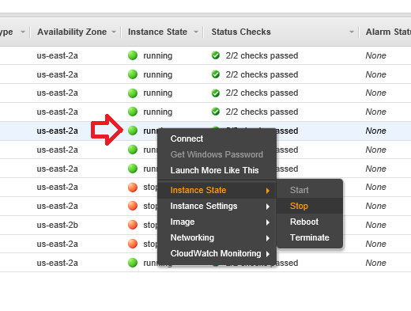
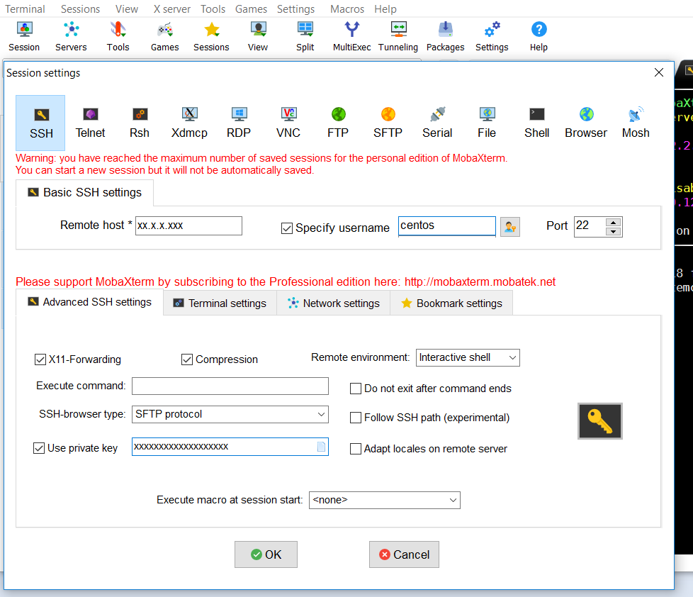

# EC2

The AWS EC2 service contains the virtual machine instances and the secure parameter store used to configure the Orchestrator, API, and UI to run on multiple environments. Users should use this component to monitor the health of each instance, find necessary connection info to SSH into the virtual machines, and resize instances in case of scaling concerns.

## AWS EC2 Instances Page

The image below shows the main instances page of the AWS EC2 component. Access this page from the AWS dashboard by navigating to Services and searching `EC2`. If this screen does not appear after clicking `EC2`, click the **Instances** link on the left side of the page.


Each of these instances correspond to a virtual machine. The naming convention for each instance is:

```text
ec2-<region>-<availability_zone>-<environment>-<rap_type>-<number>
```

For example, the name of the API instance that runs in the Dev environment in us-east-2, availability zone A is: `ec2-ue2-a-d-api-001`. The RAP types are `api`, `etl`, `pbgwy` \(Instance that runs the Power BI gateway\), `vpn`, `rs` \(Report server\), and `sql` \(Instance that runs Microsoft SQL Server\).

To start, stop, or reboot an instance, right click on the instance status and then expand **Instance State**. Stop will completely stop the instance. Reboot will stop and start the instance. 




Note: Terminate **will delete** the instance completely. There should never be any reason to select terminate.


In the event that the platforms need a scale up or down, changing the instance type is simple. Follow the steps below:

Navigate to **Instance Settings &gt; Change Instance Type**. Be sure the instance is stopped.


Select **Change Instance Type**, and choose the Instance Type to fit the situation.



Note: The AWS documentation describes all the different types of instances [here](https://aws.amazon.com/ec2/instance-types/).


## Accessing the EC2 Instances via SSH

To find the application log files of the Orchestrator and API, users must SSH into their respective. Using an SSH client \(MobaXTerm is shown here\), setup a session by entering the IP of the EC2 instance, found on the AWS EC2 instances page, the username `centos`, and then provide the private key file provided by a RAP administrator. The user needs a [VPN ](openvpn.md)connection to access these instances. 



There are two important directories on the ETL instance for troubleshooting: **`/logs/`** and **`/input/`**.

**`/logs/`** will contain the Orchestrator logs and the Local Agent logs. These logs write in real time from the applications, and contain both messages that show in the UI, as well as backend logs, such as uncaught exceptions, connection statistics, and logging around the individual Akka actors in the application. Logs save daily, and the log for the current day’s processing saves without the date appended. The Orchestrator, API, and Agent’s respective log files are orchestrator.log, agent.log, and api.log.



Refer to the [Checking logs](../../monitoring-the-process/checking-logs.md) or [Troubleshooting](../../../faq-troubleshooting/) sections for information detailing how to interpret and find common errors in these logs.


**`/input/`** will contain files in the event that the platform writes into an EC2 location rather than the default S3 bucket. The `staging_path` parameter on the [Source Details](../../../configuring-the-data-integration-process/source-configuration/source-details.md) Tab configures where the files stage. Each input file in this folder corresponds to an `input_id`, with the naming convention `<input_id>.csv` or `<input_id>.csv.gz`.


The EC2 instances are also important if there is a need to restart, stop, or start the Orchestrator, API or Local Agent without rebooting or stopping the entire instance. The applications install on their respective instances as services, and use with the following `systemctl` bash commands for control:



Start:

```bash
sudo systemctl start rap
```

Stop:

```bash
sudo systemctl stop rap
```

Restart:

```bash
sudo systemctl restart rap
```



Start:

```bash
sudo systemctl start rapapi
```

Stop:

```bash
sudo systemctl stop rapapi
```

Restart:

```bash
sudo systemctl restart rapapi
```



Start:

```bash
sudo systemctl start rapagent
```

Stop:

```bash
sudo systemctl stop rapagent
```

Restart:

```bash
sudo systemctl restart rapagent
```



