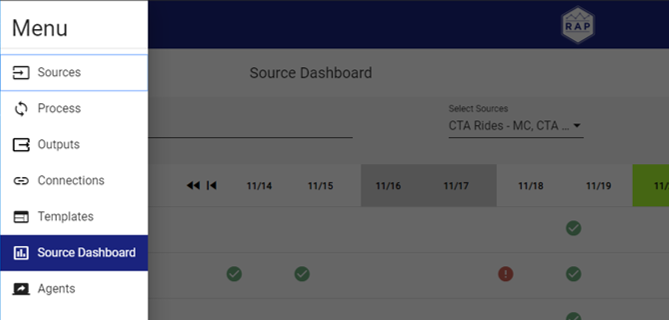
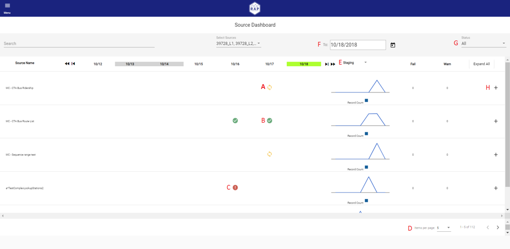

# !! Source Dashboard

### Navigation

RAP includes a dashboard for monitoring the status of Sources which is viewable by navigating to the Source Dashboard from the menu, as shown below. 

### Source Dashboard Screen

To Source Dashboard allows users to quickly ascertain the status of their sources.  The below screen and instructions illustrates how to utilize the screen. 

#### Source Dashboard Screen Elements:

A\) The input that arrived on 10/17 for the “MC – CTA Bus Ridership” source is still processing. The “In Progress” status code hyperlinks the user to the inputs page for the “MC – CTA Bus Ridership source. 

B\) The input that arrived on 10/17 for the “MC – CTA Bus Route List” has successfully processed. The “Passed” status code hyperlinks the user to the inputs page for the “MC – CTA Bus Route List” source.

 C\) The input that arrived on 10/16 for the “a_TestComplexLookupStations2” source has failed processing. The “Failed” status code hyperlinks the user to the inputs page for the “a_TestComplexLookupStations2” source. 

D\) The pagination options are located here, with the default set to five sources per page. To the right, the left and right arrows let the user navigate through the sources. 

E\) This dropdown shows different processing trends for the source. a. Staging – Tracks input record counts recorded during the Staging process b. Change Tracking – New, Old, Changed, and Unchanged records are tracked in the Change Data Capture process c. Validation – Input record counts after Validation process. Tracks total, warned, and failed records. d. Throughput – Tracks rows processed per minute and process time for the source F. The last 7 days of processing show on the dashboard with the final date being the date in this box. Saturday and Sunday highlight grey and the current day highlights neon green. 

F\) The last 7 days of processing show on the dashboard with the final date being the date in this box. Saturday and Sunday highlight grey and the current day highlights neon green.G\) The Status dropdown filters the dashboard based on input statuses, similar to how the status dropdown works in the Inputs page. H. Expanding the source shows additional information regarding number of inputs that arrived for a given day.

H\) Expanding the source shows additional information regarding number of inputs that arrived for a given day.


RAP also supports creating a Power BI gateway to connect to the Postgres layer, which enables the Support team to use Power BI to create custom operational reporting. This guide does not cover connecting and configuring Power BI.


