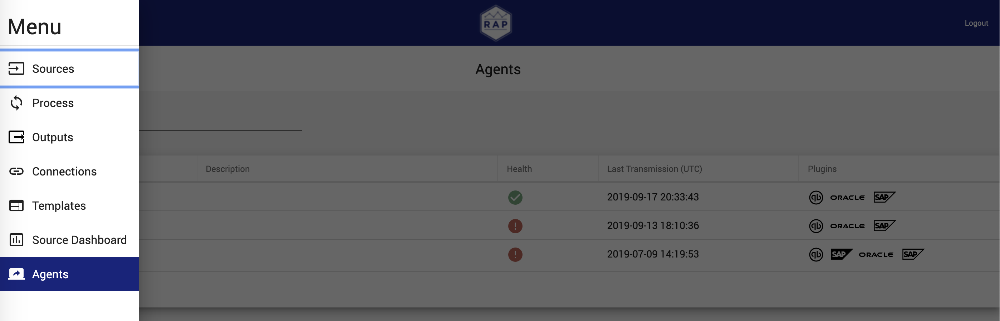
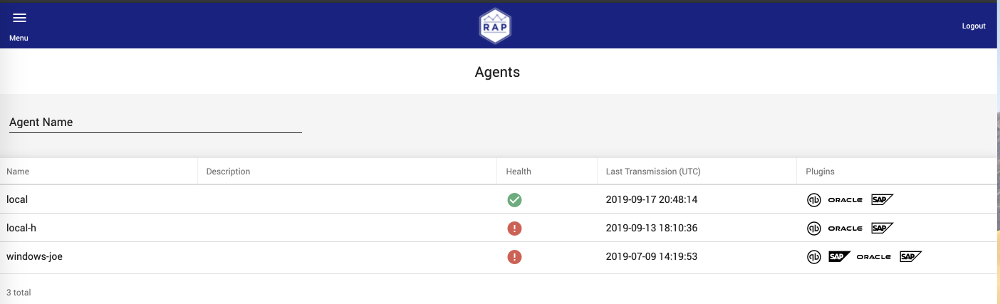
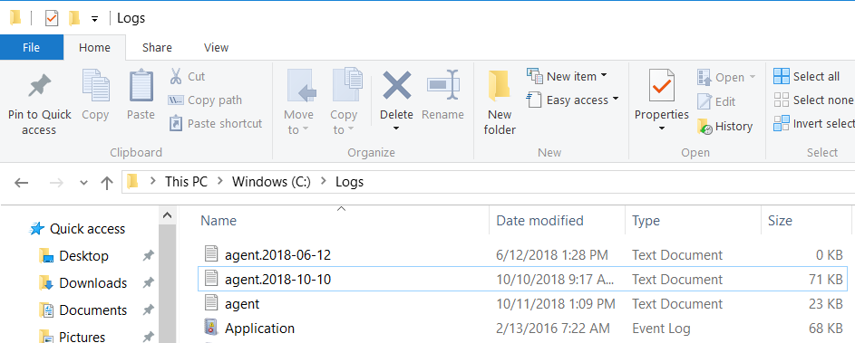

# RAP Agent

The RAP Agent installs on local client machines. Its purpose is to acquire files from local file storage and upload them to the RAP application. Because the RAP Agent is located on third party client machines, it is often more difficult to troubleshoot issues related to its operation. This section details managing the health of the RAP Agent and troubleshooting issues related to the RAP Agent.

## RAP Agent Health

The RAP Agent signals its health and continued operation via a heartbeat to the API. Every time an Agent pings the API the `last_transmission_timestamp` of the ping updates in the Database under the Agent Code that pinged the API. This timestamp and the related status of agents can found by accessing the Agents screen from the primary navigation menu.

The Agent screen lists the active agents and their respective health status which is determined by the most recent API ping.  The agent is programed to call the API every 30 seconds and if an agent fails to make its schedule call, the status will be updated to failed. When this scenario takes place, the last transmission time will remain unchanged until the agent resumes its scheduled API calls.  Furthermore the Agent screen lists the plugins that are configured for each Agent.  

Below is an example of the Agent screen with a list of agents and associated statuses, timestamps, and plugins:

## RAP Agent System & Network Requirements

In order for the Agent to successfully and securely connect with RAP servers, the on premise machine must have:

* Reliable network connectivity using Hypertext Transfer Protocol Secure \(HTTPS\).
* Java 8 installation on the on premise machine.

## RAP Agent Logs

In the event that that an Agent has a failed status, the log files can be found at:`<Drive where Agent is installed>/Logs/agent.log`

To start, stop, or restart the Agent service, navigate to the services window, and restart the service named RAPAgentBat.

