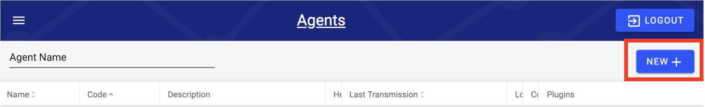

# Installing a New Agent

DataOps Agents are a means of transporting data from a source data source to a cloud storage location DataOps can manage (either in AWS or Microsoft Azure). Agents are managed through the DataOps interface once installed. This section walks through the process of installing a new DataOps Agent on a Windows server. Currently, the Agent can only be installed on Windows.


As of Intellio DataOps release 2.1.3, the Agent MSI has been reworked to match the DataOps branding - as well as some other core changes. Any MSI version pre-2.1.3 has now been deprecated. If a pre-2.1.3 DataOps MSI has been installed, please uninstall and reinstall using a 2.1.3 or later MSI version. The documentation in this guide covers MSI versions of 2.1.3 and later.


## Prerequisites (Requirements for Installation)

Prior to installing the DataOps Agent, the following requirements must be met.  Please ensure that the machine hosting the DataOps Agent meets the requirements prior to installation.

* The machine or VM must be running a Windows operating system:
  * Windows 7 / Server 2008 R2 or later
* The latest version of the Amazon Corretto JDK 8 should preferably be installed on the destination machine. Oracle JDK 8 is also sufficient. If neither is installed on the destination machine, navigate to the site linked [here](https://docs.aws.amazon.com/corretto/latest/corretto-8-ug/downloads-list.html) and download and install the Corretto JDK that is compatible with the target architecture and OS of the machine that the Agent will be installed on.
* Since the Agent initiates all its own connections, outbound connections to various cloud resources on the public Internet are required.  If a firewall is limiting outbound internet access, the following resources should be allowed through the firewall (exact domain names will vary by environment).  Note that these are all secure endpoints, so if SSL inspection is enabled at the firewall, special consideration is needed to ensure that the certificate presented to the machine hosting the Agent is trusted.
  * AWS S3 / Azure Data Lake Storage via HTTPS (port 443)
  * DataOps API endpoint via HTTPS (port 443)
  * Auth0 via HTTPS (port 443)
* File and database sources that will be accessed through the DataOps Agent must be accessible from the machine the Agent is being installed on.  In the case of database sources, many customers install the Agent software directly on the database server - network connectivity from the machine that the Agent software is being installed on is all that is required.  Note that the Agent will be performing data pulls and uploading to AWS / Azure, so the recommendation is to not segment off the Agent machine from the sources being accessed in a way that traffic needs to cross a limited capacity network segment to reach those sources.
* The user account intended for the Agent to use to access source databases needs to be set up with native database engine authentication.  In the case of SQL Server, Windows / Azure AD authentication is not supported for the Agent user and only SQL Server authentication can be used.
  * Mixed-mode authentication can still be enabled to allow for integrated authentication for non-DataOps related loads.
* A Windows user account must be created to run the agent with username and password. This user must have the ability to access any folders containing source data as well as the ability to run services. The command whoami can be run in a command line to determine the current userid.

## **Machine Guid Command**

Your machine Guid will be needed to complete the installation. To get the Machine Guid, run the following command in the terminal on the server that the Agent will be installed on.

```
reg query HKEY_LOCAL_MACHINE\SOFTWARE\Microsoft\Cryptography /v MachineGuid
```

## Setting up a New Agent Configuration



In the DataOps UI, from the left hand menu navigate to Agents, and click New. From this settings interface input the required inputs as seen below. Additional parameters exist for more detailed installations. Note that you will need information about the machine the agent will be hosted on.

| Agent Inputs  | Detail                                                                                                                   |
| ------------- | ------------------------------------------------------------------------------------------------------------------------ |
| Name          | Agent name on the backend, and name reference for sources and other DataOps elements within the UI.                      |
| Description   | Necessary clarification and detail.                                                                                      |
| Code          | Agent code on the backend - this ideally should be the same as Name                                                      |
| Region        | AWS region, or Microsoft Azure region that the DataOps is stored and being processed in (e.g. "us-west-2", "East US 1"). |
| Machine Guid  | A specific key to identify the machine the agent is running on, see below for the terminal command to obtain.            |
| s3LandingPath | Path to Datalake bucket (e.g. "s3://dev-datalake-intellio")                                                              |

####

## Installing the DataOps Agent (Windows)

Navigate to the AWS S3 console for the specific environment on which DataOps will be operating. Navigate to the bucket: \<environment>-agentjar-\<client>. Within this bucket there is a path called "msi-install". Install the appropriate version based on the version of DataOps that is live in the environment.

Identify the appropriate version of the .msi (installer) by hovering over the navigation menu in the upper left hand corner of the DataOps UI.


Download the appropriate version of the MSI installer. Run the installer and fill in the appropriate prompts.

.png>)

A specific Intellio DataOps** Agent Code** will be required, and this is the **Agent Code** that was configured in the DataOps UI. The windows username and password to run the service must also be entered. Do not alter the configuration key unless directed to by a DataOps team member.&#x20;


The service account username MUST include the domain or local server name. Example:  \<domain>\username or \<local server name>\username

This can be easily found by opening a command prompt and running "whoami" in the terminal.

The user must have the ability to log on as and run services. The user must also be able to access any folders containing source data if the Agent will be performing file Ingestions.


.png>)

If a second DataOps agent is being installed on the same server, the port will need to be altered so both agents are not running on the same port. If this is the first DataOps agent, then the port should be left as the default value of 25530.

.png>)

The final step of the installation pertains to providing the appropriate credential configuration to the application. Navigate to the DataOps UI and Agents screen and click on the cloud icon under the Config column (and for the appropriate Agent row). Clicking on this icon will download the configuration document.


Locate the file. The downloaded file should be named "agent-config.bin". Move this file to the bin folder within the Agent program files location: C:/Program Files/Intellio DataOps/bin

.png>)

Once the file has been placed, navigate to the "Services" explorer on the server and restart the service named "IntellioAgent_\__\[agent-code]". For example, if your agent code was "Dev", the service would be named "IntellioAgent Dev".

Once the service is restarted, navigate to the DataOps UI and check the Agent logs and status to make sure it is online and heartbeating.

If the Agent does not come online with a green status icon within 5 minutes, please double check all of the above steps to make sure that configuration was set up properly. If the above steps all look correct, please check the log files on the server that the Agent has been installed on. These files will be located at: C:/logs/intellio/. The current log file will be called "agent.log".

.png>)

If the service is running and no log files are being created, there is a good chance that Java is not installed correctly on the server. Please consult the Java requirements at the beginning of the guide.

Another common error is the misplacement of the agent-config.bin file. If the following message is in the logs, please make sure that the agent-config.bin file is placed in the appropriate location, and the service is restarted after the placement of the file. The file needs to be named "agent-config.bin" as well.

.png>)

If these troubleshooting steps are followed and the Agent is still not running, please reach out to your client team for support.

This should complete the setup of the Agent on the client machine. All further configuration should be able to be completed via the DataOps UI, such as locating file paths or database/data warehouse credentials.

## Uninstalling the DataOps Agent

Uninstalling the DataOps can be triggered in 2 ways. The first way is from the initial MSI that was used to install the Agent. Double click the MSI and click Remove when prompted. This can also be triggered from "Add/Remove Programs" in the Windows control panel. The program will be called Intellio DataOps Agent.

When the uninstall is complete, there is a manual step needed to remove the service. Open a command prompt in Administrator mode and run the command (replace "IntellioAgent Dev" with the service name that was installed on the server.)

.png>)

## Installing the DataOps Agent (Linux)


Historically, DataOps also provided a native Agent for Linux (Centos/Redhat), however, due to lack of demand the Linux DataOps Agent has been deprecated. Historical Linux RAP Installation can be found [here](https://westmonroepartners1.sharepoint.com/sites/DDPA/0063900000stpZHAAY/Docs/Forms/AllItems.aspx?FolderCTID=0x0120001A877AC2A8D0754C894745F7F2227E37\&id=%2Fsites%2FDDPA%2F0063900000stpZHAAY%2FDocs%2FImplementation%2FTechnical%20Documentation%2F3%20-%20RAP%2FRAP%20Agent%20Installation%2FRAP%20Agent%20Install%20Guide%20for%20Red%20Hat%206%2E10%2Epdf\&parent=%2Fsites%2FDDPA%2F0063900000stpZHAAY%2FDocs%2FImplementation%2FTechnical%20Documentation%2F3%20-%20RAP%2FRAP%20Agent%20Installation).

Linux agents are now supported via Docker containers hosted by AWS ECS or Azure Container Instances

