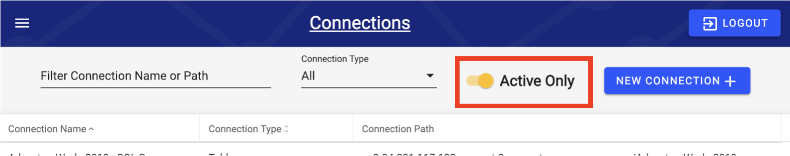
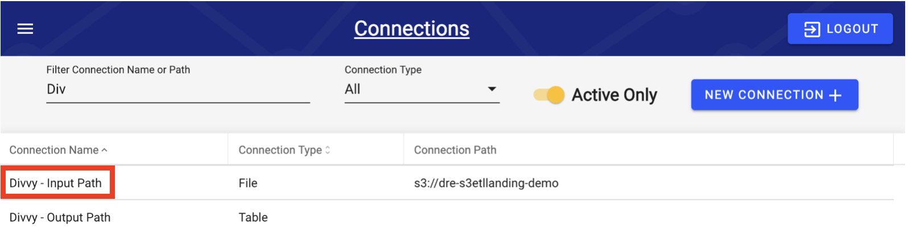
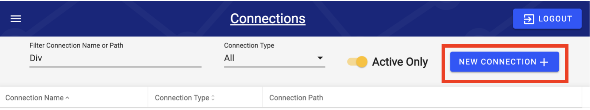
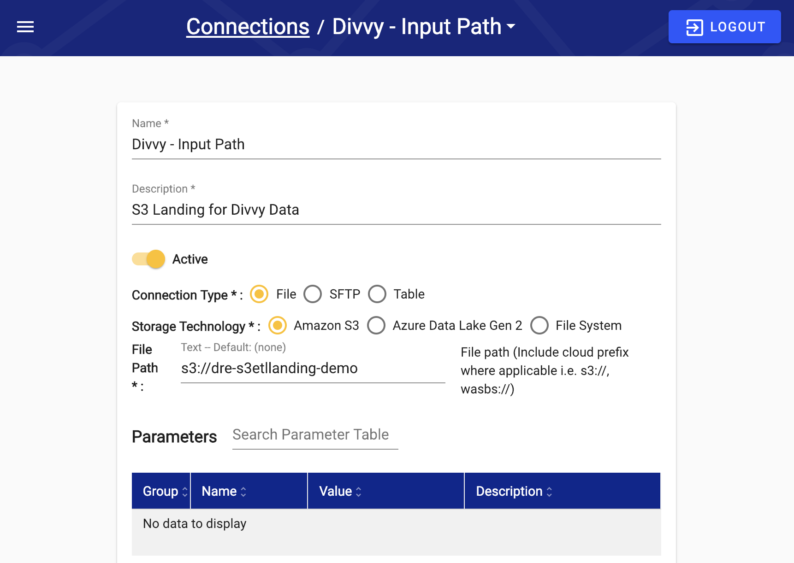

# !! Connection

The fields in the Connection Configuration vary based on the selected Connection Type and Driver. This guide provides step-by-step instructions for each Connection Type and Driver.


Connections, once configured, can be used for both Sources and Outputs. This allows a developer to create a single Configuration that both pushes and pulls data to/from the same server if required.


## Connections Screen

The Connections screen allows users to search, edit and filter all previously created Connections, as well as create new Connections. By default, only Active Connections are listed. The **Active Only** toggle changes this setting. Note that only Active Connections are operable.

To edit a Connection, select the Connection directly. This opens the Edit Connection screen.

To add a Connection, select **New Connection**. This opens the Edit Connection screen for a new Connection.

## Edit Connection Screen

Editing a Connection and creating a new Connection leads to the same screen. Users can edit different parameters to configure a Connection.

### Connections Parameters

What follower here are an enumeration of the parameters used to set up and customize connections. The  

* **Name**: A unique name for the connection. This will be displayed on the Connections screen when browsing Connections. To ensure Connections are organized easily searchable, follow the [Naming Conventions](connections-configuration.md).
* **Description**: The description of the Connection.
* **Connection Type**: There are 3 options for Connection Type: Table, SFTP and File.
  * **Table** is a connection to an external database.
  * **SFTP** \(SSH File Transfer protocol\) is a file protocol used to access files over an encrypted SSH transport.
  * **File** is used to access files and can be local or in Amazon S3 or Microsoft Azure.

### Connection Type Specific Parameters

Based on the Connection Type Intellio DataOps \(RAP\) will dynamically adjust to require necessary parameters. For example a File connection type will require storage technology to be specified where as SFTP will require parameters to be inputted into the parameter table found at the bottom of the Setting UI.

**File** requires specification of the **Storage Technology** \(Amazon S3, Azure Data Lake, File System\). Based upon the choice you will need to input the **File Path** \(Amazon S3, File System\), or the Microsoft Azure Account permission parameters \(Account Name, Key, Container\).

**Table Connection** requires the **Driver** parameter. Currently supported database connections are Access, Athena, Elasticsearch, MySQL, Oracle, Postgres, Quickbooks, SAP HANA, SQL Server, Snowflake.

**SFTP** connection requires additional parameters that are found in the Parameter Table at the bottom of the Settings UI, elaborated on below.

## Connections Parameter Table

Based upon the connection type, driver and other reasons there may be need to customize connection parameters. These parameters appear in the parameter table and can be searched. Common parameters are listed below.

### Common Parameters

<table>
  <thead>
    <tr>
      <th style="text-align:left">Parameter</th>
      <th style="text-align:left">Description</th>
    </tr>
  </thead>
  <tbody>
    <tr>
      <td style="text-align:left">connection_string</td>
      <td style="text-align:left">
        
JDBC connection string for the destination database.

        
Overrides all other parameters if specified.

      </td>
    </tr>
    <tr>
      <td style="text-align:left">database_name</td>
      <td style="text-align:left">Name of the database</td>
    </tr>
    <tr>
      <td style="text-align:left">host_name</td>
      <td style="text-align:left">Host address of the source database</td>
    </tr>
    <tr>
      <td style="text-align:left">password</td>
      <td style="text-align:left">Database password</td>
    </tr>
    <tr>
      <td style="text-align:left">port</td>
      <td style="text-align:left">Port on the database server</td>
    </tr>
    <tr>
      <td style="text-align:left">user</td>
      <td style="text-align:left">Database username</td>
    </tr>
    <tr>
      <td style="text-align:left">warehouse</td>
      <td style="text-align:left">Warehouse name</td>
    </tr>
  </tbody>
</table>

### Additional Parameters: SQL Server

| Parameter | Default Value | Description | Advanced |
| :--- | :--- | :--- | :--- |
| create\_cci\_maintenance\_job | TRUE | Create a weekly clustered columnstore index maintenance job for the target database | Y |
| encrypt | FALSE | Use SSL encryption for all data sent between the client and the server if the server has a certificate installed | Y |
| trust\_server\_certificate | FALSE | Check this box to specify that the driver does not validate the SQL Server SSL certificate | Y |
| trust\_store |  | Path \(including filename\) to the certificate trust store file | Y |
| trust\_store\_password |  | Password used to check the integrity of the trust store data | Y |
| host\_name\_in\_certificate |  | Host name to be used in validating the SQL Server SSL certificate | Y |

### SFTP Connection Type

| Parameter | Default Value | Description | Advanced |
| :--- | :--- | :--- | :--- |
| user\* |  | SFTP Account Username | N |
| password\* |  | SFTP Account Password | N |
| hostname\* |  | SFTP Account Host Name | N |
| port | 22 | SFTP Account Port | N |

### File Connection Type

A file can be locally stored or stored in S3.

| Input Parameter | Purpose | Required to Change? | Default |
| :--- | :--- | :--- | :--- |
| **file\_path** | File path for the Connection | Yes | Blank |

