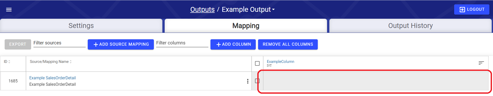

# Output Mapping

## Key Terms 

* **Columns:** Define the final schema of the Output data, such as the target file headers or table column names and types.
* **Channel:** Union between a source and the output, that defines how attributes from the source flow into the output.
* **Mapping:** Expression that ties a channel to a column.
* **Output Mapping:** Collection of all mappings that collectively defines how the data moves from all channels into the output table.


Changes made to an output mapping will not take effect unless the user presses the **Save** button at the bottom right hand corner of the output mapping screen.


## Adding a Channel

To enable mappings between an output and a source, the first step is to add the channel to the Output Mapping screen, thus generating a link between this Source and Output. Click **Add Source Mapping** at the top of the mapping table and underneath the **Mapping** tab, as seen below.

This will bring up the Channel configuration modal. To select the source to map, click on the **Select Source** search bar/drop down menu circled below, begin typing the name of the source that needs to be mapped, and once the desired source appears in the dropdown menu, it can be selected.

#### Options: 

* **Filter Expression:** Allows users to define a condition that will exclude rows of data from the output, for which the filter expression does not evaluate to **true**.
* **Operation Type:** Default is "N/A". Allows the user to mark a channel as an aggregate. More information on aggregate channels can be found [below](output-mapping.md#aggregate-channels).
* **Name:** The name of the Channel defaults to name of the source itself. The user may want to set their own name for the channel, for instance to help distinguish between two Channels that come from the same source.
* **Description:** Allows the user to briefly describe to other users the use case of the Channel.
* **Auto Add Columns:** Default is ".\*". Regex pattern, all matching column headers will be automatically added to the output.
* **Key History:** Default is false. Output key history for channels of Key sources - ignore for Time Series sources.
* **Post Processing Command:** Default is true. SQL Command to run after output is complete WARNING: This will run live against your destination DB. This aligns to the Synopsis Processing phase.
* **Allow Output Regeneration:** Default is true. If set to false, the output will not be generated if triggered by an output reset or validation reset

## Adding Columns

To add a single column, click on **Add Column** in the top middle of the screen, seen next to the **Remove All Columns** button in the image above.

Then, when the create column modal opens \(seen in the image below\), a column name must be added. The column name should start with a letter and may contain only letters, numbers, and underscores.

Optionally, the user can add a description to the column, or explicitly set the datatype of the column. If no datatype is set, the datatype of the column will be automatically inferred based on what source attributes are mapped to the column.


**Column Data Types**

The Column Data Types listed in this drop down are the target system's available data types


## Aggregate Channels

Aggregate channels allow users to output data at a higher grain than their actual data. A channel is set as aggregate by checking the **Aggregate** option of the **Operation Type** field on the channel details modal. Aggregate channels are denoted on screen by the icon circled in the picture below:

 All columns of an aggregate channel fall into one of two categories:

* **GROUPS:** Static fields by which rows with matching values will be grouped together. Akin to columns in a SQL "GROUP BY" clause.
* **MEASURES:** Usually numeric fields that we will perform aggregate operations on.

Which category a column falls under is determined by the expression mapped to it for the aggregate channel.

If an aggregate function is selected, the column automatically becomes a **MEASURE** column. Conversely, if no aggregate function is selected, the column automatically becomes a **GROUP** column.


For more information on what each aggregate function does, please refer to Spark SQL documentation: [https://spark.apache.org/docs/latest/api/sql/](https://spark.apache.org/docs/latest/api/sql/)


Furthermore, if an aggregate function for a column has been selected, the user has the option aggregate on only distinct values within the selected aggregate field, by clicking the checkbox shown below:

## Channel Menu Controls

To open the Channel control menu, click on the kebab button \(⋮\) at the far right of the **Source/Mapping Name** column of the output mapping. 

None of these actions take effect unless the output mapping save button is pressed afterwards.

* **View/Edit Details:** Will open the configuration details modal of the selected channel.
* **Automap:** Will map attributes from the source from the selected channel to any columns that the user may have created that have column names that match an attribute name.
* **Add&Map All Source Columns:** Adds a column for each attribute of the source from the selected channel, and maps the corresponding attribute to the column automatically. The newly created column names will be that of their corresponding attributes.
* **Clear Mappings:** Clears all expressions mapped to columns from the source from the selected channel.
* **Remove:** Removes the channel in question from the output.


Note: It is best practice to manually add all Output Columns when configuring an enterprise grade system to adhere to destination naming convention and semantics.


## Column Menu Controls

To open the column menu, click on the list icon button \(circled in the image below\) at the far right of each column header. None of these actions take effect unless the output mapping save button is pressed afterwards.

* **View/Edit Details:** Opens the column configuration modal of the selected column.
* **Move Left:** Shifts the column one place over to the left on the UI.
* **Move Right:** Shifts the column one place over to the right on the UI.
* **Automap:** Maps an expression to each channel in the output mapping that has a source attribute matching whose name matches the column name.
* **Clear Mappings:** Clears all expressions mapped to the column across all channels in the output mapping.
* **Hide:** Takes the column off the screen in the UI, without actually removing the column from the output.
* **Remove:** Removes column from the output mapping.

## Mapping Expressions

Once at least one channel and column have been created, the user can start mapping attributes by clicking on the empty cell that lies at the intersection of the target channel and the target column, example below:

Once the user clicks the empty cell they would like to map a value to, the expression entry modal will appear:

To begin mapping an attribute, type an opening bracket "\[" to reveal a drop down of all sources that have an active primary relation chain to the source of the target channel and the target source of the channel, represented by _\[This\]_.   
  
To map an attribute from the target source of the channel select _\[This\]_, or to map an attribute from a source that is related to the target source of the channel, choose one of the other sources in the drop down.  
  
Once a source has been selected, they can type a period "." to reveal a drop down of all attributes of this selected source. Choose an attribute from the drop down to map it to the target field.

