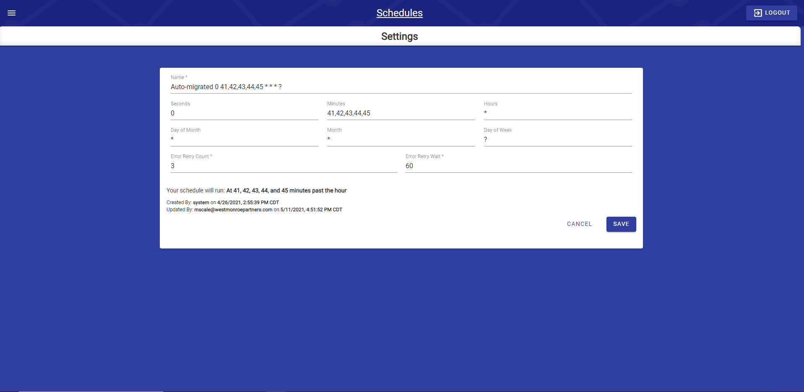

# Schedules

## Schedules

Schedules was previous found under the Source Settings parameter table \(&lt;2.4.0\). It now has its own page which can be accessed from the main menu; simply hit Schedules to be taken to the list of Schedules.

The description is the parsed CRON expression. Names can be anything, but best practice is to have a CRON expression present or use time specific statement.

## Schedule Settings

The schedule settings page allows users to create and update schedules. The example below will run at 41, 42, 43, and 45 minutes past the hour.

* **Name\*:** A unique name. Best practice has a CRON expression present.
* **Seconds:** Number of seconds ranging from 0-59 - Allowed Special Characters: , - \* /
* **Minutes:** Number of minutes ranging from 0-59 - Allowed Special Characters: , - \* /
* **Hours:** Number of hours ranging from 0-23 - Allowed Special Characters: , - \* /
* **Day of Month:** Specific days of the month as numerals ranging from 1-31 - Allowed Special Characters: , - \* ? / L W C
* **Month:** Specific months using 1-12 or JAN-DEC - Allowed Special Characters: , - \* /
* **Day of Week:** Specific days of the week as numerals ranging from 0-6 \(0=Monday 6=Sunday\) - Allowed Special Characters: , - \* ? / L C \#
* **Error Retry Count\*:** Number of times the input will retry upon error \(_default 3\)_
* **Error Retry Wait\*:** Number of seconds the input will wait before retry _\(default 60\)_

