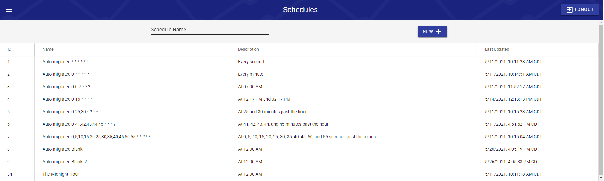

# Schedules

## Schedules

Schedules was previous found under the Source Settings parameter table \(&lt;2.4.0\). It now has its own page which can be accessed from the main menu; simply hit Schedules to be taken to the list of Schedules.

