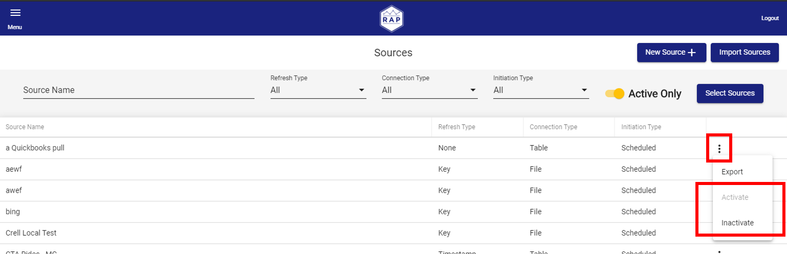
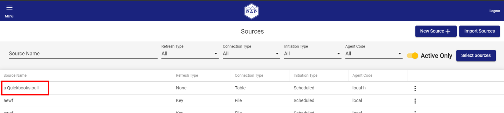
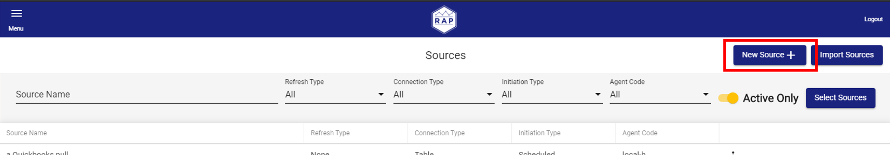

# Sources

## Sources Screen

On the Sources screen, users can see all previously created Sources, as well as search, edit, and filter them. By default, only Active Sources are listed. Users can change this by toggling the **Active Only** toggle. Note that only Active Sources are processed.

Each Source can be activated or inactivated by clicking the kebab button \(**⋮**\) on the right-hand column and selecting Activate or Inactivate.

To edit a Source, click the Source name in the list. This opens the Edit Source screen.

To add a Source, select **New Source**. This opens the Edit Source screen for a new Source.

