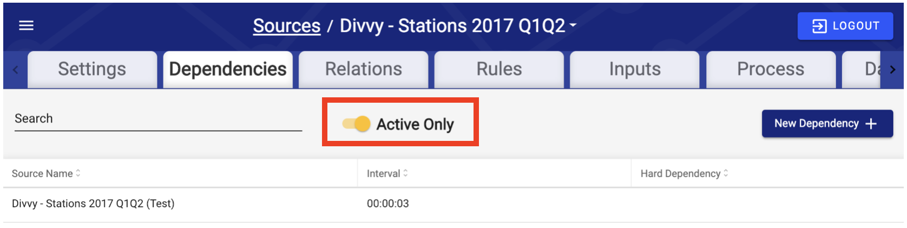
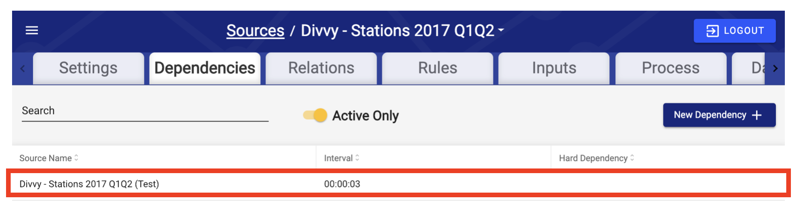
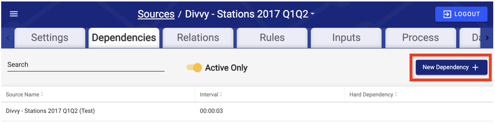

# Dependencies

## Introduction

Dependencies allow configurators to tune the DataOps workflow engine to hold specific processing steps until other processes complete - rather than processing all data as quickly as possible and then relying on other features such as Keep Current and processes such as Attribute Recalculation to resolve any potential data refresh issues.

It allows users to configure DataOps to ingest all data as soon as it is available, but wait to run any processing steps that could require intra-source data exchanges - where a potentially late arriving dataset could cause errors or wasted spend on compute.

## How Dependencies Work

Dependencies cause Sources to wait to run Enrichment until a (or multiple) dependent Source(s) complete(s) Refresh. The most common use case is when traversing a relation to pull data from one source into another via a JOIN/Lookup operation. When performing a JOIN/Lookup from one source (Source A) to another (Source B), users often want to wait for Source B to process first before populating the lookup fields in Source A.

DataOps provides configurable delays between Sources that are dependent on each other to ensure accurate dependency management in imperfect production scenarios.

### Example Scenario 1: Source A Keyed, Source B Keyed

In the following example, we have two sources scheduled to pull data using two different schedules. Source A pulls data every 12 hours at 3AM and 3PM, Source B pulls data every 24 hours at 3PM.&#x20;

Setting a hard dependency on Source A to Source B indicates that Source A should wait until there exists guaranteed time-valid data in Source B before performing the Enrichment and execute lookups and formulas.

Let's take a look at the first pull of data at 3PM:

.png>)

In this example, DataOps will generate the input 1A four Source A, then identify all dependencies. In this case it's identified Source B as a hard dependency. Before running Enrichment, the workflow will identify the maximum extract date time four all dependent sources and compare it to the current Input's extract date time. If the greatest extract date time across all inputs for Source B **is greater than or equal to** the current input's extract date for Source A, then Source A will run Enrichment.

For this case, because the greatest extract date time for Source B is equal to Input 1A's extract date time, Input 1A will not wait and will immediately begin executing Enrichment.

.png>)

Now let's take a look at what will happen when Source A pulls data again 12 hours later:

.png>)

Source A has now pulled data on its 12 hour schedule, and will again trigger a dependency check. The workflow will compare the current input's (2A) date time (3AM on 01/04/2020) to the greatest date time  across all inputs for Source B (3PM on 01/03/2020) and detect that there are no inputs for Source B with a date time greater than the current extract time of Source A. This time, Input 2A will **not** move to Enrichment, and will instead move to a "pending" status:

 **Pending**: Phase is waiting on a dependent source to complete processing.

It will remain in this state until an Input from Source B satisfies the condition of the dependency.

.png>)

Finally, let's see what happens at 3PM later that day when the next Input for Source B is pulled:

.png>)

As soon as a new Input for Source B is generated, it immediately checks if there are any Inputs waiting on upstream dependencies. In this case, Input 2A is pending, and so the workflow compares the date times between 2A and the greatest input extract time for Source B, which now exceeds the threshold for Source A's dependency, allowing Source A to begin Enrichment.

.png>)

Finally, the workflow looks at the new Input for Source A, Input 3A, and compares the maximum date time from all extract date times for Source B, finds that the time is equal to Input 3A's extract time, and thus allows Input 3A to execute.

.png>)

### Example Scenario 2: Source A Timeseries Timestamp, Source B Keyed

For Timeseries Timestamp Sources, rather than using the extract time of the Input, DataOps looks at the actual data to determine whether or not to wait to process Enrichment.

In the following example, both Source A and Source B are refreshed every 12 hours.

.png>)

In the best case scenario, the data in Source A covers the range from when data was last extracted until the current time of extract - in this case between 3PM the day before, and 3AM today. In this case, Input 2A extract is equal to the largest timestamp within Source A's data, so it works identically to Example 1. The workflow engine compares Input 2B extract with the largest timestamp in Input 2A's data (which is equivalent to Input 2A's extract time), determines 2B's extract time is greater than this largest timestamp, and decides it is safe run Enrichment immediately.

.png>)

Next, let's see what will happen if for some reason, Input 2A's extract date lags behind the relevant data stored within the Input. This is common when a middleware system must first run a job to extract data from a proprietary database system (such as a mainframe) into files for DataOps to then pick up.

.png>)

In this case, the Input 2A extract date time is not considered when evaluating dependencies. The workflow engine will compare Input 2B's extract date time to the greatest timestamp value within Input 2A's data. Because Input 2B's extract date time is greater than or equal to the greatest timestamp in 2A's data, Input 2A will be allowed to execute Enrichment.

.png>)

### Example Scenario 3: Source A Timeseries Timestamp, Source B Keyed with Interval

In this final example, we will showcase the use of the interval parameter to adjust the sensitivity of dependencies by shifting the dependent's effective date time up or down.

For this example, Source A and Source B are both refreshed every 12 hours, but Source B is staggered off of Source A's schedule by two hours to reduce the load on the upstream source system.

.png>)

In the default dependency configuration, input 1A will look for the maximum extract date across all Inputs for Source B, and find none greater than its maximum timestamp value in its own data.

.png>)

Input 1A will then not execute until the next Input for Source B is extracted - at 1PM the following day.

For the purposes of example, let's say Source B is only ever updated in the source system ever 12 hours at 12AM and 12 PM. Our current schedule of 1AM and 1PM ensures enough buffer time for this update to occur. With this information, we know that the data will not change between 12AM and 12PM.

In this instance, we now know that so long as an Input is generated after 12AM or 12PM respectively, we can allow Source A's Input to execute Enrichment immediately. DataOps provides a configuration parameter to handle these situations: Dependency Interval.

The Interval specifies how much time you want to shift the dependent source by. In our example, Input 2B arrives two hours earlier than a normal dependency would allow, thus to offset this early arrival, the Interval would have to be set to at least "+2 hours".

.png>)

According to our logic, however, we know that any input after 12AM or 12PM respectively is a legal partner to the Source A Inputs scheduled at 3AM. This means we should set the interval to "+3" to ensure if an Input for Source B is generated slightly early or Source A is slightly delayed, we still properly allow Source A to execute immediately.

Intervals can also be set to a negative number. In this example, it would make the dependency check even more strict. A "-1" Interval would specify that even if an Input from Source 2B occurred between 3:00 and 4:00 respectively, Source A would still wait until the following execution roughly 12 hours later and not execute immediately.

Intervals shift the **dependent** extract date, not the currently selected source's. This is important to remember when deciding to use + or - intervals for your dependency management.

## Dependencies Tab

The Dependency tab allows users to see all previously created Dependencies, as well as search, edit and filter them. By default, only Active Dependencies are listed. The **Active Only** toggle changes this setting.

To edit a Dependency, select the Dependency directly. This opens the Edit Dependency modal.

To add a Dependency, select **New Dependency**. This opens the Edit Dependency modal for a new Dependency.

## Edit Dependency Modal

On the Edit Dependency modal, users can modify a specific Dependency's details.

.png>)

#### Fields Available:

| Parameter           | Default Value | Description                                                                                                                                                                |
| ------------------- | ------------- | -------------------------------------------------------------------------------------------------------------------------------------------------------------------------- |
| **Source\***        |               | This is the Source that this Source depends on finishing first.                                                                                                            |
| **HH**              |               | Hours                                                                                                                                                                      |
| **MM**              |               | Minutes                                                                                                                                                                    |
| **SS**              |               | Seconds                                                                                                                                                                    |
| **Hard Dependency** | FALSE         | If activated, this forces the Source to wait for the other Source to finish running. If this is not activated, the Dependency does not wait and does not limit the Source. |
| **Active**          | TRUE          | If not activated, this Dependency does not affect a Source and the Dependency will be automatically deleted.                                                               |

