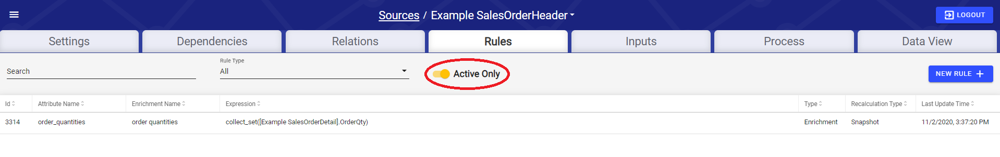

# Rules

## Rules Tab

The Rules tab allows users to select, edit, remove, or add a Source's Rules. By default, only Active Rules are listed. The **Active Only** toggle changes this setting.

To create a new Rule, click the **New Rule** button. This opens the create/edit Rule modal.

.png>)

To edit an existing rule, click on any column of that rule's row in the table besides the expression column (circled in the picture below). If a rule references another rule in its expression, a link will appear in the expression column that, when clicked, will open the edit rule modal of the rule that is referenced by the link (boxed in the picture below).

.png>)

## Enrichments vs Validations

In DataOps, there are two distinct types of Rules: Enrichments and Validations. An **Enrichment** An Enrichment is a rule type that defines an individual SQL expression resulting in a new column of any supported data type. A **Validation** is a specific type of Enrichment focused on data quality rules that only return Boolean data type columns. A validation verifies that a given column value (or group of column values) for each row adheres to a specified rule defined in the validation expression. All validations of a source are aggregated into s\_validation\_status\_code system attribute with Pass/Fail/Warn values for each column.

## Rule Parameters

.png>)

**Fields Available:**

| Parameter                            | Default Value               | Description                                                                                                                                                                                                                                                                           |
| ------------------------------------ | --------------------------- | ------------------------------------------------------------------------------------------------------------------------------------------------------------------------------------------------------------------------------------------------------------------------------------- |
| **Type**                             | Enrichment                  | The type of the Rule. Validations mark records as pass/fail based on a boolean expression in the expression field.                                                                                                                                                                    |
| **Rule Name\***                      | No Default                  | The user-defined name of the Rule.                                                                                                                                                                                                                                                    |
| **Attribute Name\***                 | No Default                  | The name of the new column of the Rule. This what will appear in attribute dropdowns of expressions, and within expressions. When creating a new rule, this field will automatically be filled in with valid formatting based on what the user enters into the Rule Name field.       |
| **Description**                      | No Default                  | The user-defined description of the Rule                                                                                                                                                                                                                                              |
| **Expression Data Type**             | Interpreted from expression | The data type of the result of the Expression, automatically inferred by DataOps. This field is not controlled by the user.                                                                                                                                                           |
| **Attribute Data Type**              | Expression Data Type        | The data type of the Enriched Attribute. RAP will attempt to convert the data type of the Expression Data Type to the Attribute Data Type. Leave as Default for no conversion.                                                                                                        |
| **Recalculation Mode**               | Snapshot                    | Snapshot means that the field will never be recalculated even after attributes the rule depends on get updated. Keep current means that if an attribute value a record depends on gets updated, the dependent attribute will also be updated during processing.                       |
| **When expression is false, set to** | Warn                        | These are the flags that will be set on records that fail to be converted to another data type. Warn, Fail, or Ignore are the possible options. For Validations only.                                                                                                                 |
| **Expression**                       | No Default                  | Use[ Intellio QL](https://app.gitbook.com/@intellio/s/dataops/\~/drafts/-MLwpeBgYEcGrh4eZftR/v/master/configuring-the-data-integration-process/expressions)/[Spark SQL](https://spark.apache.org/docs/latest/sql-programming-guide.html) syntax to set the Rule transformation logic. |
| **Active**                           | TRUE                        | Allows the user to set this Rule as Active or not. If active, it will be applied on new inputs and source resets.                                                                                                                                                                     |

Click **Save** to save the Rule. Clicking **Save and Create Validation** will create an extra Validation column to mark whether the values from the Expression Data Type succeeded the conversion to the specified Attribute Data Type.

## Rule Expressions

Rule expressions are made up of a mix of Spark SQL, and Intellio QL. Specifically, Intellio QL is used access source data attributes, which will be used within a Spark SQL expression the way column names would be used in a normal Spark SQL context.

To begin entering a rule expression, either enter an open bracket "\[" to reveal a drop down of sources with a primary relation chain to the current source and _\[This]_, or enter a tick mark " \` " to reveal a drop down of Spark SQL functions_._ Then the user can continue filling out the expression however they would like, as long as the attributes are accessed using Intellio QL, and the expression as a whole follows Spark SQL syntax.


More information on Intellio QL can be found [here in the configuration guide](https://app.gitbook.com/@intellio/s/dataops/v/master/configuring-the-data-integration-process/expressions), and more information on SparkSQL can be found [here](https://spark.apache.org/docs/3.0.0/api/sql/index.html).


## Example Expressions

### _Multiplying an attribute from a related source to an attribute of the current source through a primary relation_

> \[This].ListPrice \* \[Related Source Name].Quantity

### _Aggregating a column from a primary related source with many cardinality_

> sum(\[Related Source Name].SalesTotal)

### _Aggregating a column from a non-primary related source with many cardinality_

> sum(\[This]\~{Relation Name}\~\[Related Source Name].SalesTotal)

### _Rounding a column down to two decimal places_

> round(\[This].AverageCost, 2)

### _Window function aggregating one attribute of the current source while partitioning on another_

> sum(\[This].TotalCost) OVER (PARTITION BY \[This].CustomerID)

### _Validation rule to determine if a numeric column of the source is above a specified threshold_

> This.TotalCost > 100

## When will my rule get processed?

#### Enrichment

* All traversal rules, regardless of keep current
* Rules that do not contain window functions and do not depend on a window function rule, regardless of keep current

**Refresh**

* All window function rules (window function rules must be keep current)
* All rules that depend on window functions (rules that depend on window functions must be keep current)

**Attribute Recalculation**

* All keep current traversal rules WHEN the related source gets new data
* All rules that depend on the above keep current traversal rules (rules dependent on keep current rules must be keep current)

